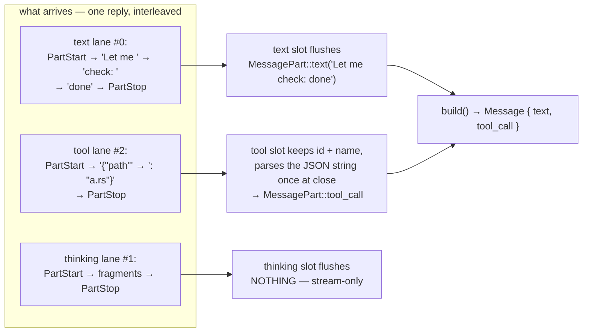
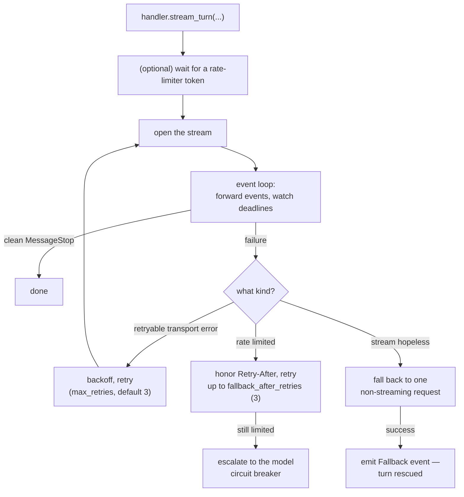

# Stream events — how a reply arrives piece by piece

**Streaming** means the model's answer arrives gradually — word by word — instead of all at once. This page explains the event vocabulary every provider client speaks, and how the pieces become a finished message. Sources: `src/stream.rs`, `src/stream/handler.rs`.

Why stream at all? Two reasons: your UI can show text the instant it appears, and a long answer can't time out as one big silent wait — the engine can see progress (or the lack of it).

---

## The event sequence

Every streaming reply follows this shape:

```text
MessageStart                     ← a reply is beginning (id, model name)
  PartStart (index 0)            ← a lane opens: text, thinking, or a tool call
  IndexedDelta (index 0, "Hello")  ← a fragment for that lane
  IndexedDelta (index 0, " world")
  PartStop (index 0)             ← the lane closes
  PartStart (index 1)            ← another lane (e.g. a tool call)
  IndexedDelta (index 1, json fragment)
  PartStop (index 1)
MessageDelta                     ← the stop reason + token usage
MessageStop                      ← the reply is complete — the only "done" signal
Ping                             ← may appear anywhere; ignore it
```

The types, in Rust:

```rust
pub enum StreamEvent {
    MessageStart(MessageStart),        // { message: { id, role, model } }
    PartStart(PartStart),              // { index, part: Option<MessagePart> }
    IndexedDelta(IndexedDelta),        // { index, delta: DeltaPart }
    PartStop { index: Option<usize> },
    MessageDelta(MessageDelta),        // { stop_reason, usage }
    MessageStop,
    Ping,
}

pub enum DeltaPart {
    Text      { text: String },          // visible text fragment
    InputJson { partial_json: String },  // tool-argument JSON, arriving in pieces
    ToolCall  { partial_json: Value },   // (legacy form)
    Thinking  { text: String },          // the model's private reasoning fragment
}
```

### Lanes, indexes, and why they exist

One reply can contain several **lanes** at once: visible text, hidden reasoning ("thinking"), and several tool calls. Each lane gets an **index**. Deltas carry the index they belong to, so interleaved content stays separated:

```text
PartStart(0, text "")        ← text lane opens
IndexedDelta(0, "Let me ")
IndexedDelta(0, "check: ")
PartStart(2, tool_call)      ← a tool lane opens (index from the provider)
IndexedDelta(2, "{\"path\"") ← tool-argument JSON, in fragments
IndexedDelta(2, ": \"a.txt\"}")
PartStop(2)                  ← tool lane closes
IndexedDelta(0, "...")
PartStop(0)
```

- A `PartStart` whose `part` is `None` opens a **thinking lane** (reasoning has no content at open time).
- `PartStop { index: None }` closes the oldest open lane (legacy providers); `Some(i)` closes the lane with that index.
- `Thinking` deltas are **stream-only**: they never appear in the assembled message. Consume them via `on_thinking_delta`. An *empty* thinking delta means "reasoning was redacted" — render a placeholder, not silence.

---

## The accumulator — pieces become a message

`StreamAccumulator` is the folding machine: feed it events one at a time, and at the end `build()` hands you the finished assistant `Message`.

```rust
let mut acc = StreamAccumulator::new();
while let Some(event) = stream.next().await {
    acc.process(&event?)?;          // Err only for invalid tool JSON at close
}
let message: Message = acc.build();
let usage: Option<Usage> = acc.usage().cloned();
```

Its rules, briefly:

- Text deltas append to the lane's buffer; on `PartStop`, the buffer flushes into a `MessagePart::Text`.
- Tool lanes collect JSON fragments; on close, the fragments are parsed. Empty input becomes `{}`. Unparseable input is the one accumulator error (`StreamError::InvalidToolInputJson`).
- Thinking lanes are tracked for routing but flush **nothing** into the message.
- Deltas with no matching open lane are silently dropped. Slots still open at `build()` are dropped too — only closed lanes produce parts.

### The slot machine, exactly

Internally the accumulator is neither a parser nor a state enum — it is a row of **open slots**, one per lane currently receiving:

```rust
struct OpenPart {
    index: usize,           // the lane's index
    kind: OpenPartKind,     // Text | Tool | Thinking — decided ONCE, at PartStart
    text: String,           // text lane buffer
    thinking: String,       // thinking lane buffer
    tool_id: String,        // tool lane: the call's id
    tool_name: String,
    tool_input: String,     // tool lane: RAW JSON text, appended fragment by fragment
}
```

The rules that make interleaving safe:

- **The kind is fixed at `PartStart`**, from the part it carries: a `ToolCall` part opens a Tool slot, a text-carrying part opens a Text slot, a `None` part opens a Thinking slot (reasoning has no content at open time). A lane never changes kind mid-flight.
- **Deltas route by `(kind, index)`** — the payload's kind picks the lane kind, then the slot with that index is found. Indices may be *reused across kinds* (a text lane 0 and a tool lane 0 coexist), so a text fragment can never land in a tool slot or vice versa. A delta with no matching open slot is silently ignored — a misbehaving provider can't corrupt the assembly.
- **Tool arguments accumulate as a raw string**, never as JSON values: fragments like `{"pa` + `th": "a` + `.rs"}` are appended, and `serde_json::from_str` runs **once**, at `PartStop`. An empty buffer parses to `{}`; a parse failure is the accumulator's one and only error (`InvalidToolInputJson`, carrying the raw text).
- **`PartStop { index: Some(i) }`** closes the first slot with that index; **`index: None`** closes the *oldest* open slot (legacy providers that stop lanes FIFO).
- **On close, slots flush under conditions**: a Text slot flushes a `MessagePart::text` only if non-empty; a Tool slot flushes a `tool_call` only if the name is non-empty; **a Thinking slot flushes nothing** — reasoning is stream-only, consumed via `on_thinking_delta`, and must never enter the conversation the model reads back.
- **`build()` drops anything still open** — only closed lanes become parts. A stream that died mid-lane leaves no half-part behind; the truncation machinery upstream decides whether to retry.



`Usage` is the token accounting: `{ input_tokens, output_tokens }`, delivered on `MessageDelta`. `total_tokens()` is the sum.

### Stop reasons

```rust
pub enum StreamStopReason { ToolCall, MaxTokens, StopSequence, EndTurn }
```

`ToolCall` means "I want to run tools" — it's the only reason that continues the agent loop. `MaxTokens` means the reply was cut off by a length cap. `from_api_str()` maps provider spellings (`"tool_use"`, `"tool_calls"`, `"stop"`, `"length"`...) onto these four.

---

## `StreamHandler` — the safety net around a stream [feature: streaming]

Raw streams fail in annoying ways: the connection drops mid-answer, the provider throttles you, one event never arrives. `StreamHandler` wraps a turn's stream and handles all of it:



Three timeouts guard every stream (defaults in parentheses):

| Guard | Default | Catches |
|---|---|---|
| `initial_event_timeout` | 2 min | first event never arrives |
| `per_event_timeout` | 3 min | the stream stalls mid-answer |
| `total_stream_timeout` | 5 min | the whole turn takes too long, even if flowing |

Plus `max_consecutive_timeouts` (10) — but an **empty** stream fails after just 2 timeouts, because a dead connection has nothing to lose.

### The four budgets, side by side

Everything the handler spends, in one view:

| Budget | Knobs (defaults) | Spent on |
|---|---|---|
| Timeouts | `initial_event_timeout` 2 min · `per_event_timeout` 3 min · `total_stream_timeout` 5 min · `max_consecutive_timeouts` 10 | silence and stalls |
| Transport retries | `max_retries` 3 · `base_delay_ms` 100 · `max_delay_ms` 10 s · `jitter_factor` 0.1 | connection errors, 5xx, 408 — never 429 |
| Rate-limit retries | `respect_retry_after` on · `default_delay` 5 s · `max_delay` 60 s · `fallback_after_retries` 3 · `max_retries` 5 | 429 / 503 / 529 |
| Proactive throttle | optional `RateLimiter` + `rate_limit_max_wait` 30 s | spending requests evenly *before* the server complains |

> **Trap:** those defaults describe a *configured* handler. If you never install one, the engine wires a **passthrough** handler instead — every timeout `Duration::MAX`, both retry budgets zero, no fallback. The stream works... until the first hiccup, when nothing protects it. Installing a stream handler is how you opt into the whole table above.

### One attempt, start to finish

`stream_turn` in walking order — one iteration of the outer loop is one *attempt*:

```text
stream_turn(request):
  total_deadline = now + 5 min
  loop:                                          ── one attempt per iteration
    not the first attempt?
        → wipe the shadow accumulator
        → yield AttemptReset   (consumers void the failed attempt's fragments)
    gate on the rate limiter (bounded wait, 30 s max, cancel-aware)
    open the stream
    inner loop, per event:
        race: stream.next() vs cancel vs event-deadline vs total-deadline
        event deadline = 2 min until the first event arrives,
                         then 3 min per event after that
        accepted event → shadow-accumulate + yield Stream(event)
        MessageStop seen → saw_terminal = true
    stream ended, no terminal event seen
        → transient failure: "stream ended without a terminal event
          after N events (truncated?)"
    on any failure, decide:
        not retryable      → Fail now
        total deadline hit → fallback rescue (if on), else Fail
        transport-shaped   → jittered backoff (budget 4) → Retry
        rate-limit-shaped  → hint-honored wait (budget 5) → Retry / Escalate
  return (accumulated message, usage, stop reason)
```

Three details in that trace repay attention. The **shadow accumulator** exists purely for diagnostics — it is what makes `has_partial_data` truthful in failure outcomes; it never contributes to the reply. The **first attempt never emits `AttemptReset`** (nothing to void). And a **truncated stream is *classified* transient** — that classification, not any flag, is what routes it into the retry ladder instead of surfacing half a reply to the model.

### What failures escalate into

Every stream failure ends as exactly one `StreamOutcome` — ordered here by severity, which is how to read them in logs:

```text
Completed < TotalTimeout < EventTimeout < RateLimited < InitFailed < FallbackToNonStreaming < Cancelled
```

| Outcome | Meaning | Carries |
|---|---|---|
| `Completed` | terminal event seen, message built | events processed, duration |
| `TotalTimeout` | the 5-minute wall clock blew | partial-data flag, event count |
| `EventTimeout` | stalls beat the per-event limits | partial-data flag, consecutive count |
| `RateLimited` | throttled past the reactive budget | detail, partial-data flag |
| `InitFailed` | the stream never opened at all | last error, attempts made |
| `FallbackToNonStreaming` | rescued by the one-shot unstreamed request | — |
| `Cancelled` | the signal won | — |

### The fallback rescue, precisely

When streaming gives up (deadline blown or transport budget spent) and `fallback_to_non_streaming` is on (default), one `create_message_with_options` request tries to bring the turn home unstreamed:

- The rescue races the cancel signal and its own deadline, like everything else in the engine.
- **Deadline arithmetic with a twist:** if the 5-minute total deadline has *already elapsed*, the rescue still runs — with one fresh `initial_event_timeout` (2 min). A turn that died at the wall clock deserves one last unstreamed attempt, not an instant loss. (A reply that resolves by the time the select is polled counts, even at or past the deadline.)
- On success: the `Fallback { message, stop_reason, usage }` event — the engine adopts the complete reply wholesale and abandons the accumulator.
- On failure: `FallbackFailed { stream_outcome, fallback_error }` — both halves of the story travel together in one error.
- **Rate limits never trigger the rescue.** A 429 is charged against the model's quota however the bytes travel; the ladder escalates instead of re-asking unstreamed.

### `HandlerEvent` — what the engine actually consumes

The handler yields three things:

- `Stream(StreamEvent)` — a raw provider event, forwarded after the handler has seen it.
- `AttemptReset` — "that attempt failed; everything you buffered from it is void." Consumers **must** reset on this or they will concatenate a failed attempt's fragments with the retry's.
- `Fallback { message, ... }` — "streaming gave up; here is the complete reply from the non-streaming rescue."

Key behaviors pinned by tests:

- **Truncated ≠ finished.** A stream that ends without `MessageStop` is treated as truncated and retried (or rescued by fallback).
- **Permanent errors never retry.** A 401 (bad key) or 404 costs exactly one attempt. Only 5xx, timeouts, and rate limits get the ladder.
- **Rate-limit escalation ≠ same-model fallback.** By default, exhausting rate-limit retries escalates to the model-level [fallback manager](../03-safety/04-fallback.md) rather than hammering the same endpoint unstreamed.
- **Everything is cancel-aware.** Cancellation during backoff, during the event loop, or during fallback returns immediately.

### Where the pieces reach you

The engine forwards every accepted event to [observers](../04-extensions/01-observers.md): `on_text_delta` per text fragment, `on_thinking_delta` per reasoning fragment, plus a simple `set_text_streamer(callback)` hook if all you want is "print text as it arrives."

> **Gotcha:** with retries enabled, delta callbacks fire for **failed attempts too** — including partial text that later gets replayed. If you concatenate deltas into a live display, reset your buffer on `AttemptReset` (observers see a fresh turn context; `text_streamer` users get the same fragments the accumulator does — the final `on_response` text is always the safe, committed one).

---

## The rate limiter (a shared brake)

`RateLimiter::new(requests_per_minute)` (0 = disabled) maintains one **token bucket** per provider base URL: requests draw tokens; tokens refill continuously. Attach it to the handler with `with_rate_limiter(...)`. The handler waits (in slices, up to `rate_limit_max_wait`, default 30 s) before an attempt rather than firing into a throttled endpoint. The reactive side (honoring 429 responses and their `Retry-After`) is the handler's retry ladder described above — two complementary layers.

---

## Related pages

- [Backoff and jitter](../09-principles/05-backoff-and-jitter.md) — the math behind the retry ladder described above.
- [Rate limiting](../09-principles/10-rate-limiting.md) — the token bucket and `Retry-After` ladder, from scratch.
- [API client](03-api-client.md) — the trait producing these events.
- [The LLM turn](../02-engine/03-llm-turn.md) — how the engine drives streaming vs non-streaming turns.
- [File reference: stream.rs](../07-file-reference/stream.md)
