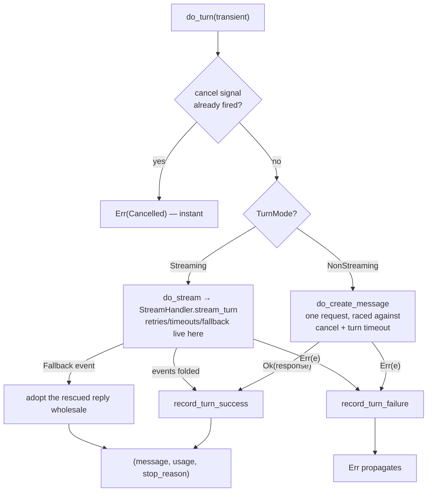

# The LLM turn — building and sending one model request

Every model call in the engine funnels through one small module: `src/engine/bare/llm_turn.rs`. This page follows a single turn from "the brain said `CallLLM`" to "the brain received the reply". Source of truth for anything about request construction.

---

## Building the request

```rust
fn build_turn_request(&self, transient: Vec<Message>) -> StreamRequest {
    let mut messages = transient;                    // contributors + memory (this turn only)
    messages.extend(self.machine.full_history());    // history + pending — the conversation
    StreamRequest::new(messages)
        .with_system(self.session.config.system_prompt.clone())
        .with_tools(self.build_tool_schemas())       // None if no tools registered
}
```

The order matters and is deliberate: **transient extras first, conversation after**. The extras (goal reminders, memory excerpts) frame the conversation, not the other way around.

What rides *alongside* rather than inside the request — **`RequestOptions`**:

- whatever you set with `set_request_options(...)` (e.g. `ToolConstraint::Strict`), and
- a per-request **model override** when the [fallback manager](../03-safety/04-fallback.md) is routing to a backup model.

Both apply to streaming and non-streaming paths alike.

### Counting the context

Before each call, the driver measures the payload the provider would actually receive:

```text
context estimate = tokens(history + pending)      // the conversation
                 + overhead_tokens()              // system prompt + tool schemas,
                                                 //   measured once, cached
                 + tokens(transient extras)       // contributors + memory, if any
```

That estimate feeds `machine.set_context_tokens(...)`, and it's the number the compaction trigger compares against the window. It deliberately over-reserves rather than under-counts (a turn running under a forced JSON format suppresses tools, so the tool-schema part of the overhead is counted but not sent — conservative is the safe direction).

---

## Two paths, one entry point



### The non-streaming path

One `create_message_with_options` call, wrapped in a **biased** `tokio::select!` against the cancel signal and the turn timeout. "Biased" means: if the cancel signal is already fired when we arrive, the provider call is never even started — cancellation is checked first, always.

The three arms of that race, exactly:

```text
biased select! {
    cancel.notified()                          → Err(Cancelled)             // polled first
    sleep(turn_timeout)                        → Err(Api("request timed     // if no timeout is
                                                 out after …"))               configured, this arm is
    client.create_message_with_options(...)    → the reply                    std::future::pending()
                                                                              — a future that never
}                                                                             resolves
```

That `pending()` trick is how "no timeout" is expressed *inside* a `select!` without special-casing the whole shape — an arm that can never win is a disabled arm. And note what this path does **not** have: retries. A non-streaming turn gets exactly one attempt under the deadline; all retrying lives in the [stream handler](../01-core-data/04-stream-events.md), one layer down. (The handler's rescue request is the one unstreamed call that gets careful treatment — deadline arithmetic and cancellation — because it exists to save an already-failing turn.)

### The streaming path

The turn is driven through `StreamHandler::stream_turn` ([full story](../01-core-data/04-stream-events.md)):

- Every accepted event goes to three places: observers (`on_text_delta` / `on_thinking_delta`), your `text_streamer` callback if set, and the engine's own `StreamAccumulator`.
- `AttemptReset` → the accumulator is wiped (a failed attempt's fragments must not mix with the retry's).
- `Fallback { message, ... }` → the accumulator is abandoned; the rescued complete reply is adopted as-is.
- The stop reason is taken from the final `MessageDelta`; usage comes with it (or from the accumulator).

> **Hint:** the turn timeout is shared across both paths — with streaming it's the handler's `total_stream_timeout` (default 5 min); without the `streaming` feature it's a fixed 5 minutes.

### Event routing, exactly

Every accepted event goes somewhere specific — this table is the whole routing decision:

| Event | Who sees it | Effect on the turn |
|---|---|---|
| `IndexedDelta` carrying Text | your `text_streamer` callback **and** observers (`on_text_delta`) **and** the accumulator | fragment joins the reply's text |
| `IndexedDelta` carrying Thinking | observers (`on_thinking_delta`) only | never enters the message — reasoning is stream-only |
| `IndexedDelta` carrying tool JSON | the accumulator only | fragment joins a tool call's argument string |
| `MessageDelta` with a stop reason | the engine | becomes the turn's `StreamStopReason` — an *unrecognized* string keeps the previous value rather than guessing |
| `MessageStart`, `PartStart`, `PartStop` | the accumulator | lane bookkeeping |
| `Ping` | nobody | a no-op |

Two defaults protect the turn when providers are sparse: if no stop reason ever arrives, the turn keeps `EndTurn` (the benign assumption); and only `ToolCall` continues the agent loop — `MaxTokens` and `StopSequence` end it with whatever text accumulated.

### Recording the outcome, exactly

`record_turn_success(turn, usage)`:
1. `fallback().record_success()` — which, during a recovery probe, is one of the two successes that close the breaker and route back to the primary.
2. `on_stream_success` fires, carrying the model that *actually served* the turn (not the configured one).

`record_turn_failure(turn, error)`, in strict order:
1. `Cancelled`? → short-circuit: breaker untouched, no event — a user stop is not a model failure.
2. Classify: `RateLimitEscalation` → `FailureKind::RateLimit`; everything else → `Transient`.
3. `record_failure` — the 3rd consecutive one trips the breaker and fires `on_fallback(from → to)`.
4. Already in `Fallback` and the active backup failed this turn too? → `mark_fallback_failed(active)` — that chain entry burns one of its two strikes, and routing advances next turn.
5. `on_stream_failure` fires (always, except cancel), and the original error returns to the caller unchanged.

And the routing that precedes all of this: `routed_model()` answers *the original* model while the breaker is `Primary`, *the active backup* while it's `Fallback` — written into the request's options as a per-request override, so the shared client is never mutated. When the serving model changes between turns, `note_routed_model` fires `on_model_switched` — your observability sees model churn even when you never configured any.

---

## After the reply: recording success and failure

Two small functions with outsized importance (they live in `emission.rs`):

**`record_turn_success(turn, usage)`** — tells the fallback breaker "one success" (which may close a recovery probe and route back to the primary model), then fires `on_stream_success` with the model that actually served the turn.

**`record_turn_failure(turn, error)`** —
- `Cancelled` short-circuits: breaker untouched, no failure event (a cancel is not a model failure).
- Rate-limit escalations count as `FailureKind::RateLimit`; everything else is `Transient`.
- If this failure **tripped** the breaker and a fallback model exists → `on_fallback` fires.
- If the breaker was already tripped and we're on a fallback that now failed too → the chain advances (that model gets marked as failed).
- Always fires `on_stream_failure` (except for cancel), and returns the original error to the caller.

These few lines are the entire glue between the LLM turn and the [model fallback system](../03-safety/04-fallback.md).

---

## The turn's paper trail

Every served turn appends a `Turn` to the current `Run` in `session.runs` — the audit trail:

```rust
Turn {
    turn: usize,                 // 0-indexed
    input: String,               // what the model was asked (display text)
    output: String,              // the model's text reply
    tool_calls: Vec<ToolCall>,   // any tool calls it requested
    input_tokens: u64,
    output_tokens: u64,
}
```

This trail is **never touched by compaction** — even after the conversation is rewritten into a summary, `session.runs` still holds every turn's original input and output. One nuance: a turn that runs *after* a compaction records the post-compaction (summarized) text as its context — the trail shows what each turn *actually saw*, which is internally consistent.

---

## Gotchas collected here

1. **Transients are ephemeral by design.** Contributor and memory messages are re-emitted fresh each turn and never persisted. Stop returning them and they vanish from the conversation — nothing to clean up.
2. **A deferred turn is invisible.** When the compaction trigger fires *after* transients were gathered, the turn defers without firing `on_turn_start`/`on_turn_end`. The retried turn (after compaction) fires them once, with a reserved budget so its transients fit.
3. **The model override beats your `RequestOptions.model`.** When the fallback manager routes to a backup, its routing decision overwrites any per-request model you set — that's the point of automatic failover.
4. **Usage may be `None`.** Providers don't guarantee usage reports (Ollama with `stream_usage: false`, some proxies). Code against `Option<Usage>`.

---

## Related pages

- [Stream events](../01-core-data/04-stream-events.md) — the handler's retry/fallback ladder.
- [Fallback](../03-safety/04-fallback.md) — what "the routed model" means.
- [The driver loop](02-driver-loop.md) — where this fits.
