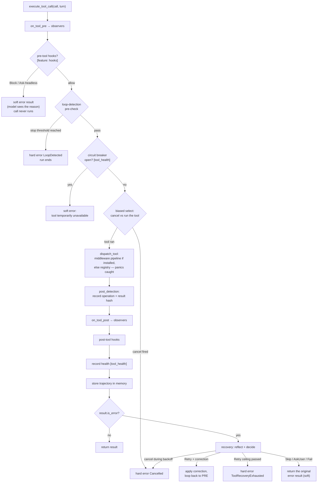

# Tool dispatch — every safety layer around every call

When the model asks "run tool X with input Y", that request travels through a carefully ordered pipeline before and after your tool code runs. This page covers the whole journey: `src/engine/bare/dispatch.rs`.

---

## The per-call pipeline — `execute_tool_call`

One function owns the entire lifecycle of a single tool call. Both dispatch modes (sequential and parallel) use **the same** function, so observers, detection, hooks, and health fire identically either way.



Reading the diagram's three outcome kinds:

- **Soft error** — `is_error: true` on an otherwise normal result. The run continues; the model reads the error and adapts. This is the destination for: hook blocks, breaker-open refusals, tool errors, panics, unknown tools, and unrecoverable-but-nonfatal failures.
- **Hard error** — an `Err(LoopError)` that ends the run: cancellation, a detected loop, or exhausted recovery.
- **Success** — the tool's result, recorded everywhere and returned.

### The attempt loop, in code order

The diagram above is the shape; here is the same lifecycle as the code runs it, per attempt (`attempt` starts at 0):

```text
execute_tool_call(call, turn):
  loop:
    notify_tool_pre                        (observers: on_tool_pre)
    pre-tool hooks                         (Block/Ask-headless → soft error, return)
    pre_detection                          (pure read of the loop window;
                                            hard stop → soft "dispatch refused" + Err)
    health gate [tool_health]              (allow_request? no → soft "temporarily
                                            unavailable", return)
    biased select!:
        cancel fired                       → Err(Cancelled)
        dispatch_tool(...)                 → the result (panics caught inside)
    ── the POST phase, in this exact order ──
    post_detection                         (record operation + result hash —
                                            the single write point per invocation)
    notify_tool_post                       (observers, with the result)
    post-tool hooks
    record_tool_health [tool_health]       (success/failure + duration)
    record_tool_memory                     (successful calls only)
    result not an error                    → return it
    recovery_wait_or_return:
        Retry { next_attempt, correction } → attempt = next_attempt
            (> 5 → Err(ToolRecoveryExhausted))
            apply correction, loop — PRE and POST re-fire
        otherwise                          → return the ORIGINAL result, soft
```

Two asymmetries in that ordering are deliberate: **detection records before observers fire**, so an observer reacting to a tool result is already seeing the detection state that includes it; and **health records under the *resolved* tool name** (what actually ran, post-renaming), while the pre-flight gate keys on the *requested* name — the only name that exists before dispatch.

### What the tool actually receives — `ToolContext`

Built per dispatch: `{ session_id, temp_dir, ..Default::default() }`. The `temp_dir` is the session's managed scratch (`{tmp}/loopctl-{session_id}/`), created lazily on first dispatch (idempotently; on failure, tools see the process-wide temp dir instead) and removed best-effort when the loop drops. A tool always has a writable scratch directory and never has to create one.

### What memory records about a call

Only **successful** calls, and lossy by design: input and result are each truncated to **500 characters**, joined as `"tool={name}; input={…}; result={…}"`, and stored as a `Trajectory` entry. Memory is for gist; the audit trail keeps the full text. Store failures are logged and swallowed — memory must never be why a turn failed.

### Panic isolation

`dispatch_tool` wraps your tool in `catch_unwind`. A panicking tool becomes a soft error — `"tool 'x' panicked: <message>"` — logged at error level, never crashing the run. This is one half of loopctl's no-panic guarantee; the other half is that the crate's own code contains no panics at all.

### Unknown tool names — two layers

1. **Names never advertised:** the brain classifies each requested call against the tool list it sent. Unknown names are pre-answered with "tool 'x' is not available" (`is_error: true`) and never dispatched.
2. **Advertised but missing at dispatch time** (e.g. renamed via middleware): the registry/pipeline miss produces `Tool not found: x. Available: a, b, c...` — and if you install `UnknownToolMiddleware`, it appends "Did you mean 'a'?" using a similarity match (default threshold 0.4). See [middleware](../03-safety/01-middleware.md).

---

## Recovery — when a tool fails

A failing tool enters the reflect-and-decide loop (full detail: [reflection](../03-safety/05-reflection.md)):

1. The **reflector** analyzes the failure (default: `NoopReflector` — marks everything non-recoverable).
2. The **recovery strategy** decides (default: `ExponentialBackoffRecovery::new(3)` — up to 3 retries, delays 100ms → 200ms → 400ms, capped at 30s).
3. On `Retry { delay }` with a **correction** (fixed input, or a different tool), the correction is applied and the call re-runs — the full pipeline, PRE and POST included, fires for every attempt.
4. A hard ceiling `MAX_RECOVERY_ATTEMPTS = 5` overrides everything: the 6th total call fails the run with `ToolRecoveryExhausted`.

> **Gotcha — the default is zero retries:** `NoopReflector` marks every failure non-recoverable, so stock defaults give each tool exactly one attempt. To get retries, install a reflector that judges recoverability (see [reflection](../03-safety/05-reflection.md)).

> **Gotcha — detection counts attempts, not calls:** every retry records into the loop detector. A flaky tool failing 3 times in a row looks (to the detector) like a repeating operation. The detector's result-hash awareness usually saves you — different error texts are different results — but identical error texts do stack up.

---

## Sequential vs parallel dispatch

Chosen per-run by `RunConfig.parallel_tool_dispatch`:

| | `Sequential` (default) | `Parallel` |
|---|---|---|
| Execution | one call at a time | concurrency-safe calls run together, up to `max_concurrency` (default 8) |
| Which calls | all | `Tool::is_safe_for_concurrent_execution(input)` says yes; same-`resource_key` calls are split into separate waves |
| Observer view | strictly paired pre/post per call | PREs batch, then POSTs; pair by `tool_call_id`, **not** arrival order |
| Results order | call order | **still the model's requested order** (filled by position) |
| Hard error | first error stops everything | the wave is cancelled; already-finished sibling results in that wave are **discarded** |
| Cancellation | checked between calls | checked at wave boundaries and per call |

Parallel mode falls back to the sequential path when a batch has fewer than 2 calls. Setting `max_concurrency: 1` makes parallel behave like sequential on the same code path (handy for debugging).

---

## What each result carries

`ToolDispatchResult` — the pipeline's output type:

```rust
pub struct ToolDispatchResult {
    pub tool_call_id: String,        // the model-issued id — the engine stamps this
                                     // AFTER the pipeline, authoritatively
    pub output: ToolContent,         // text or multipart; middlewares may have rewritten it
    pub is_error: bool,
    pub duration: Duration,          // real wall time (memoize hits replay the original's)
    pub resolved_tool_name: String,  // differs from requested when middleware renamed it
    pub display_hint: Option<DisplayHint>,
}
```

The engine stamps `tool_call_id` after the pipeline returns, unconditionally — a middleware that returns a stale or fabricated id (e.g. a cache replaying the first call's id) cannot break the model's call↔result pairing. Tests pin this exact guarantee.

---

## The middleware pipeline, in one paragraph

If you install a pipeline (`set_pipeline(builder)`), every dispatched call goes through your layers before reaching the registry core: timeout, permissions, output caps, caching, verification, redaction — in **registration order, first registered = outermost**. The core (`ToolCallMiddleware`) sits innermost and performs the actual registry lookup (with panic isolation). Full page: [middleware](../03-safety/01-middleware.md).

---

## Gotchas collected here

1. **Every retry re-fires everything** — observers, hooks, detection, health — per attempt, in both dispatch modes.
2. **`on_tool_call_received` fires once per call** (before any dispatch, including pre-answered unknown tools); `on_tool_pre` fires per **attempt**. The former carries the input JSON; the latter doesn't.
3. **A model turn with tools produces two `on_turn_end` events** — one for the LLM phase, one for the tool phase, with disjoint durations and the same token counts repeated (tools don't spend model tokens).
4. **Cancellation during recovery backoff** is honored — the retry wait is raced against the cancel signal.
5. **The breaker gate keys on the requested name**; health recording keys on the resolved name. Identical unless a middleware renames tools (no in-tree one does).

---

## Related pages

- [Waves](../09-principles/11-scheduling-parallel-work.md) — the planning algorithm behind parallel mode, from scratch.
- [Middleware](../03-safety/01-middleware.md) — the layers between the engine and your tool.
- [Reflection](../03-safety/05-reflection.md) — the recovery loop's brains.
- [Tools](../01-core-data/02-tools.md) — writing the tool itself.
