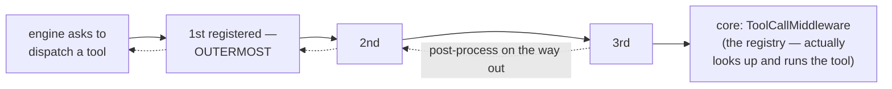

# Middleware — stackable layers around every tool call

Middleware is how you change what happens around tool calls **without touching tools or the engine**: kill slow calls, deny dangerous ones, cap giant outputs, cache repeats, verify writes. You register layers in a pipeline; every dispatched call flows through them. Sources: `src/middleware.rs` and `src/middleware/*.rs`.

---

## The pipeline model



- **Registration order = execution order.** The first registered layer is outermost: its "before" logic runs first, its "after" logic runs **last** (so an outer output cap bounds whatever inner layers append).
- Each layer receives a mutable **context** and the rest of the chain. It can inspect/rewrite the call, pass it on, and post-process the result — or return a result directly and **short-circuit** everything inside.
- The innermost core (`ToolCallMiddleware`) performs the registry lookup, runs the tool (with panic isolation), and turns outcomes into results.

```rust
pub trait ToolMiddleware: Send + Sync {
    fn name(&self) -> &str;
    fn dispatch<'a>(&'a self, ctx: &'a mut ToolDispatchContext,
                    next: &'a ToolPipeline)
        -> Pin<Box<dyn Future<Output = ToolDispatchResult> + Send + 'a>>;
}
```

### What a layer can touch — `ToolDispatchContext`

| Field | What it is | Layers may... |
|---|---|---|
| `tool_name` | the requested tool | rewrite it (routing/aliases) — the core looks up the *rewritten* name |
| `input` | the JSON arguments | inspect, rewrite |
| `call_id` | the model-issued id | read (the engine re-stamps the final result authoritatively) |
| `turn_number` | which turn | read (per-turn limits, cache TTL) |
| `cancel` | `Arc<CancelSignal>` | poll in long waits |
| `permission` | current `PermissionCheck` | read/set (the permission layer reads it) |
| `tool_context` | what the tool receives | enrich (host state injection — the sanctioned point) |

### The result — `ToolDispatchResult`

A struct, not an enum: `{ tool_call_id, output: ToolContent, is_error: bool, duration, resolved_tool_name, display_hint }`. "Error" means the `is_error` flag — a **soft** error the model sees. Hard failures (`LoopError`) exist only outside the pipeline. Layers rewrite `output` (truncate, redact, append diagnostics) but generally leave `is_error` alone.

### Installing

```rust
let builder = ToolPipeline::builder()
    .with_middleware(PermissionMiddleware::deny_all())
    .with_middleware(TimeoutMiddleware::from_secs(30))
    .with_middleware(UnknownToolMiddleware::new(registry_arc));
agent.set_pipeline(builder)?;   // the loop injects its own registry as the core —
                                // do NOT call .with_core() yourself
```

`set_pipeline` must run before the first `run()`. Direct use without an engine: `ToolPipeline::new(registry)` (zero layers) or the builder's `.with_core(registry)` + `.build()`.

---

## The shipped layers

### `TimeoutMiddleware` — a per-call clock

`TimeoutConfig { timeout, retry_on_timeout, max_retries }`, defaults: **2 minutes, no retry**. On timeout: soft error `"Tool 'x' timed out after Ns"` — the in-flight future is dropped, no partial output. With retries enabled, the deadline **doubles** each attempt. `TimeoutMiddleware::none()` opts out; `from_secs(n)` is the shortcut.

### `PermissionMiddleware` — your policy function

```rust
PermissionMiddleware::deny_all()      // block everything ("blocked by policy")
PermissionMiddleware::allow_all()     // pass-through
PermissionMiddleware::from_context()  // honor ctx.permission (set by the engine/host)
    .with_check(|ctx| {               // or decide yourself:
        if ctx.tool_name == "rm" { PermissionCheck::deny("destructive in this session") }
        else { PermissionCheck::allow() }
    })
    .with_ask_resolver(|prompt, tool| async move { ask_the_human(prompt).await })
```

`PermissionCheck` is the decision type: `Allow`, `Deny { reason }`, `Ask { prompt }`, `Modify { modified_input }`. `Deny` short-circuits (soft error, zero duration, nothing inside runs). `Ask` resolves through your async resolver — **without one, Ask is denied** (headless-safe). `Modify` rewrites the input and proceeds (not re-validated against the schema — your responsibility). More: [the permission page](08-permission.md).

### `OutputLimitMiddleware` — a hard cap on tool output

`OutputLimitMiddleware::new(max_chars)` — character-based (never cuts inside a UTF-8 character), keeps the **head** of the text, appends `\n[truncated]` within the budget. Multipart outputs share one budget across text parts; images pass through. `new(0)` disables it. Crucial for agents that read big files — an uncapped `Read` can blow the context window in one call.

### `UnknownToolMiddleware` — "did you mean...?"

When a dispatched call misses the registry, this layer appends `Did you mean 'closest_name'?` to the error text — computed by longest-common-subsequence similarity (threshold 0.4, tunable). The suggestion lookup uses the post-dispatch name, so it stays correct even behind renaming middleware. (Names the model was never shown are pre-answered by the engine instead and never reach this layer.)

### `MemoizingMiddleware` — a per-turn-window cache

Caches results for named tools (e.g. `Read`, `Glob`, `Grep`), invalidated by named *write* tools (e.g. `Write`, `Edit`) via declared file paths.

```rust
MemoizingMiddleware::new(
    vec!["Read".into(), "Glob".into()],     // cached tools (exact names)
    vec!["Write".into(), "Edit".into()],    // invalidating tools
    Arc::new(path_extractor),               // maps (tool, input) → file paths
    5,                                      // TTL in turns; 0 disables caching
)
```

Rules that matter: cache key = tool name + hash of the input (key order canonicalized); **errors are never cached; write results are never cached; a failed write doesn't invalidate** (the filesystem didn't change); a hit appends `[cached]` and carries the *requesting* call's id (the engine stamps ids authoritatively anyway); hits replay the original duration (health stats track real latency). No capacity limit — pair with a short TTL for long sessions.

### `VerifyMiddleware` — prove writes worked

Runs your `Verifier` after write-class tools succeed and appends the verdict:

```rust
impl Verifier for CargoCheck {
    async fn verify(&self, ctx: &ToolContext, _tool: &str) -> VerifyResult {
        // run `cargo check` in ctx.cwd, return pass/fail + diagnostics
    }
}
VerifyMiddleware::new(Arc::new(CargoCheck), vec!["Write".into(), "Edit".into()])
```

Appends `"\n\n[verify] passed: ..."` or `"\n\n[verify] failed: ..."` to the output. **Never sets `is_error`** — a failed verify on a successful write stays a success; the model reads the diagnostics and decides. Skipped on tool errors. `NoopVerifier` is the do-nothing default used by the [Constrained preset](../06-integration/04-presets.md).

### `RedactingMiddleware` — scrub secrets [feature: redaction]

`RedactingMiddleware::new(SecretPatternSet::default_common())` replaces secrets in tool output with `[REDACTED:<kind>]`. Curated patterns: `bearer` (Authorization headers), `api_key_kv`, `aws_access_key` (AKIA...), `pem_private_key`, `github_pat` (ghp_...), `gitlab_pat` (glpat-...), plus an entropy heuristic: any ≥32-char token with ≥4.5 bits/byte randomness (base64 secrets yes, hex hashes no). Add your own with `SecretPatternSet::default_common().with_pattern(...)`. Never sets errors; images untouched; purely post-execution.

### `SafetyShieldMiddleware` — risk-based blocking [feature: tool_shield]

Consults a `ToolSafetyShield` (default: `UnixShield`) before watched tools run; `Block` decisions become soft errors, `Warn` decisions log and proceed; every admitted call is recorded so multi-call rules ("download then pipe to shell") can fire across turns. Full story: [the shield page](07-tool-shield.md).

---

## Ordering — the part everyone gets wrong

First-registered is outermost. The canonical order (used by `ConstrainedProfile`):

```text
output_limit → verify → memoize → [core]
```

Why: memoize innermost caches the **raw** result (the cache never holds verify diagnostics, and every write is verified anew); the cap outermost truncates the **combined** output (verify diagnostics can't escape the cap).

More rules of thumb:

| Layer | Recommended slot | Why |
|---|---|---|
| `PermissionMiddleware` | outermost (or near) | deny before any work — tests pin a deny returns in ~0ms |
| `RedactingMiddleware` | outer, before verifiers | also scrubs what inner layers append (a verifier echoing tool output would otherwise re-leak) |
| `SafetyShieldMiddleware` | **inside** renaming layers, **outside** memoize | evaluate the name the registry will execute; cache-served repeats still get scored |
| `TimeoutMiddleware` | around everything slow | bounds the layers inside it too |
| Host layers that must see original calls | mind the preset rule | anything chained onto `ConstrainedProfile::pipeline_builder()` lands **inside** its memoize layer |

And three universal guarantees: the engine stamps `tool_call_id` after the pipeline (middleware ids can't corrupt pairing); `DisplayHint` and `duration` survive every shipped layer; middleware is invisible to parallel-dispatch planning (waves come from tool declarations, not layers).

---

## Related pages

- [Caching & invalidation](../09-principles/09-caching-and-invalidation.md) — the memoizer's algorithm: keys, TTL, epochs.
- [Text matching](../09-principles/12-text-matching.md) — the LCS math behind "did you mean...?".
- [Tool dispatch](../02-engine/04-tool-dispatch.md) — where the pipeline sits.
- [Permission](08-permission.md) — the decision type in depth.
- [File reference: middleware.rs](../07-file-reference/middleware.md)
