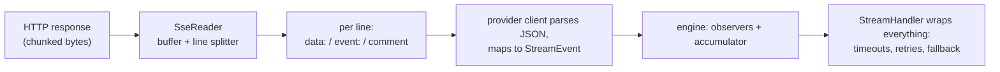

# SSE — how streaming bytes become events

**SSE (Server-Sent Events)** is the text protocol most providers use to stream replies: the server keeps the HTTP connection open and pushes lines. This page explains the shared reader under the provider clients — useful when debugging streams or writing your own client. Source: `src/provider/sse.rs`.

---

## The wire format

An SSE response is a stream of lines:

```text
event: content_block_delta        ← optional event name
data: {"type":"content_block_delta", ...}   ← the JSON payload
                                    ← blank line = event boundary
: keep-alive                      ← colon lines are comments; ignore
data: [DONE]                      ← OpenAI's end sentinel
```

The reader (`SseReader`) handles the parsing rules that matter:

- **`data:` and `event:` prefixes** accept exactly one optional space after the colon (`data:{...}` and `data: {...}` both work; field names are case-sensitive).
- **Line endings** — both `\n` and `\r\n` (the reader trims).
- **Bytes, not strings** — buffering is byte-oriented on purpose: TCP chunks don't respect character boundaries. Decoding happens per *complete* line; a genuinely invalid-UTF-8 line is an error, not a crash.
- **Comment lines** (starting with `:`) are skipped — that's how providers send keep-alives.
- **Multi-line data** (Anthropic) — consecutive `data:` lines of one event concatenate with newlines.
- **A 1 MiB line cap** — one endless line (a broken server) is a protocol error, not unbounded memory.

### The reader's line state machine

How those rules compose into running code — the reader is a small loop over a byte buffer:

```text
fill buffer from the socket (arbitrary chunk boundaries)
loop:
    find the next b'\n' in the buffer
    none yet?  → wait for more bytes (a partial line survives across chunks)
    take the bytes up to it, trim a trailing b'\r'        ← CRLF handled here
    blank line? → dispatch the accumulated event (data lines joined with \n), reset
    starts with b':'? → comment: skip (keep-alives die here)
    "data:" prefix (one optional space)? → append the rest to the current event's data
    "event:" prefix (one optional space)? → record the event name
    anything else → skip (unknown fields are legal SSE; ignore them)
    line longer than 1 MiB? → protocol error
```

Watching it eat a chunk boundary makes the byte-orientation obvious:

```text
socket chunk 1:  b'data: {"type":"content_block_del'
socket chunk 2:  b'ta","index":0}\n\ndata: [DONE]\n\n'
                                     ── after chunk 2, two complete lines
                                        surface: the payload, then the sentinel
```

A string-oriented reader that decoded eagerly could split a multi-byte UTF-8 character at exactly that boundary — which is why decoding happens per *complete* line only.

## The `[DONE]` sentinel

OpenAI-family servers end their stream with `data: [DONE]`. The reader records seeing it; the OpenAI client uses it to distinguish *"the server said we're done"* from *"the connection just died"* — the difference between a completed turn and a truncated one. Anthropic and Gemini use their own terminal signals (`message_stop` event; `finishReason` chunk) and have no sentinel.

## Where retry lives (not here)

The SSE layer is a **parser, not a reconnector**. If the stream dies mid-reply, the reader just ends; the provider client reports the events it got (no fake terminal); and the decision to retry — with backoff, rate-limit honoring, or non-streaming rescue — belongs to the [StreamHandler](../01-core-data/04-stream-events.md), one layer up. Keeping these apart is why a retry can transparently replay a whole turn.

## Reading flow, end to end



## Debugging tips

- A stream that "ends silently" almost always means the terminal event never arrived — look for `truncated` outcomes in handler logs, not exceptions.
- Gibberish or empty events usually mean the base URL is wrong for the protocol (e.g., pointing an OpenAI client at a non-OpenAI path).
- If you implement a custom client over SSE, remember the two invariants the engine depends on: **events in the standard order** and **never a synthetic `MessageStop` on failure**.

## Related pages

- [Stream events](../01-core-data/04-stream-events.md) — the vocabulary and the handler.
- [API client](../01-core-data/03-api-client.md) — implementing your own.
