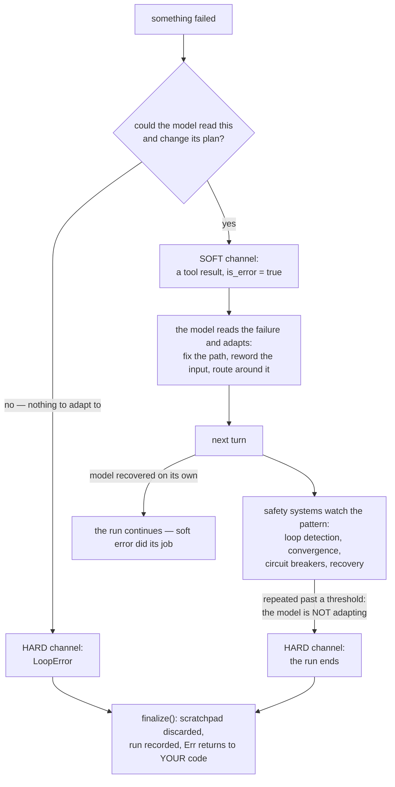

# Soft and hard errors — tell the model, or end the run

When something fails inside an agent, there are exactly two places the failure can go:

- **Soft** — it becomes a *message the model reads*, and the run continues.
- **Hard** — it becomes a `LoopError` returned to *your code*, and the run ends.

Which one to pick is the single most consequential error-design decision in an agent framework, and loopctl answers it with a principle: **the model is a collaborator that can read and adapt — most failures are information for it, not emergencies for you.** This page explains the principle, where loopctl draws the line, and what the choice costs.

---

## The failure that teaches the pattern

A classic first agent looks like this: the model asks to read `src/mian.rs` (a typo). The tool call fails. The program propagates the error. The run crashes.

Now watch the same moment with soft errors: the tool result comes back as a message — *"tool call failed: file `src/mian.rs` not found"* — and the model reads it, says "oops," and asks for `src/main.rs`. The run succeeds, and nobody was paged.

The model misspells paths, guesses at argument shapes, asks for tools that don't exist, and sends queries that time out — *constantly*, because it is guessing its way through your program's interface. Each of those is a normal, expected, recoverable moment. Crashing on them means crashing on the normal case. So: **if the model could plausibly read the failure and change its plan, the failure is soft.**

Hard errors are reserved for the cases where continuing would be pointless or impossible: the network is gone, the context cannot fit at all, the model is stuck in a [detected loop](../03-safety/02-loop-detection.md), the user pressed Ctrl-C. Nothing the model *reads* will fix those — so it never sees them; your code does, as a typed `LoopError`.

The whole philosophy in one picture — including the escalation path that keeps softness from becoming a trap:



---

## The two channels, side by side

| | Soft error | Hard error |
|---|---|---|
| Shape | a tool result with `is_error: true` | a `LoopError` value |
| Who sees it | **the model** (as message text) | **your code** (as `Err`) |
| The run | continues | ends now |
| The scratchpad | kept — the failure is part of the story | discarded — failed runs leave no trace |
| Example | "file not found" | network unreachable mid-turn |

Everything the dispatcher can produce lands on one side deliberately:

| Failure | Channel | Why |
|---|---|---|
| Tool returns `Err` | soft | the model can fix its input |
| Tool **panics** | soft | caught (`catch_unwind`), reported as text — the model retries or routes around it |
| Tool name unknown | soft | the brain pre-answers "tool 'x' is not available"; the model corrects the name next turn |
| A hook vetoes the call | soft | "blocked by policy: {reason}" — the model picks another route |
| Circuit breaker refuses a sick tool | soft | "temporarily unavailable" — the model routes around it |
| Recovery strategy gives up (skip/fail) | soft | the analysis *and* the failure go back to the model |
| Cancellation | hard | the user ended this; nothing to adapt to |
| Context can't fit after compaction | hard | no request can be built that would work |
| Loop / convergence stop | hard | the model already proved it won't adapt |
| Recovery retries past the ceiling (5) | hard | the model's retries aren't converging; stop wasting tokens |

Read the two columns of "why" and the rule falls out: **soft failures are ones the model's next turn can act on; hard failures are ones no next turn can save.**

> **The no-panic promise is this principle taken to the limit.** The crate compiles with `panic = "deny"` for itself, and a tool that panics anyway is *caught at the dispatch boundary* and converted to a soft error. A crashing tool becomes one more piece of information in the conversation instead of a dead process.

---

## What softness costs — and what pays for it

Soft errors are permissive by design, and a permissive system can be *trapped* by it: a model that responds to "file not found" by asking for the same missing file, again and again, politely reading its own failure every turn. Every soft error is also an invitation to loop.

That is not a flaw in the principle; it is the boundary condition that shapes the rest of the safety stack. loopctl keeps errors soft *because* separate systems watch for the pathological consequences:

- The [loop detector](../03-safety/02-loop-detection.md) catches identical calls returning identical failures — the "model ignoring its errors" case — and stops the run at the hard layer.
- [Convergence detection](../03-safety/03-convergence.md) catches the answer-side version (near-identical final replies).
- The [recovery](../03-safety/05-reflection.md) layer adds memory between "error seen" and "retry blindly" — analyze, correct, back off.
- Circuit breakers ([fallback](../03-safety/04-fallback.md), [tool health](../03-safety/06-tool-health.md)) turn *sustained* soft failure into temporary refusal — still soft, still model-visible.

The clean way to hold the whole design in your head:

> **Soft errors handle the *expected* failure; the safety systems handle the *repeated* failure.**

## The exact words the model reads

Soft errors are text the model will *reason about* — so their wording is part of the design. The actual shapes:

| Producer | Result text (shape), `is_error: true` |
|---|---|
| Brain's pre-answer (name never advertised) | `tool 'x' is not available` |
| Registry miss at dispatch | `Tool not found: x. Available: a, b, c...` (+ `Did you mean 'a'?` if the [suggestion layer](../03-safety/01-middleware.md) is installed) |
| Tool panicked | `Tool "x" panicked: <message>` — the payload is recovered by downcasting to `&str`/`String`, else `(unknown payload)` |
| Timeout middleware | `Tool 'x' timed out after Ns` |
| Circuit breaker refusal | `tool temporarily unavailable: circuit breaker open` |
| Loop-detector pre-dispatch refusal | `dispatch refused before execution: <the detection error>` |
| Hook veto | the hook's own reason text |
| Recovery gives up | the **original** failing result, verbatim — analysis never rewrites history |

Each string is written to be *acted on*: it names the thing that failed and, where possible, the alternatives. A stack trace is none of that; a phrase like "did you mean" is.

## The recovery ceiling, precisely

The retry machinery around soft errors has one number that overrides everything: `MAX_RECOVERY_ATTEMPTS = 5`. How it actually counts:

```text
attempt 0  = the original call (failed)
attempt 1..5 = retries granted by the recovery strategy
attempt 6 would be the 6th total call → ToolRecoveryExhausted { attempts: 6 }
```

The ceiling is enforced **twice, deliberately**: the strategy receives `max_attempts = 5` as an input to its decisions, *and* the driver independently stops any strategy that keeps saying "retry" past it. A misbehaving custom strategy cannot turn "soft errors plus retries" into an infinite loop — the hard channel catches what the soft channel's judgment misses. (Hence the error payload's quirk: `attempts` counts total *calls*, so 6 means "original plus 5 retries.")

One more precision: when recovery answers `Skip`, `AskUser`, or `Fail`, the *original* failing result is returned soft — not the reflector's analysis, not a summary. The model sees exactly what went wrong, unedited; any correction is applied to the *retry's* input, never to the record of what happened.

## Where each hard error is born

The hard channel is small enough to map completely — every `LoopError` that ends a run through this philosophy, and the single spot it comes from:

| Error | Born at |
|---|---|
| `Cancelled` | any cancellation checkpoint ([the signal](../02-engine/05-cancellation.md)) |
| `ContextExceeded` | compaction overflow, or the no-progress guard inside the compaction feed |
| `LoopDetected` | the loop detector's stop threshold, or convergence with action `Stop` |
| `UserInputRequired` | convergence with action `AskUser` — the one "hard" error that asks for a human, not a fix |
| `ToolRecoveryExhausted` | the ceiling above |
| `FallbackExhausted` | every model in the chain spent while the breaker's cooldown runs |

Note what's *absent*: no tool-level error appears here. A tool cannot end a run — ever. The engine decides when runs end; tools only contribute information.

---

## Writing your own tools with the principle

When your tool's function fails, you choose the channel too:

- Return `Err(...)` from `Tool::call` — or a `ToolOutput` marked error — and you stay **soft**: the text reaches the model. Do this for everything the model could fix: bad paths, invalid arguments, upstream 404s, empty results.
- There is no tool-level way to force a hard error, and that is deliberate — the engine decides when runs end, not tools. (If a failure truly must stop the world, the *host* observes it — [observers](../04-extensions/01-observers.md) and [hooks](../04-extensions/02-hooks.md) can fire the cancel signal.)

And one craft rule: **write error text for the model, not for a log.** "File `/etc/osts` not found; did you mean `/etc/hosts`?" is something the model can act on. A stack trace is not.

---

## Related pages

- [Errors](../01-core-data/05-errors.md) — every `LoopError` variant and its meaning.
- [Tools](../01-core-data/02-tools.md) — the tool-side surface of this split.
- [Loop detection](../03-safety/02-loop-detection.md) — what catches soft errors being ignored.
- [Circuit breakers](06-circuit-breakers.md) — refusing *reliably* failing things, softly.
