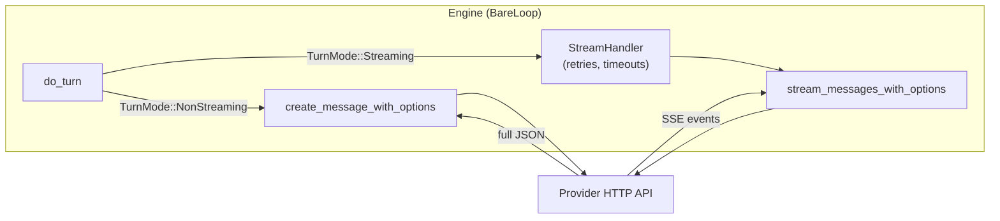

`ApiClient` is the border between loopctl and the outside world. Implement it, and the engine can talk to *anything* — a big cloud provider, a local model server, or a fake in your tests. Sources: `src/api.rs`, `src/api/error.rs`.

---

## The trait

```rust
pub trait ApiClient: Send + Sync {
    // Required:
    fn model(&self) -> String;                       // model name, e.g. "gpt-4o"
    fn stream_messages(&self, request: &StreamRequest)
        -> Pin<Box<dyn Stream<Item = Result<StreamEvent, ApiError>> + Send + 'static>>;
    fn create_message(&self, request: &StreamRequest)
        -> Pin<Box<dyn Future<Output = Result<NonStreamingResponse, ApiError>> + Send + '_>>;

    // Provided (override to opt in):
    fn set_model(&self, _model: &str) -> bool { false }
    fn base_url(&self) -> String { String::new() }
    fn stream_messages_with_options(&self, request: &StreamRequest, options: RequestOptions)
        -> Pin<Box<dyn Stream<...>>>;      // default: rejects non-empty options loudly
    fn create_message_with_options(&self, request: &StreamRequest, options: RequestOptions)
        -> Pin<Box<dyn Future<...>>>;      // default: rejects non-empty options loudly
    fn extract_structured(&self, message: &Message) -> Value;  // default: tool input or JSON-ish text
}
```

Two ways to get a reply:

- **`stream_messages`** — the reply arrives as a stream of small events (pieces of text as they are produced). Used in `TurnMode::Streaming`.
- **`create_message`** — the reply arrives whole, in one piece. Used in `TurnMode::NonStreaming`, and as the rescue path when streaming keeps failing.

**`StreamRequest`** carries the conversation to send:

```rust
StreamRequest::new(messages)           // Vec<Message> — the conversation
    .with_system(Some("You are...".into()))  // optional system prompt
    .with_tools(Some(schemas))         // optional tool list; None = no tools offered
```

**`NonStreamingResponse`** carries the reply: `{ message: Message, stop_reason: StreamStopReason, usage: Option<Usage> }`.

### Rules implementors must follow

- The stream returned by `stream_messages` must be `'static` — **clone out of `&self` everything you need**; do not borrow the client in the stream.
- Always emit events in the standard order: `MessageStart → (PartStart → deltas → PartStop)* → MessageDelta → MessageStop`. The [stream events page](/core-data/stream-events/) defines each.
- Never emit a synthetic `MessageStop` on failure — the *absence* of the stop event is how the engine detects a cut-off stream.

### The options methods — fail loudly

`RequestOptions` carries three optional extras: a per-request **model override**, a **response format** (forced JSON), and a **tool constraint** (strict tool schemas). If your client cannot honor one of these, the default `*_with_options` implementations **reject the request with an `ApiError`** rather than silently dropping it. Silently ignoring a model override, for example, would send the request to the wrong model. Override these methods only to actually support the options.

---

## `ApiError` — provider errors, classified

```rust
pub enum ApiError {
    Api(String),                        // generic API failure
    RateLimit { retry_after: Option<Duration>, message: String },  // 429 / 503 / 529
    Auth(String),                       // bad key / no permission
    Http(String),                       // HTTP status errors ("HTTP 429: ...")
    Json(serde_json::Error),            // unparseable response
    Io(std::io::Error),                 // local IO failure
    Tool(String), Config(String), Interrupted, Other(String),
}
```

The interesting part is not the shapes — it's the three questions every error can answer:

| Question | Method | True for |
|---|---|---|
| Worth retrying? | `is_retryable()` | rate limits, timeouts, 5xx server errors, connection errors. **False** for auth failures and other 4xx — fail fast, don't burn retries on a bad key. |
| Are we being throttled? | `is_rate_limited()` | 429/503/529 in any shape, and messages mentioning "rate limit" |
| Is the request too big for the window? | `is_context_overflow()` | messages mentioning "context", "too many tokens", "exceeds maximum", "max tokens" |

Each error also has a stable numeric **`ErrorCode`** (e.g. 1002 = rate-limited, 1101 = auth failed) — handy for logging and dashboards.

`RateLimit.retry_after` is the provider's parsed "wait this long" hint (`Retry-After` header), so nothing downstream has to re-parse it.

---

## Ready-made clients

You usually will not implement this trait at all — loopctl ships clients:

| Client | Feature | Notes |
|---|---|---|
| `OpenAiClient` | `openai` | Also the base for Ollama, DeepSeek, Grok/xAI, Azure OpenAI, Moonshot, self-hosted. |
| `AnthropicClient` | `anthropic` | Claude; also used by Z.ai. |
| `GeminiClient` | `gemini` | Google Gemini. |
| `BedrockClient` | `bedrock` | AWS Bedrock, with request signing. |
| `MockApiClient` | `testing` | Scripted fake for your tests. |

Each has `from_env()` (reads the obvious environment variables), a builder (`with_api_key`, `with_model`, `with_base_url`, timeouts...), and full support for streaming, tool calls, and `RequestOptions`. Full details: [the providers section](/providers/overview/).

## The shared HTTP layer — caps, timeouts, error classification

Underneath every shipped client sits one shared HTTP layer with three hard numbers and a deliberate timeout philosophy:

| Guard | Value | Enforced |
|---|---|---|
| Max response body | **10 MB** | twice: pre-read via `Content-Length`, *and* chunk-by-chunk during the read — a hostile server lying about its length never causes the allocation |
| Max error-diagnostic body | **8 KiB** | error bodies are for humans reading logs, not for parsing; the rest is dropped |
| Max SSE line buffer | **1 MiB** | a newline-less event from a broken server is a protocol error, not unbounded memory |

**Timeout semantics — the subtle one.** The HTTP-level `with_timeout` (default **120 s**) is a *read/idle-gap* timeout, **deliberately not a total deadline**: a healthy stream that produces an event every few seconds can legitimately run for minutes. Total-duration bounding belongs to the [StreamHandler](/core-data/stream-events/)'s 5-minute clock — each layer owns the kind of time it can actually judge. Around it: `with_connect_timeout` (default 10 s), TCP nodelay on by default, keepalive off, pool idle timeout 90 s.

**Error classification happens in one place.** Every non-2xx response funnels through a single construction site that reads `Retry-After` (both spellings: delta-seconds `"12"` and the HTTP-date form) and classifies by status: `401` → invalid-key auth error (permanent), `403` → auth, `429 | 503 | 529` → `RateLimit` carrying the parsed hint, anything else → plain HTTP error with the (bounded) body attached. One consequence worth knowing: **mid-stream SSE errors cannot carry `Retry-After`** (there's no header on an event) — they're classified into the rate-limit family by their payload instead, and the hint is `None`.

And one security habit baked in: credential headers (`Authorization`, `x-api-key`, `x-goog-api-key`, `X-Amz-Security-Token`) are marked **sensitive** — redacted in debug output and excluded from HTTP/2 header-compression indexing, so keys don't linger in logs or cross-stream caches.

---

## Writing your own — a sketch

```rust
struct MyClient { http: reqwest::Client, base: String, key: String }

impl ApiClient for MyClient {
    fn model(&self) -> String { "my-model".into() }

    fn stream_messages(&self, request: &StreamRequest)
        -> Pin<Box<dyn Stream<Item = Result<StreamEvent, ApiError>> + Send + 'static>>
    {
        // Clone everything you need out of &self here, then:
        Box::pin(try_stream! {
            yield Ok(StreamEvent::MessageStart(/* ... */));
            for chunk in call_your_api(&self.base, &self.key, request).await? {
                yield Ok(StreamEvent::IndexedDelta(/* ... */));
            }
            yield Ok(StreamEvent::MessageStop);
        })
    }

    fn create_message(&self, request: &StreamRequest)
        -> Pin<Box<dyn Future<Output = Result<NonStreamingResponse, ApiError>> + Send + '_>>
    {
        Box::pin(async move { /* one request, one response */ })
    }
}
```

Wire it in: `BareLoop::new(Arc::new(my_client), tools, config)` — the engine treats every client identically. `set_model` returns `false` by default; return `true` when your client supports hot-swapping the model, which unlocks [`switch_model`](/engine/model-switch/).

> **Hint — the `base_url` matter:** `base_url()` keys the built-in [rate limiter](/providers/overview/): requests to the same base URL share one token bucket. The default is `""`, so custom clients that don't override it all share one bucket. Override it if that matters to you.

---

## How the engine uses the client



- In **non-streaming** mode, each turn is one `create_message_with_options` call, raced against the cancel signal.
- In **streaming** mode, the turn goes through `StreamHandler` (retry, per-event timeout, rate-limit ladder, non-streaming rescue), which calls `stream_messages_with_options` — possibly several times.
- On [fallback](/safety/fallback/), the engine adds a per-request model override via `RequestOptions` — one shared client can serve two models without cross-talk.

---

## Related pages

- [Stream events](/core-data/stream-events/) — the event vocabulary your client must speak.
- [Providers](/providers/overview/) — the shipped clients, env vars, defaults.
- [Testing](/integration/testing/) — `MockApiClient`, the zero-infrastructure client.
