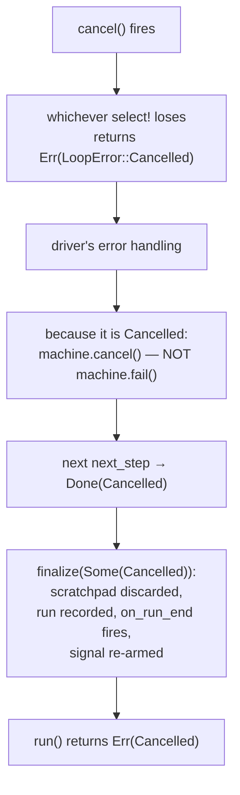

Users press Ctrl-C. Servers shut down. Tasks get abandoned. loopctl's answer is one small type, `CancelSignal` (`src/cancel.rs`), honored at every level of the engine. This page explains the mechanism, every checkpoint, and the "one cancel = one cancelled run" guarantee.

---

## The signal

```rust
let signal: Arc<CancelSignal> = agent.cancel_signal();  // share it anywhere

signal.cancel();                  // fire — idempotent, wakes every waiter
signal.is_cancelled();            // non-blocking check: true/false
signal.notified().await;          // async wait: completes when fired
signal.reset();                   // re-arm for the next run (the engine does this for you)
```

Inside, it wraps a tokio `CancellationToken` — a purpose-built primitive that avoids the classic race of hand-rolled `AtomicBool` + notification pairs (check-then-act races where a cancel arrives exactly between "I checked" and "I started waiting"). The token is one-shot: once fired it stays fired, so `reset()` swaps in a *fresh* token rather than un-firing the old one.

**The wiring you'll actually write** — Ctrl-C handler:

```rust
let cancel = agent.cancel_signal();
tokio::spawn(async move {
    if tokio::signal::ctrl_c().await.is_ok() {
        cancel.cancel();
    }
});
```

Any task holding a clone can fire it — a UI button, a watchdog, a test.

---

## Where cancellation is honored

The engine checks the signal at five granularities, so a cancel lands quickly no matter what the run is doing:

| Granularity | Where | Mechanism |
|---|---|---|
| Before any turn's work | `do_turn` entry | early guard: return `Err(Cancelled)` before touching the provider |
| During a model call | non-streaming path | biased `select!`: cancel raced against the provider future |
| During a streaming reply | the stream handler | every event poll races the cancel signal |
| During one tool call | `execute_tool_call` | biased `select!`: cancel raced against the tool future |
| Between tools / during retry backoff | dispatcher, recovery | poll checks and raced sleeps |

"Biased" means the cancel branch is polled **first** — if the signal is already fired, the work future is never even started. Cancellation always wins the race.

---

## What a cancel actually does



Three deliberate properties:

1. **Cancelled is not Failed.** The brain routes it to `Terminal(Cancelled)`, not `Terminal(Failed)`. Your error handling can treat them differently — cancel is expected, failure is not. Both discard the scratchpad, keeping the conversation clean.
2. **Partial work is not committed.** A cancelled run's half-finished turns never glue into history. The audit trail (`session.runs`) still records the run, with `stop_reason: Cancelled`.
3. **The signal re-arms after the run, not before.** This ordering has a subtle guarantee behind it:

> **Why re-arm at the end?** Suppose you fire cancel while no run is active, then call `run()`. If `run()` cleared the signal at its top, the pending cancel would vanish — your agent would look permanently dead or the cancel silently ignored. Instead: `finalize()` re-arms *after* the run observes and reports the cancellation. One cancel always produces exactly one `Err(Cancelled)`, and the next run starts fresh.

---

## Cancel mid-tool: what your tool should know

The engine drops your tool's future when a cancel lands mid-call. Rust's async dropping means **execution just stops at the next await point** — no destructors run "politely," no cleanup handler fires. The practical rule:

> **Write tools that are safe to abandon mid-write.** Write to a temp file and rename at the end; use transactions rather than half-states; keep external side effects (HTTP calls to other services) idempotent or resumable.

The same applies to tools served over MCP — the server adapter races each call against the request's cancellation token and drops in-flight futures on cancel.

---

## Cancelling from inside a run

You don't need a separate task. Anything holding the `Arc<CancelSignal>` can fire — including code inside an [observer](/extensions/observers/) or a [hook](/extensions/hooks/) running on the engine's tasks. The next checkpoint (almost always within milliseconds) picks it up.

Tests pin the whole ladder: cancel during the model call, during a stream, during a tool, during retry backoff, before the run starts — every one returns `Err(Cancelled)` promptly, and the agent is usable again immediately after.

---

## Related pages

- [Cooperative cancellation](/principles/cooperative-cancellation/) — the pattern behind this design: why a shared flag beats a kill switch.
- [Termination](/engine/termination/) — how Cancelled compares to the other endings.
- [The driver loop](/engine/driver-loop/) — the error path a cancel travels.
- [File reference: cancel.rs](/file-reference/cancel/)
