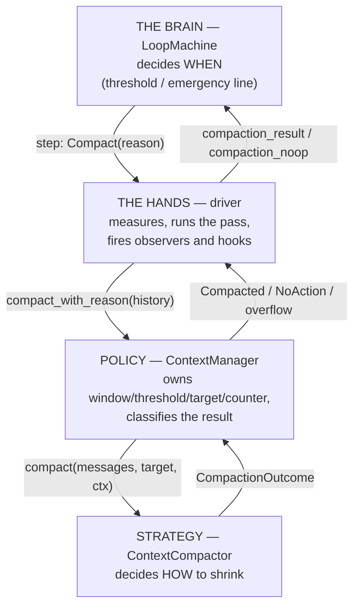
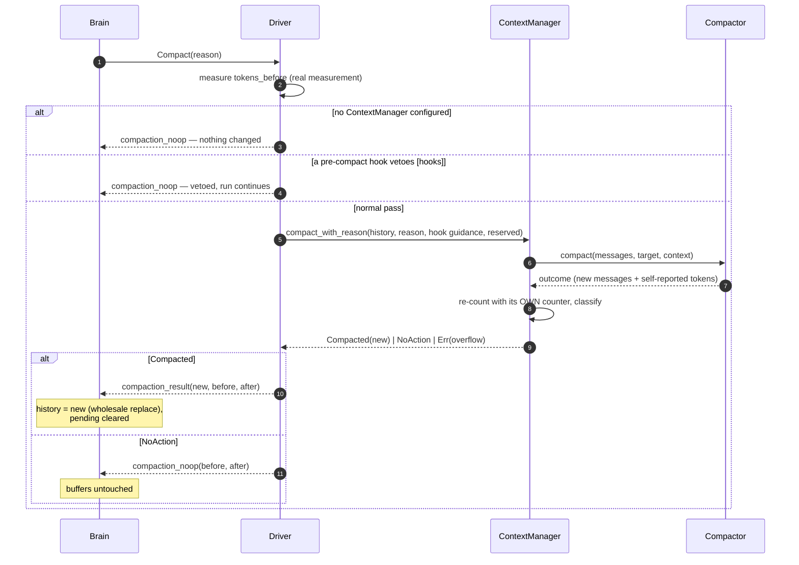
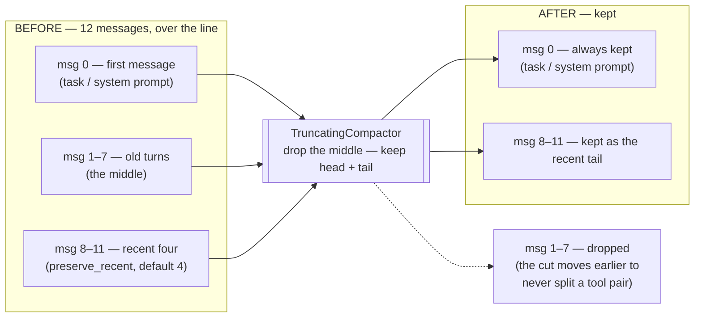

Every model has a hard limit on how much text it can read per request: the **context window**. An agent that just keeps appending will eventually build a request the provider rejects. Compaction is the subsystem that notices the conversation approaching the ceiling and rewrites it into something smaller — then the run continues inside the budget. Sources: `src/compact.rs`, `src/compact/truncating.rs`, `src/engine/core/machine.rs`, `src/engine/bare/compact.rs`.

**Read this if:** your agent runs long, your tools produce big outputs, or you have met `LoopError::ContextExceeded` and want to know exactly what happened.

---

## The words, once

| Term | Plain meaning |
|---|---|
| **Context window** | The provider's hard ceiling, in tokens. You set it (`SessionConfig::context_window`, default 200,000). |
| **Estimate** | The conversation's approximate token count. Compaction runs on estimates, never exact counts. |
| **Token counter** | The pluggable piece that produces estimates. Default: ~4 characters per token (`HeuristicTokenCounter`). |
| **Threshold** | Your soft line: past `compact_threshold`% of the window (default 80%), compact before the next model call. |
| **Emergency line** | The hard line at 95% of the window. Always active, even with `auto_compact: false`. |
| **Committed history / pending** | The two message buffers (see [the big idea](/start-here/the-big-idea/)). Compaction replaces **both together**. |
| **Compactor** | The strategy object deciding *how* to shrink. Default: `TruncatingCompactor` — cut the middle, keep head and tail. |
| **Context manager** | Owns the compactor plus the sizing policy (window, threshold, target size, counter). |

Two distinctions prevent most confusion:

- **Threshold vs window:** crossing the threshold is *normal* — it's the trigger. Exceeding the window is a *contract violation* — no request is ever sent over it; the run fails first.
- **Measurements vs hints:** a compactor may report its own token numbers, but they're **hints**. Every decision uses the manager's own re-count with its configured counter.

---

## Four roles, cleanly split



| Question | Answered by |
|---|---|
| *When* do we compact? | the machine (threshold + emergency) |
| *How* do we shrink? | the compactor strategy |
| *Did it work?* | the manager (re-measures, classifies) |
| *What now?* | the machine again (continue or fail) |

This split is why you can swap the truncator for an LLM summarizer without touching the engine.

---

## When it triggers

Before every model call, the brain checks (first hit wins):

1. Turn limit exceeded? → end the run (not compaction's business).
2. `estimate >= window × 95%` → **`Compact(Emergency)`** — inclusive comparison, always active.
3. `auto_compact` and `estimate > window × threshold%` → **`Compact(ThresholdExceeded)`** — strict comparison (a payload exactly at 80% serves normally; past it compacts).

Worked example, window 8,000, threshold 80% (the trigger line is 6,400; the emergency line is 7,600):

| Conversation estimate | What happens |
|---|---|
| 5,500 tokens | next model call, nothing special |
| 6,500 tokens | `Compact(ThresholdExceeded)` before the next call |
| 7,700 tokens | `Compact(Emergency)` — even with `auto_compact: false` |

### When the estimate is refreshed

The driver measures the payload at every growth point, so the trigger's number is always current before a request goes out: at run start (committed history + new input), after every model response, and after every batch of tool results (a single huge tool result becomes visible *before* the next request — you can't sneak past the trigger with a giant tool output). Extras riding the next request (memory, contributor messages) are counted too, and the turn defers to compaction if the fuller payload crosses the line — with a reserved budget so the extras still fit after shrinking.

---

## What one pass looks like



The classification rules, in the manager (`compact_with_reason`):

- Compactor reported failure, or its result **still doesn't fit** the window (minus any reserved budget) → `Err(ContextOverflow)` — the run ends with `ContextExceeded`.
- Same message count and no size reduction → `NoAction` — honest "nothing happened." Observers stay silent; hooks stay silent.
- Anything else → `Compacted` — with `tokens_after`/`tokens_saved` **normalized to the manager's counter** (the compactor's self-report is overwritten).

### The target size

The manager doesn't just say "shrink" — it passes a concrete target: by default **70% of the threshold line** (e.g. window 200k × threshold 80% × 70% = 112k tokens). Tune it with `with_compact_target(CompactBase::Threshold | Context)` and `with_compact_target_pct`.

---

## What happens to the two buffers — the important part

After a **successful** pass (`compaction_result`):

1. `history` is **replaced wholesale** by the compacted messages.
2. `pending` is **cleared** — everything the current run said so far was folded into the compacted result.
3. The token estimate is set to the new (smaller) count; state → `Start`; the deferred model call proceeds.

The invariant: **compaction collapses `history + pending` into a new, shorter `history`, and `pending` restarts empty.** That's what makes it actually reduce context — both buffers become one smaller one.

After a **no-op** pass (`compaction_noop`): both buffers untouched. The run simply continues. This distinction exists so an unchanged pass doesn't accidentally glue half-finished run messages into permanent history.

### The no-progress guard

Both feeds compare the driver's measured before/after numbers. If `tokens_after >= tokens_before` — nothing was shaved — the brain ends the run with `Failed(ContextExceeded)` instead of ping-ponging between Compact and CallLLM forever. This is also the honest price of a **hook veto** at over-threshold: nothing shrank, so the guard fires. A veto over-threshold is a decision to stop, not a decision to proceed.

### The audit trail is never touched

Compaction rewrites the *operational* conversation the loop uses. The *observational* record — `session.runs[N].turns` with every turn's original input and output — survives intact. You can always read what was actually said before the summary replaced it. (One nuance: a turn that runs *after* compaction records the summarized view as its context — the trail shows what each turn really saw.)

| | Before | After success | After no-op / failure |
|---|---|---|---|
| `history` | committed messages | **replaced** by compacted list | unchanged |
| `pending` | this run's messages | **cleared** (folded in) | unchanged |
| `session.runs` audit trail | full record | **unchanged** | unchanged |

And remember from [the big idea](/start-here/the-big-idea/): a run that compacts and *then* fails leaves the compacted history behind — compaction is a commit point.

---

## The default strategy — `TruncatingCompactor`

Dependency-free, no LLM calls. It drops the **middle** of the conversation:



Two knobs: `with_preserve_recent(n)` (default 4, minimum 1) and `with_min_messages(n)` (default 6, minimum 2 — conversations shorter than this pass through untouched). Three rules:

1. **The first message is always kept** — it usually holds the task or system prompt everything else depends on.
2. **Tool call/result pairs are never orphaned.** If the cut would keep a tool result while dropping its call (or vice versa), the cut point moves so the pair survives together — providers reject conversations with orphaned halves. (The machinery handles even nasty cases: reused call ids pair per occurrence; results of the first message's calls are pulled back adjacent to it.)
3. **Never return an empty list** — a conversation that can't be safely cut reports "no change" instead.

### Inside `TruncatingCompactor`, step by step

The exact procedure behind those rules (`_target_tokens` is deliberately ignored — this is *positional* truncation, not token fitting):

```text
compact(messages):
  1. len ≤ min_messages (6)?          → unchanged
  2. split = len − preserve_recent    // the provisional cut point
  3. fixpoint loop:                   // pair-safety moves the split EARLIER,
       adjusted = adjust_for_tool_pairs(messages, split)   // never later; it is
       if adjusted == split: break                         // non-increasing and
       split = adjusted                                    // bottoms out at 0 —
                                                           // always terminates
  4. split == 0?                      → unchanged          // nothing can be dropped
  5. preserved = [first message] ++ messages[split..]      // first is ALWAYS kept
  6. reattach: dropped ToolResults whose calls live in the
     preserved first message are pulled back, adjacent to it
  7. preserved empty?                 → unchanged          // never replace a
                                                           // conversation with nothing
  8. re-measure with the manager's counter; report tokens_saved
```

The pair-safety machinery behind step 3 works like a bracket-matcher for tool traffic: a forward scan keeps, per tool-call id, a stack of *unconsumed* calls; each `ToolResult` pops the most recent unconsumed preceding call with that id, and the two become a **pair**. Leftovers are classified — an unmatched call is a `LoneCall` (its result may still be in flight), an unmatched result is a `LoneResult` (a result cannot exist without its call — it's a protocol violation). The sanitizer then applies three asymmetric rules to the output: **`LoneResult`s are dropped everywhere**; **`LoneCall`s are kept *outside* the dropped region** (compaction can run before results land) but strict pairing applies *inside* it; and messages left empty by filtering are removed. Even the `unchanged()` path runs the same filtering, so a "no change" report is honest about what it would have saved.

`TokenSplitter` (same file, exported) gives you the same principled split for **custom** compactors — an old/recent boundary at a real turn transition, pair-safe — so an LLM summarizer can summarize `to_compact` and keep `preserved`.

## Writing your own compactor

One async function:

```rust
impl ContextCompactor for SummarizingCompactor {
    fn compact(&self, messages: Vec<Message>, target: u64, ctx: CompactionContext)
        -> Pin<Box<dyn Future<Output = CompactionOutcome> + Send + '_>>
    {
        Box::pin(async move {
            let split = TokenSplitter::new().split(&messages); // old vs recent
            let summary = self.client.summarize(&split.to_compact, target).await;
            let mut kept = vec![Message::new(Role::System,
                vec![MessagePart::text(summary)])];
            kept.extend(split.preserved);
            let tokens_after = ctx.counter.count(&kept);  // self-report in the right unit
            Ok(CompactionOutcome::compacted(kept, ctx.tokens_before, tokens_after))
        })
    }
}
```

`CompactionContext` carries everything a smart strategy needs: `tokens_before`, the `reason` (an emergency may justify more aggression), the `context_window`, the turn, the manager's counter (use it for self-reports), plus hook-supplied `instructions` and `additional_context`.

Install it:

```rust
let manager = ContextManager::new(Arc::new(SummarizingCompactor { /* ... */ }))
    .with_context_window(32_000)
    .with_threshold(75)
    .with_token_counter(Arc::new(my_real_tokenizer)); // one unit for everything!
agent.set_context_manager(Arc::new(manager));
```

> **Gotcha — one counter, everywhere.** Trigger decisions and post-compaction classification must run in the same "unit." Mixing the heuristic counter (trigger) with a real tokenizer or billed counts (compactor) causes flapping — compact, look small, un-compact, look big, repeat. Install one counter on the manager; the driver reuses *its* counter automatically.

---

## Failure — reading a `ContextExceeded`

`ContextExceeded { used, limit }` can arrive from three places; the numbers tell you which:

| `limit` means | Cause | Fix |
|---|---|---|
| the window | the compacted result still didn't fit | bigger window, or a compactor that can shrink harder (summarizer) |
| the pre-pass size | no-progress guard: nothing was shaved (includes hook vetoes and short-but-fat conversations the truncator can't cut) | summarizing compactor, bigger window, or trim the seed content |
| — | (engine form) `used`/`limit` are payload-comparable estimates including system prompt + tool schemas + reserved budget | — |

Three promises hold in every case: **no request is ever sent over the window** (the run fails first); **a failed run leaves no trace** (pending discarded); **the estimate is never faked** (a no-op is reported as a no-op).

---

## Configuration quick reference

```rust
ContextManager::new(Arc::new(TruncatingCompactor::default()))  // the seeded default
    .with_context_window(200_000)   // default 200_000
    .with_threshold(80)             // default 80, clamped 1..=100
    .with_auto_compact(true)        // default true
    .with_compact_target(CompactBase::Threshold)  // default
    .with_compact_target_pct(70)    // default 70, clamped 1..=100
    .with_token_counter(Arc::new(HeuristicTokenCounter))  // default
```

Host-facing calls on the manager: `ensure_context_fits(messages, turn)` (checks the threshold itself), `compact_manual(messages, turn)` (bypasses the threshold — hook trigger `Manual`), and `compact_with_reason(...)` (the engine's path). Watching: `on_compaction` observers fire **only** on real compactions; the `pre_compact` hook can veto or steer (its merged `new_instructions` reach the compactor's `CompactionContext`).

---

## Related pages

- [Tokens and context windows](/principles/tokens-and-context/) — what tokens are, why the window is finite, and why the estimate errs high.
- [Session config](/core-data/session-config/) — where the window and threshold live.
- [Hooks](/extensions/hooks/) — the pre/post compact hooks.
- [File reference: compact.rs](/file-reference/compact/)
