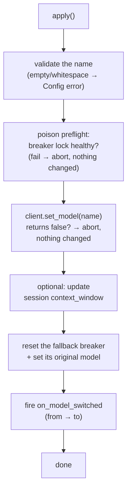

Sometimes you need to change the model while the agent lives: the task turns out harder than expected, a cheaper model suffices, the provider retires the old name. `BareLoop::switch_model(...)` (in `src/engine/bare/model_switch.rs`) does it in one careful sequence so no half-switched state survives a failure.

This is the *manual*, host-driven switch. The *automatic* one (on provider failures) is the [fallback manager](/safety/fallback/) — different mechanism, same notification.

---

## The basics

```rust
use loopctl::engine::SwitchOutcome; // (names simplified for reading)

// Switch to a bigger model whose context window differs:
agent.switch_model("claude-sonnet-4-5")
     .with_context_window(200_000)
     .apply()?;

// Just change the model name:
agent.switch_model("gpt-4o-mini").apply()?;
```

`switch_model(...)` returns a small builder — `ModelSwitch` — and nothing happens until `.apply()`. It is deliberately **not** `Clone`: two concurrent switches would race on shared state, and the type system stops you.

`apply()` either fully succeeds or changes nothing.

---

## What one apply does, in order



Each step exists for a reason:

- **Client acceptance first.** Some clients can't hot-swap (their `set_model` returns `false`). The switch aborts *before* touching anything else — no half-updated window, no reset breaker.
- **The window is optional but usually right.** If the new model has a different context window and you don't update it, the compactor keeps using the old threshold — too small (needless compaction) or too big (overflow risk). `with_context_window(tokens)` when the window differs.
- **The breaker resets because old-model failures are meaningless for the new model.** Failure counts, tripped state — all wiped; the new model starts with a clean slate as primary.
- **Observers find out.** `on_model_switched(ModelSwitchedContext { from, to })` fires — your UI or logs can track what's serving.

## Requirements

The client must support hot-swapping: `ApiClient::set_model(&str) -> bool`. All shipped provider clients return `true` and swap an internal mutex-guarded model string; `MockApiClient` does too (so you can test switching). The default trait implementation returns `false` — a custom client that doesn't override it rejects every switch cleanly.

Per-request overrides (via `RequestOptions::with_model`) are a different, lighter tool: they change one request's model without touching the client — used internally by the fallback machinery. `ModelSwitch` is for "the session's model *is* now X."

---

## Gotchas

1. **Call it between runs, not during.** Nothing mechanically explodes, but a switch racing an in-flight run means the run's requests may span two models. The clean pattern: finish or cancel the run, switch, run again.
2. **Concurrent loops over one shared client**: per-request overrides don't cross-wire (they live on the request, not the client) — but a `ModelSwitch` mutates the shared client for *everyone* using it. One client per loop if their models must differ.
3. **The fallback manager's `original_model` becomes the new name.** After a switch, "fall back to primary" means the *new* primary — usually exactly what you want, but worth knowing if you kept references to the old name.
4. **`switch_model` is not gated by the "configure before run" rule** — unlike `set_memory` and friends, it's designed for mid-session use. (Setters panic-in-debug after the machine advanced; switching doesn't.)

---

## Related pages

- [Fallback](/safety/fallback/) — the automatic model switching.
- [Observers](/extensions/observers/) — `on_model_switched` and friends.
