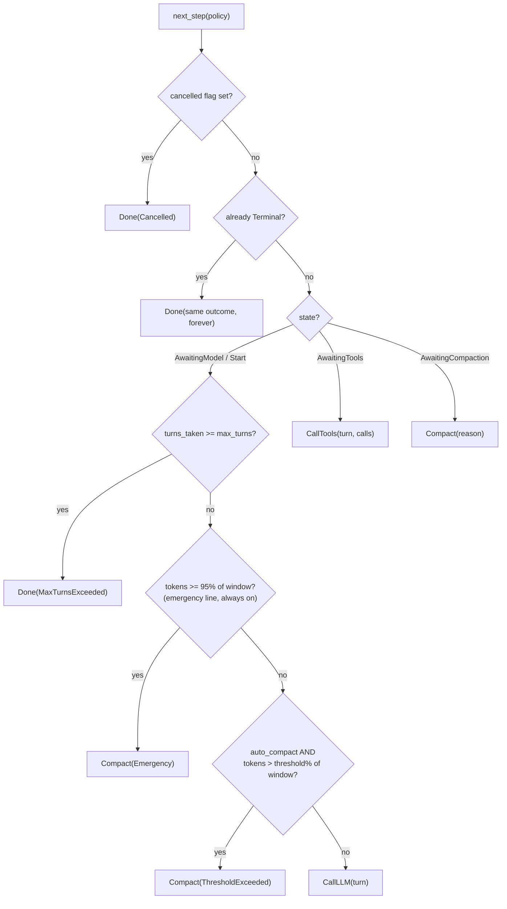

The `LoopMachine` (in `src/engine/core/machine.rs`) is the decision-making half of the engine. It holds the conversation, counts turns, watches the context size, and answers one question — "what next?" — with total consistency. It performs **no** network calls, no tool runs, no clock reads. Feed it results, read its decisions; serialize it, restore it, and it resumes exactly where it left off.

If you haven't yet, read [the big idea](/start-here/the-big-idea/) first — this page goes deeper into every rule the brain follows.

---

## What the brain holds

| Field | What it is |
|---|---|
| `state: MachineState` | Where we are: `Start`, `AwaitingModel`, `AwaitingTools`, `AwaitingCompaction`, `Terminal(outcome)` |
| `history: Vec<Message>` | The notebook — messages of past **successful** runs |
| `pending: Vec<Message>` | The scratchpad — the current run's messages |
| `pending_tools: Vec<PendingToolCall>` | Tool calls awaiting dispatch (with any pre-resolved answers) |
| `turns_taken: usize` | Turns completed this run |
| `context_tokens: u64` | The latest estimate of the whole conversation's size |
| `cancelled: bool` | Whether cancel was requested |
| `last_compaction_tokens: Option<u64>` | Size measured just before the current compaction pass |

Settings (max turns, context window, thresholds) are **not** stored — the driver passes them in as a `MachinePolicy` on every `next_step()` call. That's what keeps the machine pure, serializable state.

### `MachinePolicy` — the numbers, and where each comes from

| Policy field | Source | Default |
|---|---|---|
| `max_turns` | `RunConfig::max_turns` | 200 |
| `context_window` | `SessionConfig` / `ContextManager` | 200,000 tokens |
| `compact_threshold` | `ContextManager::threshold` | 80 (%) |
| `auto_compact` | `ContextManager::auto_compact` | true |

The driver rebuilds this struct every loop iteration from the session config, the in-flight run's config, and the context manager's sizing policy — so a mid-run change to any of them takes effect on the very next step, and the machine itself serializes without a single setting inside it.

### The feeds' postconditions, in one table

| Feed | Legal from | Effect on buffers | New state |
|---|---|---|---|
| `accept_input` | any non-terminal | clears `pending`, pushes the user message, resets counters | `Start` |
| `model_response` | `AwaitingModel` | reply appended to `pending`; tool calls classified into `pending_tools` (unknown names pre-answered) | `AwaitingTools`, or `Terminal(Completed)` |
| `tool_results` | `AwaitingTools` | results appended; **consumes `pending_tools`** (only feed that does) | `Start` |
| `compaction_result` | `AwaitingCompaction` | `history` replaced wholesale, `pending` cleared, estimate = after | `Start`, or `Terminal(Failed)` on no-progress |
| `compaction_noop` | `AwaitingCompaction` | **both untouched** | same two exits, buffers preserved |
| `inject` | non-terminal | one message appended to `pending`; estimate **not** refreshed | unchanged |
| `cancel` / `fail` | non-terminal | none (flag / terminal only) | flag set / `Terminal(Failed)` |

The "illegal from" column is implicit and enforced: a feed arriving in the wrong state is a driver contract violation, not a silent no-op — which is what makes the transition set auditable.

---

## The decision order in `next_step(policy)`

Every call to `next_step` walks these checks in this exact order. The first hit wins:



Reading the two compaction checks precisely:

- **Emergency line:** `tokens >= window × 95%` — inclusive, fires **even when `auto_compact = false`**, ignores `compact_threshold`. The last-ditch net against overflowing the window.
- **Threshold line:** `tokens > window × compact_threshold%` — strict (a payload exactly at the line serves normally), honored only when `auto_compact` is on.
- `context_window = 0` disables both (window policy off entirely).

`next_step` is **pure and repeatable**: call it twice with nothing in between and you get the same answer. Nothing is recorded by asking.

---

## The feeds — how results come back

Each step has exactly one matching feedback method:

### `model_response(response, context_tokens)`

The driver calls this after a model reply. The brain:

1. Pushes the assistant message onto `pending`, adopts the token estimate, counts the turn.
2. No tool calls in the reply? → **`Terminal(Completed { final_text })`** — the run is over, the final text is the reply's text.
3. Tool calls present? Each one is **classified** against `available_tools` (the names the driver advertised):
   - Known name → a real pending call, waiting for dispatch.
   - Unknown name → the brain **pre-answers** it: a tool-result message "tool 'x' is not available" with `is_error: true`, stored alongside. The driver will feed it back without ever dispatching — the model sees its mistake and can correct it.
4. State becomes `AwaitingTools { turn }`.

### `tool_results(messages)`

After tools run. Appends result messages to `pending`, **consumes** `pending_tools` (this is the only feed that does — it's what makes re-polling safe), state → `Start`. The next step will be a fresh `CallLLM` (subject to the checks above).

### `compaction_result(compacted, tokens_before, tokens_after)` — history was rewritten

After a **successful** compaction pass:

1. **No-progress guard:** if `tokens_after >= tokens_before` → **`Terminal(Failed(ContextExceeded))`** — compaction achieved nothing; looping between compact and call would be pointless. Buffers are left untouched.
2. Otherwise: `history = compacted` (wholesale replacement), `pending` cleared (its content was folded into the compacted result), `context_tokens = tokens_after`, state → `Start`.

### `compaction_noop(tokens_before, tokens_after)` — nothing changed

For passes that didn't rewrite anything (no compactor configured, a hook vetoed, or the compactor returned the conversation unchanged). Same no-progress guard, but **both buffers are left alone** — in particular, `pending` survives and the run continues rather than silently "committing early."

The distinction matters: feeding an unchanged conversation through `compaction_result` would glue the run's half-finished scratchpad into permanent history mid-run. `compaction_noop` exists precisely to avoid that.

### The smaller feeds

- `accept_input(input)` — starts a run: clears `pending`, pushes the user message, resets counters, state → `Start`.
- `set_context_tokens(n)` — updates the size estimate only. The driver refreshes it at run start, after tool results, and before model calls carrying fresh extras (memory, contributor messages), so the compaction trigger always sees the true size of the next request.
- `inject(message)` — you (the host) push an arbitrary message onto `pending`. It does **not** refresh the context estimate — if you inject something big, call `set_context_tokens` yourself.
- `cancel()` — sets the flag; the next `next_step` returns `Done(Cancelled)`.
- `fail(error)` — instant `Terminal(Failed)`; how driver errors are recorded.

### The two maintenance operations

- `commit_pending()` — glue the scratchpad into the notebook. The driver calls this **only** on a successful run exit.
- `discard_pending()` — throw the scratchpad away. Called on failure, keeping the notebook clean.

---

## Reading and resuming

```rust
machine.history()        // committed messages only
machine.full_history()   // history + pending — exactly what the next request would send
machine.state()          // current MachineState
machine.turns_taken()
machine.is_terminal()
machine.is_cancelled()

// The checkpoint/resume pair at the driver level:
let saved = serde_json::to_string(&agent.into_machine())?;    // pause anywhere
let m: LoopMachine = serde_json::from_str(&saved)?;           // restore anywhere
let agent = BareLoop::from_machine(m, config, client, tools); // new body, same brain
```

Tests pin that a restored machine makes **identical** step decisions — resume is not "close enough," it's exact. Once `Terminal`, a machine accepts no further input and repeats its outcome forever (a restored finished run still knows it finished — `fail()` even ensures an errored machine carries its failure record into serialization).

---

## Rules recap — the brain's contract

1. The brain never does IO; it only decides. All doing belongs to the [driver](/engine/driver-loop/).
2. Policy is passed in fresh each step, never stored — the brain serializes as pure state.
3. `next_step` is pure: asking never changes anything (except consuming the cancelled flag's transition).
4. Feeds are the only way in; each step has exactly one matching feed; `tool_results` is the only feed that consumes `pending_tools`.
5. Terminal is forever. Every outcome maps to at most one `LoopError` via `to_loop_error()` (`Completed` maps to `None`).
6. Failed runs leave no trace: `pending` is discarded, `history` holds only successful history — except after a mid-run compaction, which is a commit point (the compacted history stays even if the run then fails).

---

## Related pages

- [State machines](/principles/state-machines/) — the pattern this machine is an instance of, explained from scratch.
- [The driver loop](/engine/driver-loop/) — the hands that execute these steps.
- [Compaction](/engine/compaction/) — the full story of the Compact step.
- [File reference: machine.rs](/file-reference/engine-machine/)
