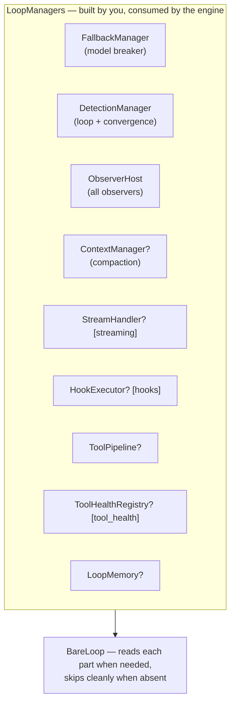

An engine needs a lot of optional equipment: observers, detectors, the fallback breaker, a compaction manager, a stream handler, hooks, a middleware pipeline, tool health, memory. `LoopManagers` (`src/managers.rs`) is the box they all go in — one struct the engine carries, one accessor per part. Build the bundle, hand it to the engine, done.

---

## The picture



Every `?` part is `Option` — absent by default. A minimal agent (no `with_*` calls) runs fine with none of them.

## Building one

```rust
let managers = LoopManagers::new()
    .with_observer(Arc::new(logging_observer))          // appends — see below
    .with_detection(my_detection_manager)
    .with_fallback(my_fallback_manager)
    .with_memory(Arc::new(InMemoryStore::new()))
    .with_stream_handler(StreamHandler::new())          // [streaming]
    .with_hook_executor(Arc::new(my_hooks))             // [hooks]
    .with_health_registry(Arc::new(ToolHealthRegistry::new()))  // [tool_health]
    .with_pipeline(my_pipeline)
    .with_context_manager(Arc::new(my_context_manager));

let mut agent = BareLoop::new_with_managers(client, tools, config, managers);
```

Or the simple way — `BareLoop::new(...)` uses an empty bundle, and you install parts afterward through the loop's own setters (`set_memory`, `register_observer`, ...), which write into this same bundle.

Facts about the bundle:

- **Fallback, detection, and observers are always present** (with defaults) — the rest are `Option`s.
- **The constructor seeds a compaction manager** if your bundle doesn't carry one: a `ContextManager` around the default truncating compactor, synced to your `SessionConfig`. Auto-compaction is never "on" without machinery behind it; your own manager is never overridden.
- **`with_observer` appends.** There is no replace-observers call — hosts accumulate.
- **Not `Clone`.** The engine consumes it by value. Share the `Arc`-wrapped parts (memory, context manager, health registry, hook executor) by cloning the `Arc`s *before* building, if you need the same store in two places.

## Reading it — capability traits

Code that wants to *use* a bundle without knowing it's `LoopManagers` narrows to just what it needs via the capability traits (`src/capabilities.rs`): `Observable` (observers), `Detectable` (detection), `FallbackCapable` (fallback), `Compactable` (context manager), `RememberCapable` (memory), `StreamCapable` (stream handler), `Hookable` (hooks), `PipelineAware` (pipeline), `HealthTrackable` (tool health). `LoopManagers` implements all of them — that's the point of the layer: your generic code asks for `impl Detectable`, not for the whole world.

One subtlety: `StreamCapable::stream_handler()` never returns `None` — an unset handler yields a shared **passthrough** (no retries, no timeouts, total timeout = effectively unbounded). "Is a real handler configured?" is answerable only by comparing with the passthrough default — or by simply always configuring one.

## `reset_all()` — the clean slate

`managers.reset_all()` resets the fallback breaker (→ Primary), clears loop/convergence detection state, and calls `reset()` on every observer. It does **not** touch memory, hooks, the pipeline, health, the stream handler, or the context manager — and the engine never calls it for you. Reach for it mid-session when stale state would mislead: after a long outage, or when switching to an unrelated task. `RunConfig { reset_managers: true }` triggers the same reset at the start of a run.

---

## Gotchas

1. The default `FallbackManager` has an **empty chain**: it counts failures and trips, but with no backup models configured the routed model never changes. Configure `set_fallback_models` for real failover.
2. Default detection thresholds: warn at 3 repetitions, stop at 10.
3. Feature-gated accessors **vanish** without the feature (they don't degrade) — `stream_handler` exists only under `streaming`, etc.
4. Poisoned locks inside fallback/detection surface as `LoopError::LockPoisoned` from reset and from the operations that need those locks; the engine additionally *disables* detection for the session after a detection poison rather than failing runs.

---

## Related pages

- [The driver](/engine/driver-loop/) — who consumes the bundle.
- Every component's own page: [observers](/extensions/observers/), [hooks](/extensions/hooks/), [memory](/extensions/memory/), [detection](/safety/loop-detection/), [fallback](/safety/fallback/), [compaction](/engine/compaction/), [stream handler](/core-data/stream-events/).
