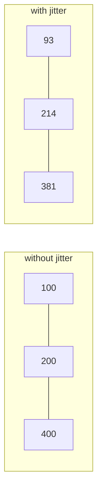

Networks hiccup. Servers get overloaded. Streams die halfway. The question is never *whether* to retry — it's **when**, and **how many times**, and **what to do when everyone retries at once**. This page explains the two ideas that answer those questions — **exponential backoff** and **jitter** — and maps them onto loopctl's actual retry ladders.

---

## Why "retry immediately, forever" is wrong

Suppose a request fails because the server is briefly overloaded. The naive response is to retry at once. But if a hundred clients all failed at once, they all retry at once — a synchronized wall of requests landing on the very server that just said "stop." Each retry fails, each client retries again, and the failure becomes self-sustaining. (The names for this: **thundering herd** / **retry storm**.)

So two rules are needed:

1. **Wait between attempts** — give the failure time to pass.
2. **Grow the wait** — because every *additional* failure is evidence the problem isn't the millisecond-blip kind.

## Exponential backoff

**Backoff** is rule 1; **exponential** is rule 2. The wait before attempt *n* is:

```text
delay(n) = min( base × 2ⁿ , cap )
```

With loopctl's default stream-transport numbers (base 100 ms, cap 10 s), the ladder is:

```text
attempt 1 → wait  100 ms
attempt 2 → wait  200 ms
attempt 3 → wait  400 ms
attempt 4 → wait  800 ms   ...capped at 10 s
```

Why *exponential* rather than fixed or linear? Each retry that fails carries information: "the problem outlasted my last wait." Doubling responds to that information — if the outage lasts 30 seconds, you want your waits to span 0.1 → 10 s in a handful of attempts, not to crawl there linearly over fifty. And the **cap** exists because the opposite failure mode is worse than stopping: a client that waits unboundedly is a client that hangs. loopctl's caps: 10 s in the stream-transport ladder, 30 s in the tool-recovery ladder, 60 s for rate-limit waits.

## Jitter — breaking the lockstep

Backoff alone has a hidden flaw: it's *deterministic*. Every client that failed at the same moment computes the same schedule (100, 200, 400...) and continues to arrive in synchronized waves — smaller waves, but synchronized all the same.

**Jitter** is random variation added to each delay. loopctl's stream ladder multiplies each delay by a random factor in **±10%**:

```text
delay = base × 2ⁿ × (1 + f),   f uniform in [−0.1, +0.1]
```

The first retry now lands somewhere in 90–110 ms, the next somewhere in 180–220 ms. Within a few attempts the herd has smeared across the timeline and the synchronized wave is gone. Ten percent is enough for that job while keeping the exponential shape clearly visible in your logs.



Every client marches the same staircase ← → clients smear across the staircase's steps

---

## loopctl's ladders, with their numbers

Backoff+jitter appears in four places, each with its own budget and its own job:

| Ladder | Where | Base → cap | Attempts | Decided by |
|---|---|---|---|---|
| **Stream transport** | [stream handler](/core-data/stream-events/) | 100 ms → 10 s, ±10% jitter | 4 (1 + 3 retries) | config, automatic |
| **Rate limit** | stream handler | server's `Retry-After` (or 5 s) → 60 s | 5, then escalate | config, automatic |
| **Tool recovery** | [recovery](/safety/reflection/) | 100 ms → 30 s | ≤ 5 hard ceiling | your `RecoveryStrategy` |
| **Timeout retry** | [timeout middleware](/safety/middleware/) | deadline **doubles** per retry | 1 + `max_retries` | middleware config |

Two structural choices in that table are worth calling out, because they're principles, not just settings:

**Rate limits get their own budget.** A 429 ("slow down") is not a transient glitch — it's the server *pricing* your usage. loopctl keeps the rate-limit ladder separate from the transport ladder so a rate-limit storm cannot eat the retries you need for genuine network failures (nor vice versa). When the rate-limit budget is spent, the failure **escalates** — it becomes a `RateLimitEscalation` that the [fallback breaker](/safety/fallback/) understands, rather than a retry in disguise. And the ladder honors `Retry-After` (the server's own "wait this long" header) whenever it's present, capped at 60 s — the server knows its load better than any formula.

**Tool retries are yours; model retries are the engine's.** Retrying a *model* call is cheap and safe — worst case you paid for some regenerated text. Retrying a *tool* may charge a credit card twice. That's why tool retries route through a pluggable `RecoveryStrategy` that sees each failure and decides retry/skip/ask/fail, while model-call retries are an engine default you can only tune, not per-call arbitrate.

---

## The formulas, exactly

Every wait in the engine reduces to one of these four lines:

```text
transport:     delay(attempt) = min( base_ms × 2^attempt , 10_000 ms )
               jitter:        delay × (1 + f),  f uniform in [−0.1, +0.1]
                              f = ((rand() − 0.5) × 2) × jitter_factor

rate limit:    delay = min( Retry-After hint if present else 5_000 ms , 60_000 ms )
               — always clamped to the remaining turn deadline

tool recovery: delay(attempt) = min( 100 ms × 2^attempt , 30_000 ms )
               budget = min(strategy.max_retries, 5)      ← two ceilings, first reached wins

timeout retry: current_timeout = current_timeout × 2      ← the deadline itself grows
```

Read the jitter line carefully and you'll see it is *multiplicative*, not additive — ±10% of a doubling number, so the smear grows with the delay instead of being flattened by it. And note the timeout middleware's difference in kind: it doesn't wait-and-retry, it *re-runs with a doubled deadline* — the bet is "the tool is slow, not dead," which longer patience can win.

## The transport ladder, decided step by step

What actually happens when a streaming attempt fails, in order:

1. **Classify.** Was the error retryable at all? (`ApiError::is_retryable`: 5xx, timeouts, transport failures — yes; 401/403 and other 4xx — no.) Not retryable → **fail now**, one attempt total.
2. **Check the total deadline.** The whole turn has a wall-clock budget (default 5 min). Blown → skip to the fallback path (step 4's exit), else fail.
3. **Check the attempt budget.** `max_retries + 1` total attempts (default 4). Spent → fallback path if enabled, else fail.
4. **Otherwise: sleep and reconnect.** Sleep = jittered `delay(transport_attempts)`, clamped to the deadline; increment the counter; open a fresh stream — and emit `AttemptReset` first, so everything buffered from the failed attempt is voided before the retry's fragments arrive.

One special rule inside step 2's family: an attempt that has produced **zero events** fails after just `min(2, max_consecutive_timeouts)` event timeouts instead of the usual 10 — a connection that has shown nothing has nothing to lose by giving up early.

## The rate-limit ladder, counted

The same shape, different budget, and the server gets a vote:

```text
429/503/529 arrives → count = 1
  count ≤ 3:  sleep min(Retry-After hint, 60s), retry the stream
  count > 3:  ESCALATE — LoopError::RateLimitEscalation { attempts, retry_after }
              → recorded as FailureKind::RateLimit on the model breaker
  count > 5:  hard stop → non-streaming fallback if enabled, else fail
```

The escalation at count 4 is the interesting rung: it stops retrying *this model* and reports upward, where the [fallback system](/safety/fallback/) can reroute the turn to another model entirely. Retrying harder against a service that is explicitly rationing you is never the answer — the ladder is built to hand the problem to a different mechanism at exactly the point where more patience stops being creditable.

A worked timeline of both ladders together — a turn that hits a blip, then a rate limit (transport budget 4, rate budget 5):

```text
t=0.00s  attempt 1 → connection reset (retryable, transport)
t=0.10s  sleep ~100ms (jittered)
t=0.10s  attempt 2 → events flow... → 429 with Retry-After: 2
t=2.10s  rate-limit retry 1 → events flow, reply completes → success
```

Cost of the whole incident: ~2.2 s, one transport retry, one honored server hint, zero escalations. Had the 429 persisted: retries at ~t=4.2, ~t=6.2, escalation out at ~t=8.2 — and the breaker, not the ladder, takes it from there.

## What is *safe* to retry — idempotency

A request is **idempotent** if doing it twice has the same effect as doing it once. Reading a file: idempotent. Generating a model reply: effectively so (costs money, changes nothing). Charging a payment: **not** idempotent — the retry itself becomes a new failure.

Backoff schedules assume idempotence. loopctl's defaults respect this asymmetry: transport-level retries wrap *model* requests (safe to repeat), while tool calls only retry when your recovery strategy — which can see the tool's name and input — says so. When you write your own retry logic around side-effecting tools, the question "is this safe to repeat?" must come before "how long should I wait?"

---

## A worked timeline

A streaming turn hits a brief provider blip (defaults throughout):

```text
t=0.0s   attempt 1 → connection error (retryable)
t=0.1s   wait ~100 ms (jittered)
t=0.1s   attempt 2 → another error
t=0.3s   wait ~200 ms (jittered)
t=0.3s   attempt 3 → events flow, reply completes → success
```

Total cost of the blip: ~0.3 s and two failed attempts. Had *both* failures been a real outage, attempt 4 would land at ~+700 ms, and after that the ladder hands off: to the non-streaming fallback path, or upward as an error — never into an infinite wait. Every ladder in loopctl is finite, and every finite ladder ends by **escalating honestly** rather than dying quietly.

---

## Related pages

- [Stream events](/core-data/stream-events/) — where the transport and rate-limit ladders live.
- [Reflection & recovery](/safety/reflection/) — the tool-side ladder.
- [Circuit breakers](/principles/circuit-breakers/) — what happens when retries *keep* failing: stop retrying, start probing.
