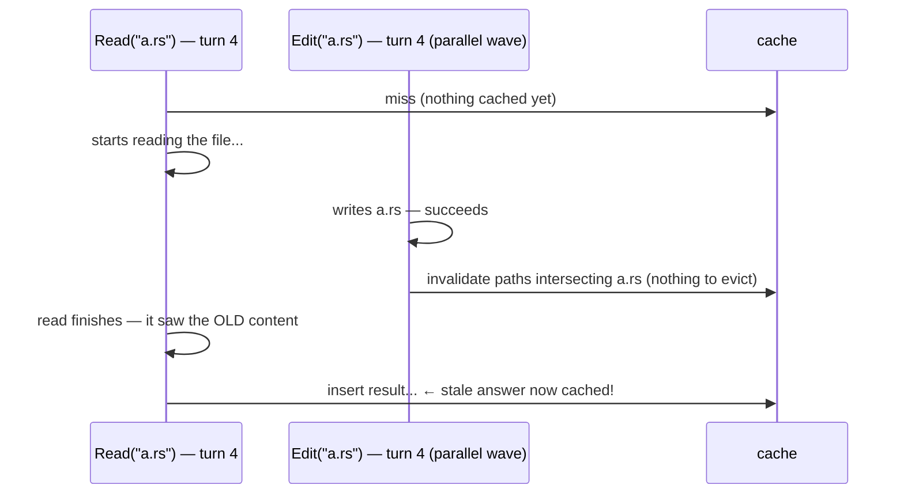
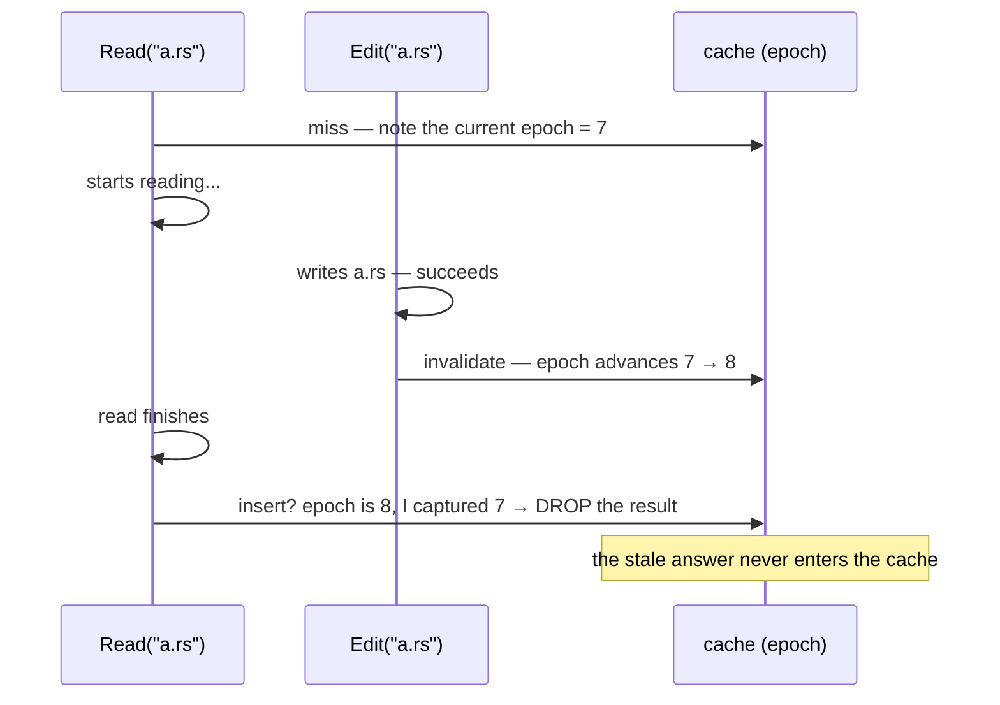
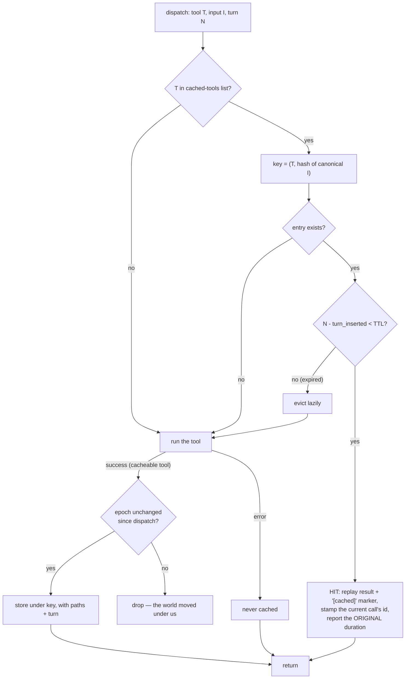

Agents repeat themselves. A model will read the same file in turn 2 and turn 6, grep the same pattern twice, list the same directory after every edit. A **cache** skips the repeated work: remember the answer, replay it. That's the easy half. The hard half — the half this page is about — is **forgetting at the right moment**: a cached answer is only safe while the world it describes hasn't changed.

loopctl's memoizer (`MemoizingMiddleware`, in `src/middleware/memoize.rs`) is a small, complete example of a cache done carefully, and every choice in it illustrates a general rule.

---

## The two clocks of staleness

A cache entry goes stale in two ways, and each has its own cure:

| Staleness clock | Meaning | Cure |
|---|---|---|
| **Time** | the entry is simply old | **TTL** — "time to live": forget after N units |
| **Events** | something happened that invalidates it | **invalidation** — forget when the world changes |

Time-based forgetting is cheap and blunt: it doesn't know *what* changed, only that enough has happened since. Event-based forgetting is precise but only as good as its detection of "the world changed." Real caches use both — the TTL catches what invalidation misses, invalidation catches what TTL would let linger.

loopctl's memoizer measures its TTL in **turns**, not seconds — a natural unit for agents, where "how long ago" matters less than "how much has happened since." A 5-turn TTL means: an answer is trusted for the next 5 turns of the run, then re-earned.

## What gets remembered — and what never does

Before any timing question, the memoizer is picky about *what* enters the cache:

- **Only successes are cached.** An error is not an answer — it's a report that the world was in a certain state. Retrying a failing call is cheap and might succeed; caching the failure would freeze it.
- **Write-tool results are never cached.** A write's *value* is its effect, not its text — and its effect (see below) is to *evict* things.
- **Only tools you name are cached.** You declare the cached tools (`Read`, `Glob`, `Grep`...) and the write tools (`Write`, `Edit`...) explicitly; nothing is cached by accident.

## The key — canonical form

A cache answers "have I seen this question before?" — which requires two phrasings of the same question to produce the same key. The memoizer's key is:

```text
key = ( tool name,  hash of the input JSON in canonical form )
```

**Canonical form** means one agreed spelling for every equivalent input. Here the trick is almost free: the JSON serializer stores object keys in sorted order, so `{"path":"a.rs","line":1}` and `{"line":1,"path":"a.rs"}` serialize to *identical* bytes and hash to the same key — same question, cache hit. Hashing shrinks the input to one number (the same fingerprinting idea as [loop detection](/principles/measuring-repetition/)).

> The free-ness has a price tag: it depends on the serializer's key ordering. Turning on serde_json's `preserve_order` feature anywhere in your dependency graph would make the two spellings hash differently — silent cache misses, never wrong answers, but the cache quietly stops working.

### The rules, precisely

The moving parts, in the middleware's own terms:

```rust
struct CacheEntry {
    result: ToolDispatchResult,   // only ever a success (is_error == false)
    turn_inserted: usize,         // when it was earned
    paths: Vec<String>,           // what the PathExtractor says it touched
}

// freshness — integer turn arithmetic, no clock anywhere:
expired  ⇔  current_turn.saturating_sub(entry.turn_inserted) ≥ ttl_turns
//            ttl 0 caches nothing; 1 expires on the turn after insertion
```

On a **hit**, four things happen, three of which are anti-footguns:

1. the `[cached]` marker is appended — `"\n[cached]"` onto a Text result, or a new `" [cached]"` text part pushed into a Multipart one — so the model *knows* it's reading a replay;
2. the result is **re-stamped with the requesting call's id** — a replay must answer the call being made now, not the call that populated the cache;
3. the **original call's duration is reported**, not ~0 — so [health statistics](/safety/tool-health/) keep measuring the real tool, never discovering an impossibly fast one;
4. the inner pipeline is skipped entirely — that's the point.

On an **insert**, one guard runs (the epoch check below) and one invariant holds always: the lock is never held across the inner dispatch — a slow tool cannot block cache reads for every other call.

## Invalidation — the write rule

The event half. A `PathExtractor` you supply declares, per call, **which files a tool touches**. Then one rule drives everything:

> **After a successful write, evict every cached entry whose paths intersect the write's paths.**

A write to `src/main.rs` throws out the cached `Read` of `src/main.rs` (and of anything else the extractor says that write touched). Two subtleties make the rule safe in practice:

- **A failed write invalidates nothing.** The filesystem didn't change; the old answers are still true.
- **Matching is exact string equality** — no globs, no prefixes. So extractors should *over-return* paths: naming extra paths costs a few harmless extra evictions, while missing a path costs **staleness** — a wrong answer served as truth. Over-erase is always safe; under-erase never is.

## The epoch guard — closing the race

One race survives the rules above, and it's worth seeing in slow motion, because it's the classic cache bug:



The read *started before* the write and *finished after* the invalidation — its result describes the pre-write world, yet it enters the cache after the eviction that was meant to kill it, and would now survive until the TTL expires.

The memoizer closes this with an **epoch counter** — a number that advances on every invalidation:



Capture the epoch when work starts; refuse to insert if it moved while you worked. Three lines of code, and the window where staleness can slip in closes completely.

## A session, cached turn by turn

All of the above in one concrete sequence — cached tools `Read`/`Glob`, write tools `Write`/`Edit`, TTL 5 turns:

| Turn | Call | What the cache does | Why |
|---|---|---|---|
| 2 | `Read("src/main.rs")` | miss → run → **insert** (key: `("Read", hash("src/main.rs"))`, turn 2, paths `["src/main.rs"]`) | first earn |
| 3 | `Read("src/main.rs")` | **hit** — replayed with `[cached]`, this call's id, the original 340 ms | 3 − 2 = 1 < 5, still fresh |
| 4 | `Edit("src/main.rs")` succeeds | run (writes are never cached) → **evict** the turn-2 entry | paths intersect `src/main.rs`; epoch 7 → 8 |
| 5 | `Read("src/main.rs")` | miss → run against the *new* content → insert (turn 5) | the eviction worked — no stale answer |
| 5 | `Read("src/main.rs")` again, same turn | **hit** — fresh entry, replayed | 5 − 5 = 0 < 5 |
| 9 | `Read("src/main.rs")` | miss (5 − ... nothing cached since turn 5's entry would expire at turn 10 — hit, replayed) | TTL arithmetic: 9 − 5 = 4 < 5 |
| 12 | (nothing) | entries from turn ≤ 7 are all expired on sight | lazy eviction — removed when a lookup touches them |

Two things to notice: the edit at turn 4 is what keeps the cache *correct*, while the TTL is what keeps it *bounded* — remove either and the other's failure mode eventually bites. And nowhere in the table does a clock appear: "when" is always a turn number.

## The full decision, end to end



Details on that diagram worth pausing at:

- **Eviction is lazy.** There is no background timer sweeping expired entries — a stale entry is removed when a lookup touches it. Simpler, and the cost lands exactly where the benefit would.
- **A hit re-stamps the call id.** The model pairs calls to results by id; a replayed answer must answer *this* call, not the original one. (The engine stamps ids authoritatively after the pipeline anyway — belt and suspenders.)
- **A hit replays the *original* duration.** If the first read took 900 ms, the hit reports 900 ms, not 0 — so [health statistics](/safety/tool-health/) keep tracking real latency instead of discovering an impossible fast tool.
- **No capacity limit.** The cache grows with distinct (tool, input) pairs until entries expire. For long sessions, the fix is a shorter TTL, not hope.

---

## The principles, compressed

1. **Storing is easy; forgetting is the design.** TTL for time, invalidation for events, both together.
2. **Only facts worth freezing enter the cache** — successes, read-only, declared tools.
3. **Canonical keys or no hits** — two spellings of one question must hash the same.
4. **Invalidation may over-fire, never under-fire** — extra evictions are cheap; staleness is corruption.
5. **Races need epochs** — "checked before, inserting after" needs a guard, not good intentions.

---

## Related pages

- [Middleware](/safety/middleware/) — the memoizer's configuration and pipeline position (innermost, beside the core).
- [Waves](/principles/scheduling-parallel-work/) — the parallel execution that creates the epoch race in the first place.
- [Windows, averages, and similarity](/principles/measuring-repetition/) — the same fingerprint-hashing idea used for repetition instead of caching.
