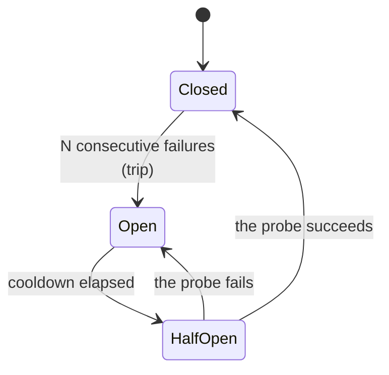

Retries answer "the last call failed — try again?" But retries have no *memory*: call number 500 into a dead service gets exactly the same eager retry as call number 2. A **circuit breaker** adds that memory. After enough consecutive failures, it decides *stop calling this for a while* — and later, carefully, tests whether the thing came back.

The name comes from the electrical panel: when a circuit draws too much current, the breaker **trips** and cuts the flow to protect the wiring. Flipping it back on immediately would just trip it again — you fix the fault first, then reset. The software pattern (an old, industry-standard one) copies the whole dance.

---

## The three states

Every circuit breaker, loopctl's included, is a three-state machine:



- **Closed** — "the circuit is complete": normal life. Calls flow; failures are counted. One success resets the failure count. This is where every breaker starts, and where a healthy system stays.
- **Open** — tripped. Calls are **refused without being attempted**. This is the entire point: failing *fast* instead of hanging on a call that was going to time out anyway. A cooldown clock starts.
- **Half-open** — the experiment. After the cooldown, the breaker lets **exactly one** call through as a *probe*. If the probe succeeds, the breaker closes and normal life resumes. If it fails, the breaker opens again with a fresh cooldown.

Why the probe is a single call: if the service is still down and you let *all* traffic probe it, you've rebuilt the thundering herd the cooldown just cured. One cautious request, then decide.

## Why this is more than "retry with extra steps"

Compare the two policies against a 5-minute outage, with a 2-minute timeout per call:

| | Plain retries | Breaker |
|---|---|---|
| Call during outage | attempts, hangs 2 min, fails, backs off, attempts again... | refused **instantly** |
| Cost while broken | every caller burns timeouts and backoff budget | one refusal message |
| Recovery after fix | traffic was still hammering; first retry succeeds, fine | one probe confirms, then full traffic resumes |

The breaker's value is the *open* state: converting slow failures into fast ones, for everyone, until there's evidence the target is healthy again. The probe is the evidence-gathering step — recovery must be *proven*, not assumed, because a single lucky success amid an outage would otherwise slam the door open and re-trip everything.

---

## loopctl has two breakers

Same pattern, two granularities:

| | Model breaker ([fallback](/safety/fallback/)) | Tool breaker ([tool health](/safety/tool-health/)) |
|---|---|---|
| Protects | the *model* connection | each *tool* individually |
| States | `Primary` / `Fallback` / `Recovering` | `Closed` / `Open` / `HalfOpen` |
| Trips after | 3 consecutive failed turns | 3 consecutive failed calls |
| While "open" | requests route to a **backup model** (the fallback chain) | calls are **refused** with a soft error |
| Cooldown | 60 s | 30 s |
| Closes after | 2 probe successes | 1 probe success |

The model breaker's "open" is softer in effect — it doesn't refuse the run, it *reroutes* — but the skeleton is identical: consecutive-failure trip, cooldown, careful probe, proven recovery. (Its half-open is called `Recovering`, and its trip routes to a chain of backups, each of which gets its own limited failure budget — 2 strikes — before the chain advances on. When the whole chain is spent and the cooldown hasn't elapsed, the run fails honestly with `FallbackExhausted`.)

## The subtle rules — and the reasons

Three breaker behaviors look odd until you see the failure they prevent:

**1. A success arriving while *open* is ignored.**
A call that succeeded was *started before the trip* — it describes the pre-breakage world. Letting it close the breaker would re-open the floodgates on stale evidence. Only the probe's verdict counts. (Compare: a thermometer that worked yesterday doesn't prove today's fever is gone.)

**2. Half-open refuses everyone but the probe — and the probe has a lease.**
If the probe call vanishes (cancelled, task dropped), a naive breaker waits in half-open forever — wedged. loopctl's probe carries a **lease** (30 s); when it expires, the breaker re-arms as if the probe failed, with a fresh cooldown. A lost probe can't strand the machine.

**3. A failure arriving while *open* restarts the cooldown clock.**
It's fresh bad news about the present, not history — the wait to probe again should count from *now*.

And one loopctl-specific rule on the model breaker: a **rate-limit** failure during a recovery probe re-trips instantly (the provider is explicitly saying "no more load"), while a *transient* failure merely resets the probe's success streak and keeps probing patiently.

## Every transition, with its side effects

State diagrams show the moves; the *side effects* are where the semantics live. The model breaker (`Primary / Fallback / Recovering`):

| Transition | Trigger | Side effects beyond the state flip |
|---|---|---|
| `Primary → Fallback` | 3rd consecutive failed turn (`trip_threshold`) | `fallback_activated` set (sticky "ever tripped"), cooldown clock starts, **both counters zeroed** (the failure streak is now the fallback's problem), `on_fallback` fires with from/to |
| `Fallback → Recovering` | before a turn: `elapsed ≥ 60s` (`recovery_timeout`) | `primary_success_count = 0` — the probe starts with a clean slate |
| `Recovering → Primary` | 2nd probing success (`recovery_successes_needed`) | everything zeroed, cooldown clock cleared — **and every chain entry's failure count cleared too**: a recovered primary means the backups get a fresh chance as well |
| `Recovering → Fallback` | a *rate-limit* failure during the probe | immediate re-trip — the provider explicitly said "no more load" |
| `Recovering` (no move) | a *transient* failure during the probe | only `primary_success_count = 0`; **probation continues** — one blip doesn't waste the cooldown already paid |
| `Primary` (no move) | any success | `consecutive_failures = 0` |

The per-tool breaker (`Closed / Open / HalfOpen`) — same shape, more forensic rules:

| Transition | Trigger | Side effects |
|---|---|---|
| `Closed → Open` | 3rd consecutive failure (`failure_threshold`) | `last_failure_time = now`; the probe slot is cleared |
| `Open → HalfOpen` | a call arrives and `elapsed(last_failure) ≥ 30s` (`recovery_duration`) | `probe_started_at = now` — **the caller that asked is the probe**, granted the single slot |
| `HalfOpen → Closed` | the probe succeeds (lease still live) | counters zeroed — recovery *proven* |
| `HalfOpen → Open` | the probe fails | cooldown restarts from this failure |
| `HalfOpen → Open` | the probe's **lease expired** (30s, `probe_timeout`) | `last_failure_time` *backdated to the lease's end* — a vanished probe counts as failed from when it should have answered |
| `Open` (no move) | a success arrives | **ignored** — it was started before the trip; it describes the pre-breakage world |
| `Open` (no move) | a failure arrives | `last_failure_time = now` — fresh bad news restarts the wait |

The backdating in the lease row is the detail worth sitting with: without it, an expired lease would either strand the breaker half-open forever (wedge) or restart the cooldown from *now*, handing the dead tool 30 free seconds per probe. Anchoring to the lease end makes the timeline honest.

## Chain arithmetic — how backups spend out

The fallback chain is a list of entries, each with its own small budget:

```text
entry.failed()  =  manually disabled  OR  attempt_count ≥ max_fail_count (default 2)
routing         =  active_model = the FIRST entry that is not failed
a failed turn while in Fallback  →  the active entry's attempt_count += 1
```

So a flaky backup gets two strikes (its own failed turns), then routing advances to the next entry on the following turn — the breaker trips *within* the chain, per entry, on top of the primary-level breaker. `FallbackExhausted` is the exact conjunction of three facts, checked at the top of every LLM turn:

```text
state == Fallback                    // the breaker is tripped
AND active_model() == None           // every chain entry is failed
AND !fallback_models.is_empty()      // there WAS a chain to spend
→ LoopError::FallbackExhausted       // fail rather than retreat to the known-bad primary
```

The third clause matters: a manager with *no* chain configured never produces this error — it trips, but keeps serving the primary (the trip state is bookkeeping, not an outage).

## Reading without consuming

The tool breaker offers two APIs that agree at every instant but differ in one dangerous way: `allow_request(name)` is the *mutating* gate — calling it in `HalfOpen` may grant you the single probe slot — while `would_allow_request(name)` is a pure oracle that answers the same question without touching anything. Dashboards and availability checks use the pure one; a telemetry poll that used the mutating gate would *eat the probe*, and the actual recovery test would be refused as "already probing." Two functions, one invariant, no way to accidentally spend the slot from the bleachers.

## Refuse softly

Both breakers report their refusals as **soft errors** the model can read: *"tool temporarily unavailable: circuit breaker open"*. The run continues; the model routes around the sick tool or waits. A breaker that crashed your agent to protect it would be trading one failure for a worse one — see [soft and hard errors](/principles/soft-and-hard-errors/) for the principle. (For tools, refusal isn't even the only policy: the `HealthRouter` can substitute a healthy backup tool instead.)

---

## Where breakers sit relative to retries

The two mechanisms compose in time:

```text
call fails → [retry ladder: backoff + jitter]  — handles TRANSIENT failures
                 ↓ keeps failing
             [breaker trips]                   — handles SUSTAINED failures
                 ↓ cooldown, then
             [one probe]                       — tests RECOVERY
                 ↓ success
             [breaker closes]                  — normal life resumes
```

Retries are optimism at millisecond scale; breakers are pessimism at minute scale. You need both, in that order — see the [previous page](/principles/backoff-and-jitter/) for the optimism half.

---

## Related pages

- [Fallback](/safety/fallback/) · [tool health](/safety/tool-health/) — the two real breakers, in full detail.
- [Backoff and jitter](/principles/backoff-and-jitter/) — what happens before the breaker gets involved.
- [State machines](/principles/state-machines/) — the pattern both breakers are instances of.
