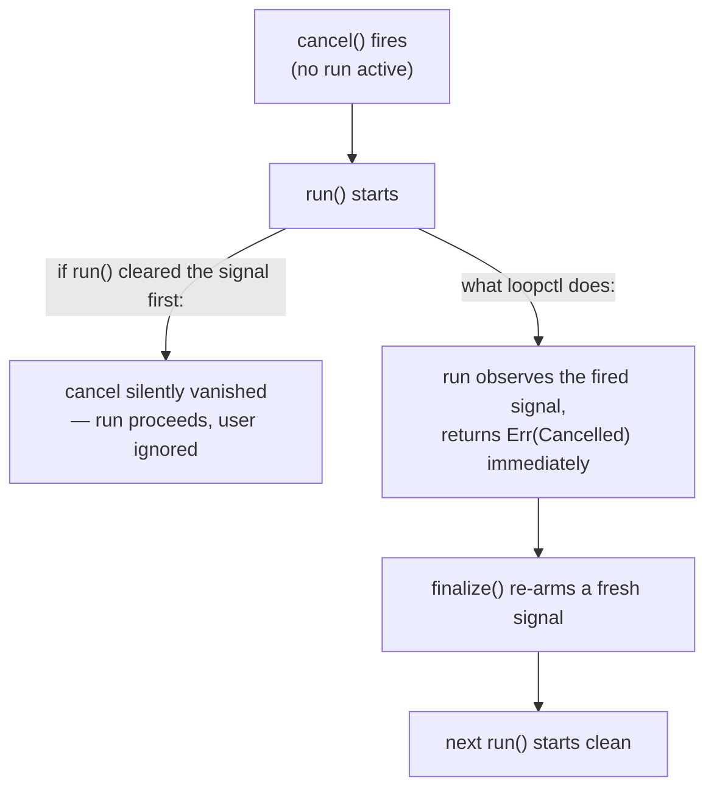

An agent run can be told to stop at any instant: the user hits Ctrl-C, a watchdog times out, a UI button says "abort." There are two ways for a program to honor that:

- **Preemptive** — someone kills the work from outside, mid-sentence, whether it's ready or not.
- **Cooperative** — a **shared flag** is raised, and the work itself checks that flag at agreed points and exits cleanly.

loopctl is built entirely on the second. This page explains why cooperative is the right model for agents, how the signal works, and what "cooperative" demands from you as a tool author.

---

## Why not just kill it?

Preemptive stopping is fast but blind. An agent mid-run is often holding something half-done: a tool that has written half a file, a request that has charged an API and not recorded the answer, a conversation with a tool call whose result never arrived. Killing at a random instruction can leave all of those broken — and, worse, *silently* broken.

Cooperative cancellation moves the decision to somewhere safe. The run keeps executing until it reaches a **checkpoint** — a moment between actions, where nothing is half-done — and exits there. You lose "instantly, mid-anything"; you gain "always at a clean boundary, within milliseconds anyway."

There's a Rust-specific reason the question even comes this way: **Rust's async has no preemptive kill for tasks.** An async task runs only while it's being polled, and the runtime can *drop* (abandon) a future — which stops it at its next `await` point — but it cannot stop one mid-computation. So "cooperative checkpoints" isn't just good design here; it's the only design the execution model offers. loopctl's job is to place enough checkpoints that the practical difference vanishes.

## The signal — and why not a plain bool

The flag is `CancelSignal` (`src/cancel.rs`), shareable as an `Arc`, wrapping tokio's `CancellationToken`. The obvious DIY version — an `Arc<AtomicBool>` — has a classic race:

```text
worker:  if flag.is_cancelled() { ... }        // check: not cancelled
                                                // ← cancel() fires HERE
worker:  await something_that_takes_10s();     // act: starts waiting anyway
```

The check and the wait are two steps, and a cancel landing *between* them is missed until the wait finishes. A `CancellationToken` closes that gap by construction: checking ("is it fired?") and waiting ("wake me when fired") are two views of the same primitive, so a cancel raised at any instant wakes every current and future waiter immediately.

Two deliberate semantics on top:

- **The signal is one-shot.** Once fired, it stays fired — there is no "un-fire," because two tasks disagreeing about whether a fired signal is live is exactly the race you're avoiding.
- **So "reset" swaps in a brand-new token.** Re-arming for the next run replaces the fired token with a fresh one, observed by everyone through the same shared handle. A task still awaiting the *old* token resolves against it correctly.

### The type, inside

```rust
pub struct CancelSignal {
    inner: Mutex<CancellationToken>,    // tokio_util's purpose-built primitive
}
```

Method by method, what each actually does:

| Method | Behavior | The detail that matters |
|---|---|---|
| `cancel()` | fires the token — **idempotent**, wakes every current and future waiter | a poisoned lock is force-recovered: a panicking holder can't brick the signal |
| `is_cancelled()` | non-blocking poll | for checks at checkpoints |
| `notified().await` | clones the token out under the lock (held only for the clone), then awaits the clone | the clone-and-await *is* the race-freedom — a cancel fired any time before or during the await resolves it |
| `reset()` | swaps in a **brand-new** token | "un-firing" is not an operation that exists |

## The checkpoints — where the flag is honored

The engine checks the signal at every granularity where work can be stuck. "Biased" below means the cancel check is polled *first* — if the signal is already fired, the competing work is never even started:

| Where | What happens on cancel |
|---|---|
| Before each model call | the turn is never sent — instant `Err(Cancelled)` |
| During a model call (non-streaming) | the request future is dropped at its next await |
| During streaming | every event poll races the signal — mid-stream exit |
| During a tool call | the tool's future is dropped at its next await |
| Between tools / between parallel waves | next call never starts |
| During recovery backoff sleep | the sleep is abandoned, no retry starts |

The exhaustive map, for reasoning about a specific hang — every place the signal is consulted, and what each check returns:

| # | Call site | Mechanism | On cancel |
|---|---|---|---|
| 1 | turn entry (`do_turn`) | early guard | `Err(Cancelled)`, provider untouched |
| 2 | non-streaming request | biased 3-way `select!` | request future dropped at its await |
| 3 | streaming, per event poll | `select!` racing `stream.next()` and both deadlines | mid-stream exit, no further events read |
| 4 | streaming, gate and backoff sleeps | cancel-aware sleeps | the wait is abandoned |
| 5 | non-streaming fallback rescue | biased `select!`, checked on entry | the rescue is never sent |
| 6 | sequential dispatch, between calls | poll before each call | the next call never starts |
| 7 | parallel dispatch, wave boundaries | poll at each wave top | remaining waves never start |
| 8 | a single tool call | biased `select!` vs the tool future | **the future is dropped mid-flight** |
| 9 | recovery backoff sleep | biased `select!` vs the sleep | no retry starts |
| 10 | pipeline level (`dispatch_all`, the timeout layer) | checks before/after each call; layers race the signal | partial batches are discarded |

Rows 2/3/5/8/9 are *races* (cancel wins instantly, mid-work); rows 1/6/7/10 are *polls* (the next unit of work never begins). Nothing else in the engine waits indefinitely without falling into one of these rows — that's the invariant that makes "how fast does a cancel land?" answerable: at worst, one event-poll or one await point.

The result lands on the run's record as `Cancelled` — which is **not `Failed`**. A cancel is an expected, healthy outcome of an interactive program; the brain records it as its own terminal state, the scratchpad is discarded (a cancelled run is not committed — half a conversation is not a good conversation), and the run is logged with stop-reason *cancelled* so your telemetry can tell user-stops from malfunctions.

## One cancel = exactly one cancelled run

The signal re-arms **at the end of the run** (inside `finalize()`), not at the start. Order matters:



Re-arming after the run *observes and reports* the cancellation means a cancel is never silently swallowed — one firing always produces exactly one cancelled run, and then the signal is fresh.

Two precision notes that the guarantee rests on:

- **A cancelled turn is not recorded as a model failure.** When the error path sees `Cancelled`, it short-circuits *before* failure bookkeeping — the [fallback breaker](/safety/fallback/) is not fed, no stream-failure event fires. A user changing their mind must not trip a circuit breaker; that's what actual errors are for.
- **The token-swap has exact semantics for stragglers.** A task already awaiting the *old* token still resolves against it (it was cancelled — correctly), while anything that asks *after* the swap sees the fresh, unfired signal. No waiter can observe a half-reset state, because there is never a moment when "the" signal is both.

## What cooperative asks of *you*

The engine controls its own checkpoints, but **your tools are the part of the system the engine cannot see inside.** When a cancel lands mid-tool, the engine drops the tool's future — execution stops at the next `await`, and cleanup code after it does not run. The practical contract for tool authors:

> **Write tools that are safe to abandon at any await point.**

- Land writes atomically: write to a temp file, then `rename` into place (a rename is atomic; a half-written file is not).
- Prefer idempotent side effects — operations where "did it twice" equals "did it once" — for anything reaching other systems.
- Don't hold invariants *across* awaits that a drop would strand (an open lock, a half-sent batch).

The same contract applies through [MCP](/integration/mcp/) — the server adapter races each remote call against the token and drops in-flight calls on cancel.

And cancellation can come from *inside*, too: anything holding the `Arc<CancelSignal>` — an [observer](/extensions/observers/) deciding "this is going nowhere," a [hook](/extensions/hooks/) enforcing a policy — can fire it, and the next checkpoint (almost always milliseconds away) picks it up.

---

## The pattern, condensed

| Property | Choice | Reason |
|---|---|---|
| Stop model | cooperative, not preemptive | exits happen at clean boundaries; async Rust allows nothing else |
| Signal | one-shot token, not a bool | check-then-wait races are impossible by construction |
| Re-arm | swap a fresh token, after each run | one cancel = one cancelled run, never swallowed |
| Checks | biased — cancel polled first | cancellation always wins the race |
| Mid-tool | future dropped at next await | tools must be safe to abandon |
| Outcome | `Cancelled` ≠ `Failed` | a user stop is not a malfunction |

---

## Related pages

- [Cancellation](/engine/cancellation/) — the full mechanism page (API, wiring, tests).
- [Termination](/engine/termination/) — where `Cancelled` sits among the other endings.
- [Backoff and jitter](/principles/backoff-and-jitter/) — the other place "time" enters the engine's decisions.
