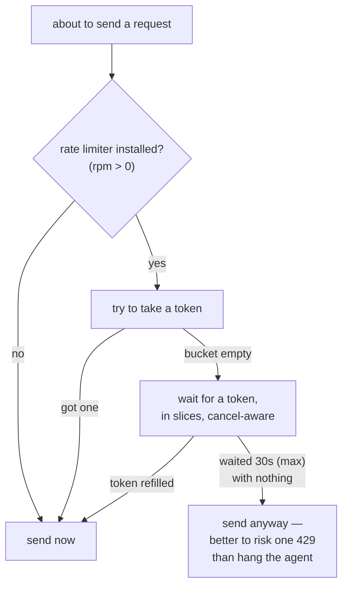

Model providers meter you: so many requests per minute, and a pointed error (HTTP **429**, "too many requests") when you exceed it. A client that ignores the meter gets throttled, then slowed further, then cut off. **Rate limiting** is the client-side discipline of spending requests at a rate the provider will accept — proactively, before the 429, and reactively, once the server has spoken. loopctl has both layers; this page explains the machinery of each.

---

## The token bucket — a budget that refills

The classic rate-limiting algorithm, and the one loopctl uses (`src/stream/rate_limit.rs`), models a **bucket of tokens**:

- The bucket holds up to **C** tokens (its *capacity*).
- Every request **takes one token**. No token, no request.
- Tokens **refill continuously** at rate **r** per second, up to the brim — never beyond.

Two knobs, two behaviors:

```text
capacity C  →  BURST: how much you can do back-to-back right now
refill r    →  SUSTAINED: how much you can do forever
```

Worked example — the default constructor's shape, 60 requests/minute: C = 60 tokens, r = 1 per second.

```text
t=0:00  bucket full (60) → fire 20 requests → 40 left
t=0:10  refilled +10 → 50 left → fire 30 → 20 left
t=0:30  refilled +20 → 40 left...
sustained rate: forever, 1 request per second;
               never more than 60 in any single burst from empty.
```

The bucket *is* a savings account: it lets you save up capacity for a burst, then re-earns it at a fixed wage. Compare the naive alternative — "at most 1 request per second" — which forbids legitimate bursts and wastes capacity you've earned but not spent.

**The lazy-refill trick.** An obvious implementation runs a background task dripping tokens into the bucket. loopctl does it with *no timer at all*: each `take()` looks at the wall clock, computes how much time elapsed since the last refill, adds `elapsed × r` tokens (capped at C), and updates the bookmark. The math is identical; the moving parts are zero. (One refinement: when the bucket is *full*, the bookmark only advances to the moment it became full — tokens you couldn't have stored were never yours.)

## The bucket, computed

`take()` in pseudocode — the entire algorithm, including the fill-point refinement:

```text
take():
    now      = clock()
    elapsed  = now − last_refill
    tokens   = min(tokens + elapsed × (capacity / 60), capacity)   # lazy refill
    if tokens == capacity:
        last_refill = the moment it reached capacity               # ← the refinement:
    else:                                                          #   tokens you couldn't
        last_refill = now                                          #   store were never yours
    if tokens ≥ 1:
        tokens −= 1
        return Ok
    else:
        return Wait(time until the next whole token)
```

Why the refinement matters: without it, a bucket that sat full for an hour would *bank* that hour of refills it never needed — and "refill rate r" would silently become "refill rate r, plus whatever accumulated while idle." Anchoring `last_refill` to the brim moment means idle time earns nothing, exactly as the contract ("capacity C burst, r sustained") promises.

Loopctl's concrete numbers: `RateLimiter::new(rpm)` gives each provider base URL its own bucket with `capacity = rpm`, starting full; `rpm = 0` disables the limiter entirely (every `take` succeeds).

## The proactive layer — waiting before you fire

loopctl keeps **one bucket per provider base URL** (different providers = separate budgets) behind a `RateLimiter`, and the stream handler consults it before every attempt:



That last arrow is a philosophy, not an accident: client-side limiting is *throttling yourself politely*, and it must never become *deadlocking yourself*. The wait is bounded (`rate_limit_max_wait`, default 30 s) and cancellation-aware, and past the bound the request goes out and takes its chances.

## The reactive layer — listening when the server speaks

Prevention is a guess; the server's answer is a measurement. When a 429 (or a 503/529 "overloaded" — same treatment) still arrives, the [stream handler](/core-data/stream-events/) switches to the reactive ladder:

1. **Honor `Retry-After`.** The response usually carries a header saying exactly how long to wait. That hint wins over any formula — the server knows its own load. The wait is capped at 60 s so a hostile or broken hint can't freeze the agent.
2. **Retry, with the hint as the delay** — up to `fallback_after_retries` (default 3) times.
3. **Escalate.** Still limited after 3 tries → the failure becomes `RateLimitEscalation` and is reported to the [model circuit breaker](/safety/fallback/), which can reroute the whole turn to a backup model. Deliberately, this does **not** silently retry the same model unstreamed — a rate limit is charged against the model's quota no matter how the request travels.
4. **Hard stop** after `max_retries` (default 5).

### The reactive ladder, counted precisely

The numbered flow above hides three exact rules worth having on record:

**Detection — what counts as "rate limited."** Three shapes, in order of trust: the structured `ApiError::RateLimit` variant (parsed from the response, carrying its `Retry-After`); an `Api` error whose text contains "rate limit" or "429"; an `Http` error with status 429 — or 503/529, classified as *Overloaded* rather than plain rate limiting (the server is drowning, not rationing — same treatment, different label for your dashboards).

**Delay — how the hint is honored.** `Retry-After` is parsed as delta-seconds (and as an HTTP-date when the `providers` feature is on), then `min(hint, 60 s)` — the cap is what keeps a hostile or broken hint from freezing the agent. No hint at all → the default 5 s. Every wait is additionally clamped to the turn's remaining total deadline.

**Escalation — the exact rungs.** Retries 1–3 honor the hint; the 4th rate-limit failure escalates (`RateLimitEscalation { attempts, retry_after }`, recorded on the model breaker as `FailureKind::RateLimit`); past the 5th, hard stop → the non-streaming fallback if enabled, else failure. Note what never happens: a same-model retry *disguised* as a fallback — a rate limit is charged against the model's quota however the bytes travel, so the only honest moves are wait, escalate, or switch models.

## Why two layers

The layers answer different questions and fail differently:

| | Proactive (token bucket) | Reactive (`Retry-After` ladder) |
|---|---|---|
| Acts | *before* the request | *after* the refusal |
| Knows | your configured rate | the server's actual state |
| Prevents | most 429s | damage from the ones that happen |
| Failure mode if wrong | you under-use your quota | you back off as told |

Keep both and each covers the other's blind spot. The same two-layer shape — prevent, then adapt — recurs across loopctl: timeouts *and* retries, health scores *and* circuit breakers, threshold compaction *and* the emergency line.

> One accounting note: rate-limit retries have a **separate budget** from transport retries (network blips, 5xx). A storm of 429s cannot consume the patience you need for genuine network failures — see [backoff and jitter](/principles/backoff-and-jitter/) for the other budget.

---

## Related pages

- [Stream events](/core-data/stream-events/) — where both layers are wired.
- [Backoff and jitter](/principles/backoff-and-jitter/) — the retry math the reactive ladder uses.
- [Circuit breakers](/principles/circuit-breakers/) — where rate-limit escalation lands.
