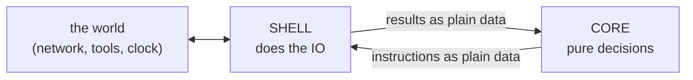
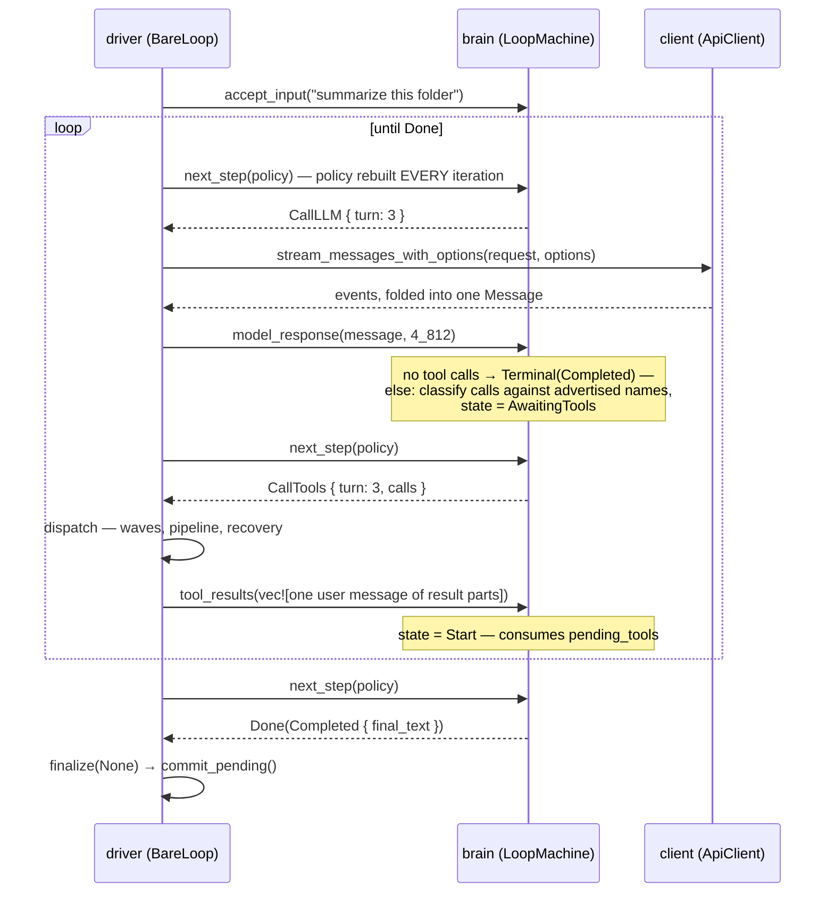

**Sans-IO** means "without input/output." It is a design pattern with one rule at its center: **the part of your program that makes decisions should never touch the outside world.** No network, no files, no clock, no randomness — nothing whose answer could differ from one run to the next. All of that lives in a separate shell that does the dirty work and reports back.

loopctl's engine is built this way. If you read one page about *how* loopctl works, the [big idea](/start-here/the-big-idea/) page shows the split. This page explains the pattern itself: where it came from, what it buys, what it costs, and how to spot it in the code.

---

## What counts as IO, and why it's separated

**IO (input/output)** is anything a program does to reach outside its own memory:

| Outside thing | Why it's trouble for a decision-maker |
|---|---|
| The network | Slow, flaky, different answers every time |
| Files, databases | Can change between two looks |
| The clock | "Now" is a different value every millisecond |
| Randomness | Two identical questions get different answers |

The common thread: **IO makes behavior depend on things you don't control.** A decision-maker that touches IO becomes hard to test (you must fake the world), hard to save (what do you do with an open network connection?), and hard to reason about (the same inputs no longer give the same answer).

The sans-IO answer is to quarantine the unpredictability. The decision core becomes **plain data in, plain decision out** — deterministic, meaning *the same inputs always produce the same outputs*.

> The name comes from the Rust networking world, where protocol libraries (HTTP, QUIC) keep their connection logic as pure state machines and push the actual sockets to the edges. loopctl applies the same idea to the agent loop. You may also see the general shape called a **pure core** with an **imperative shell**.

---

## The pattern, in the abstract

Every sans-IO design has the same three moving pieces:



1. **The core** holds all the state and all the rules. You ask it "what next?" and it answers with an instruction — data, not action.
2. **The shell** executes the instruction in the real world.
3. **The shell reports back**, feeding the outcome into the core as plain data. Repeat until the core says "done."

The core never "calls" anything. It only ever *asks to be told*. That single inversion is the whole pattern.

---

## How loopctl applies it

| Pattern piece | loopctl name | Where it lives |
|---|---|---|
| The core | `LoopMachine` (the brain) | `src/engine/core/machine.rs` |
| The shell | `BareLoop` (the driver / the hands) | `src/engine/bare.rs` + submodules |
| The instructions | `MachineStep`: `CallLLM` · `CallTools` · `Compact` · `Done` | the brain's only vocabulary |
| The reports | The feeds: `model_response()` · `tool_results()` · `compaction_result()` · ... | the only way results enter the brain |

The discipline is enforced by details, not comments:

- **Settings are never stored in the brain.** The driver hands the brain a fresh `MachinePolicy` (max turns, context window, thresholds) on *every* step. This is what keeps the brain serializable — saved state is pure data, with no config to drift out of sync.
- **The brain holds no clock, no connection, no handle to anything.** Turn counts and token estimates are numbers the driver feeds it, not things it observes.
- **Asking never changes anything.** `next_step()` is pure: call it twice in a row and you get the same answer. All change happens through feeds.

---

## The vocabulary, in actual types

The brain's entire outward vocabulary is four instructions; its inward vocabulary is the matching feedback methods. In real types (signatures shortened):

```rust
enum MachineStep {
    CallLLM   { turn: usize },
    CallTools { turn: usize, calls: Vec<ToolCall> },
    Compact   { reason: CompactReason },     // Emergency | ThresholdExceeded | Manual
    Done(MachineOutcome),                    // Completed | Cancelled | MaxTurnsExceeded | Failed
}

impl LoopMachine {
    // the one question
    fn next_step(&mut self, policy: MachinePolicy) -> MachineStep;

    // the feeds — the ONLY way results enter the brain
    fn accept_input(&mut self, input: &str);
    fn model_response(&mut self, response: Message, context_tokens: u64);
    fn tool_results(&mut self, messages: Vec<Message>);
    fn compaction_result(&mut self, compacted: Vec<Message>, before: u64, after: u64);
    fn compaction_noop(&mut self, before: u64, after: u64);
    fn set_context_tokens(&mut self, n: u64);
    fn inject(&mut self, message: Message);
    fn cancel(&mut self);
    fn fail(&mut self, error: LoopError);

    // the two maintenance calls, used only by the exit door
    fn commit_pending(&mut self);    // success exit: scratchpad → notebook
    fn discard_pending(&mut self);   // failure exit: scratchpad → trash
}
```

Count them: **one question, four instructions, eleven ways in.** That is the complete interface between the two halves of the engine. Anything else either half knows, it knows about itself — which is exactly why the seam is auditable: the entire set of ways the world can touch a run fits on one screen.

## One loop iteration, method by method



Details a first reading misses:

- **The turn number belongs to the brain.** It names the turn in `CallLLM { turn }`; the driver never counts turns itself — it borrows the brain's count, so there is exactly one turn ledger, not two that can drift.
- **`tool_results` takes one user message containing all result parts** — the provider convention (results ride a user-role message) is assembled by the driver and accepted whole by the brain. One batch, one feed, one state change.
- **`model_response` does classification.** The brain itself sorts each requested call against the tool names the driver advertised: known → a pending call awaiting dispatch; unknown → *pre-answered* with an `is_error` result ("tool 'x' is not available") that travels back to the model without ever touching the registry. Even error-recovery is a brain decision, made from data.
- **The policy is rebuilt every iteration** from session config, run config, and current extras — a mid-run config change takes effect on the very next step. That's why nothing setting-shaped is ever serialized.

## What serializes — exactly

"Save the run" is `serde_json::to_string(&machine)`. What's inside the bytes, and what deliberately isn't:

| Serializes (the brain) | Stays behind (the shell) |
|---|---|
| `state` — including `Failed` *with its error record* | the client, the registry, every observer/hook/middleware |
| `history` + `pending` — both message buffers | the cancel signal (a fresh one is wired on restore) |
| `turns_taken`, `context_tokens`, `cancelled` | the policy — settings are re-supplied per step |
| `pending_tools` — including pre-answered unknown-tool results | nothing else: the brain has nothing else |

Two refinements that tests pin: `fail()` stores the error inside `Terminal(Failed)` *before* anything could be serialized — a saved errored machine restores as an errored machine, never as a mysterious mid-state. And a restored machine makes **identical** `next_step` decisions — resume is exact by construction, because the state is the behavior.

---

## What the pattern buys you

**1. Testing without theater.**
To test "does the engine compact at 95% of the window?", you build a machine, feed it a fake token count, and read its step. No mock HTTP server, no sleeping, no flakiness. The engine's behavior tests run in microseconds because the brain has nothing slow inside it.

**2. Pause anywhere, resume anywhere.**
Plain data can be serialized — turned into bytes with `serde` and stored. Because the brain is nothing *but* plain data, a run can be saved mid-flight on one machine and restored on another, and the resumed brain makes **identical** decisions (a test pins this). You cannot serialize an open network connection; that's exactly why the connection lives in the shell.

**3. The engine outlives any provider.**
The brain doesn't know what an OpenAI or an Anthropic is. All model access flows through one small trait (`ApiClient`) in the shell. New providers plug in without the decision logic ever noticing.

**4. Determinism makes bugs reproducible.**
When a run misbehaves, the sequence of (state, feed) pairs is a complete, replayable explanation. Nothing hidden happened between two lines of your log — nothing *could* happen, because the brain can't act on its own.

---

## What the pattern costs

Honest accounting — this split is not free:

- **Every outcome needs a matching feed.** The brain can't "just find out" — the shell must faithfully report model replies, tool results, compaction outcomes, cancel requests. A forgotten feed path is a real bug class (this is why the driver routes *all* exits through one `finalize()` door, and why there are exactly two compaction feeds — one for "history was rewritten" and one for "nothing changed" — where a lazier design would use one).
- **More explicit plumbing.** An ordinary loop can inline "call the model, use the reply." A sans-IO loop must phrase that as a step, a state, and a feed. The machinery in [the state machine](/engine/state-machine/) and [the driver loop](/engine/driver-loop/) pages *is* that plumbing.
- **The split must be honest.** One sneaky clock read or network call inside the brain and the guarantees (serializable, deterministic, testable) silently break. The boundary is a discipline, not a wall the compiler enforces here.

---

## How to spot the seams in the code

When reading loopctl's source, ask of any line: *does this decide, or does this do?*

| If it decides... | If it does... |
|---|---|
| it belongs in `LoopMachine` (or a pure helper) | it belongs in the driver or a provider client |
| its inputs are policy + feeds | its inputs are connections, registries, the filesystem |
| it can run in a plain `#[test]` with no mocks | it needs `#[tokio::test]`, a client, or a temp dir |

The same question applies to the subsystems: the loop *detector* is pure (a window of recorded operations, no IO); the *reflector* runs a model call, so it lives behind a trait in the shell with a no-op default. Whenever loopctl needs both deciding and doing for one feature, the decision half is pure and the doing half is a pluggable trait object.

---

## Related pages

- [The big idea](/start-here/the-big-idea/) — the same split, as an introduction.
- [State machines](/principles/state-machines/) — the shape the pure core takes.
- [The state machine](/engine/state-machine/) · [the driver loop](/engine/driver-loop/) — the two halves in full detail.
