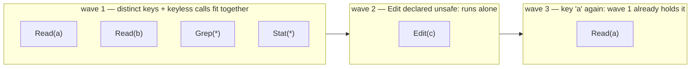
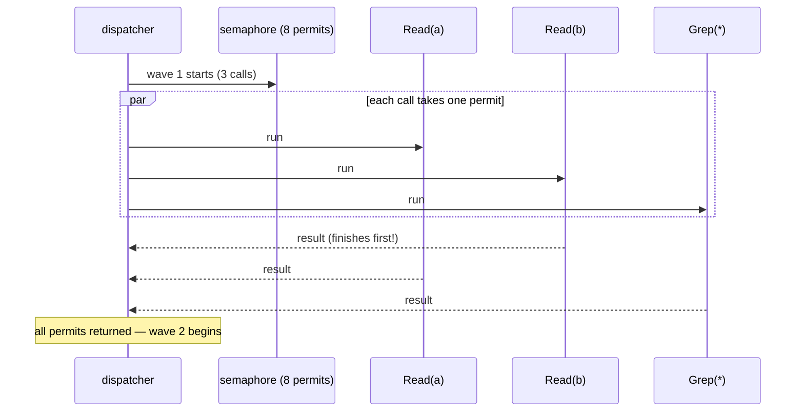

When a model replies with several tool calls in one turn, running them **in parallel** can turn five seconds of wall-clock into one. But two of those calls might write the same file — running them together corrupts it. And whatever happens, the results must come back **in the order the model asked for them**, because providers require every tool call to be answered, in place.

loopctl's parallel dispatcher solves this with a two-phase design: a pure **planning** phase that groups calls into **waves** (every call in a wave is safe to run at the same time), and an **execution** phase that runs each wave concurrently under a cap. The planning algorithm is deliberately simple — greedy first-fit — and this page explains both the grouping and why simple is the right choice. Source: `src/engine/bare/dispatch.rs`.

---

## Who declares what is safe — the two flags

The engine cannot *guess* which calls conflict; only the tool author knows. So each tool declares, per input (they can vary call to call):

```rust
// on your Tool implementation:
fn is_safe_for_concurrent_execution(&self, input: &Value) -> bool { /* default: false */ }
fn resource_key(&self, input: &Value) -> Option<String> { /* default: None */ }
```

- **`is_safe_for_concurrent_execution`** — "running me at the same time as *anything* else is fine." Reads, searches, pure computations: `true`. Anything with uncontrolled side effects: `false` (the conservative default).
- **`resource_key`** — the *shared thing* this call touches: a file path, a database name, a service endpoint. Two calls with the **same key** must not overlap; two calls with different (or no) keys can.

A `Read` might return `Some("file:a.rs")` — so two reads of *different* files run together, while two calls on `a.rs` serialize. The key is only consulted when the call is already marked concurrency-safe.

## The planning algorithm — greedy first-fit wave packing

Planning is **pure**: it looks at the calls and tool declarations, and produces waves. No IO, no execution. The rule set is four lines:

```text
for each call, in the model's order:
  1. not concurrency-safe         → its own wave, closed to everyone
  2. safe, no resource key        → join the EARLIEST wave still open
  3. safe, key K                  → join the earliest open wave
                                      that doesn't already hold key K
  4. no such wave                 → start a new wave
```

In code terms: `ToolDependencyGraph::from_calls(calls, &registry)` first builds one node per call — `{ idx, parallelizable, resource_key }` — by asking each *registered* tool for its two declarations with the call's input (an unregistered tool is conservatively non-parallelizable; you can't ask it). Then `plan()` walks the nodes in order, keeping two bookkeeping lists: `wave_keys` (the set of resource keys each wave already holds) and `wave_open` (whether each wave may still accept members — a singleton wave is born closed):

```text
plan(nodes):
    for node in nodes (in model order):
        if !node.parallelizable:
            new wave [node.idx], born CLOSED
        else if node.resource_key is None:
            join the earliest wave with wave_open == true
        else if some open wave whose wave_keys excludes node.resource_key:
            join the earliest such wave; add the key to its set
        else:
            new wave [node.idx], born OPEN
```

Worked example — six calls arrive from the model:

```text
calls, in order:   Read(a)   Read(b)   Edit(c)   Grep(*)   Read(a)   Stat(*)
                    safe,key  safe,key  UNSAFE    safe,—    safe,key  safe,—

the planner walks them once, left to right:

  Read(a)  → wave 1 is born (open, keys {a})
  Read(b)  → earliest open wave without "b" = wave 1          → joins
  Edit(c)  → unsafe: own singleton wave 2, born CLOSED
  Grep(*)  → keyless: earliest OPEN wave = wave 1             → joins
  Read(a)  → wave 1 holds "a", wave 2 is closed, nothing fits → wave 3 born
  Stat(*)  → keyless: earliest open wave = wave 1 (still open!) → joins
```

Result — one four-call wave, one forced singleton, one follow-up wave, run in that order:



Note what the packing achieved for `Read(a)`: waves 1 and 3 both touch `a`, but they never *overlap* — the key rule forced the second read into a later wave. And note the small surprise: `Edit(c)` was call #3 but executes *before* the wave-3 read — waves run in creation order, and the closed singleton keeps its place in line.

The same example as the planner sees it — every decision, in order, with the rule that made it:

| # | Call | parallelizable? | key | Decision | Rule applied |
|---|---|---|---|---|---|
| 1 | `Read(a)` | yes | `a` | **new wave 1** (open, keys `{a}`) | nothing exists yet |
| 2 | `Read(b)` | yes | `b` | join wave 1 (keys `{a,b}`) | earliest open wave without `b` |
| 3 | `Edit(c)` | **no** | — | **new wave 2 — singleton, born closed** | rule 1: unsafe runs alone |
| 4 | `Grep(*)` | yes | — | join wave 1 | keyless: the *earliest open* wave — still wave 1 |
| 5 | `Read(a)` | yes | `a` | wave 1 rejected (holds `a`), wave 2 closed → **new wave 3** | no open wave without `a` |
| 6 | `Stat(*)` | yes | — | join wave 1 | keyless fits the earliest open wave, wherever it is |

Row 6 teaches the detail worth remembering: **open waves never close.** A wave born open keeps accepting for the whole planning pass — only singletons are born closed — so a late keyless call still lands in wave 1 even after waves 2 and 3 exist. Deterministic, slightly non-obvious, and exactly what "first-fit" means: fill the earliest bin that fits, always.

**Why greedy, not optimal?** Finding the minimal number of waves is a bin-packing problem — expensive to solve exactly, for a payoff (a few saved milliseconds of scheduling) that is dwarfed by the tool calls themselves. Greedy first-fit runs in essentially linear time, is deterministic (same calls → same plan), and gets most of the parallelism available. The general trade: **scheduling is cheap; only execution is expensive — never spend the first to save the second.**

## Execution — concurrency with a cap, order with slots

Each wave runs to completion before the next starts; within a wave, calls run concurrently, bounded by a **semaphore** with `max_concurrency` permits (default 8, clamped down to the batch size — never more slots than calls):



**Order preservation** — the subtle requirement. Tools finish in arbitrary order (`Read(b)` above finished first). But the model's conversation needs results *in request order*. The fix is positional slots: the results array is pre-sized to the call count, and each call — whichever task it runs in — writes its result at **its own original index**. Completion order is irrelevant; slot order is everything. (A defensively-unfilled slot becomes a soft error, not a hole.)

**Failure semantics** — deliberate hardness in one place:

- A **soft error** (`is_error: true`) is a normal result — it takes its slot and the wave moves on.
- A **hard error** (cancellation, a loop-detection stop) aborts the whole batch: sibling results already resolved in that wave are **discarded**, and the error ends the run. No half-batches — the model would see a conversation missing results, and providers reject those. (Same principle as the two-buffer scratchpad: all of a unit, or none of it.)

**Cancellation** is checked at every wave boundary, and each call races the cancel signal individually — see [cooperative cancellation](/principles/cooperative-cancellation/).

### The execution rules, precisely

- **The semaphore is clamped**: `max_concurrency.clamp(1, tool_calls.len())` — never more permits than calls, never zero. `max_concurrency: 1` degenerates parallel mode into sequential *on the same code path* — a debugging switch, not a different mode.
- **Permits are acquired inside each task**, not up front: a wave of 5 under a 3-permit semaphore starts 3 calls and admits the rest as permits free. A dropped/cancelled permit acquisition surfaces as `Err(Cancelled)` — it can't silently shrink the wave.
- **Result slots are `Option`s**, pre-sized to the call count; a task writes `results[original_index]`. The final mapping treats any still-`None` slot (defensively unreachable) as a soft `"dispatch produced no result"` — a hole can never reach the model.
- **Within a wave, `join_all`**: the wave ends when all its calls end. A hard error propagates out of the join and the *already-resolved* sibling slots of that wave are dropped with it — the test that pins this is literally named `parallel_hard_error_discards_sibling_results`.
- **Fewer than 2 calls skips planning entirely** — the sequential path serves them (nothing to overlap).

## When parallel isn't

Three honest fallbacks: a batch of fewer than 2 calls runs through the sequential path (nothing to overlap); `max_concurrency: 1` makes parallel mode *behave* like sequential on the same code path (a debugging tool); and the default mode is sequential entirely — parallel is opt-in per run, because only the tool author's declarations make it safe.

Observers see the same event stream either mode (PREs batch, POSTs arrive by completion — pair by `tool_call_id`, not arrival order), and both modes use the *same* per-call pipeline, so every safety layer from [tool dispatch](/engine/tool-dispatch/) fires identically.

---

## The pattern, compressed

1. **Declarations, not guesses** — safety comes from tools declaring it, per call.
2. **Plan purely, then execute** — the wave plan is a function of the calls; testable without running anything.
3. **Greedy beats optimal at this scale** — scheduling must never cost more than it saves.
4. **Concurrency inside, ordering outside** — free completion order, fixed result order.
5. **All-or-nothing failure** — a batch with a hole is worse than no batch.

---

## Related pages

- [Tool dispatch](/engine/tool-dispatch/) — where waves sit in the per-call pipeline.
- [Tools](/core-data/tools/) — declaring `is_safe_for_concurrent_execution` and `resource_key`.
- [Caching](/principles/caching-and-invalidation/) — the epoch guard exists precisely because waves make reads and writes overlap.
