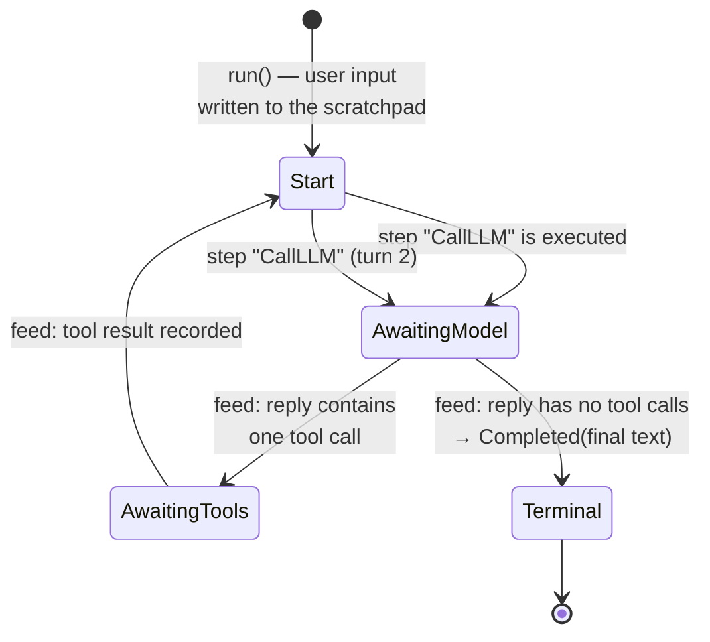

A **state machine** is a way of designing a system so that, at every moment, it is in exactly one named **state**, and only certain moves (**transitions**) between states are allowed. Everything else — every state not on the list, every move not on the list — simply cannot happen.

That sounds abstract, so here is the whole idea in one familiar object: a **turnstile** (the waist-high gate at a stadium). It has two states: *locked* and *unlocked*. It understands two events: *coin* and *push*.

| Current state | Event | New state | What happens |
|---|---|---|---|
| locked | coin | unlocked | it clicks open |
| locked | push | locked | it refuses (that's the point) |
| unlocked | push | locked | one person passes, it re-locks |
| unlocked | coin | unlocked | extra coin, no harm |

Notice what the table *forbids*: there is no row where pushing a locked gate lets anyone through. The machine cannot be confused, half-locked, or "probably open" — because those aren't states. **That is the value: if you can name every situation, you can prove you handle every situation.**

loopctl's engine brain ([`LoopMachine`](/engine/state-machine/)) is a state machine. This page explains why an agent loop is a natural fit for the pattern, and what the pattern buys once it's there.

---

## Why an agent loop *is* a state machine

Watch what a run actually does. It sends the conversation to the model and **waits for the reply**. It runs tools and **waits for the results**. Sometimes it shrinks the conversation and **waits for that to finish**. Eventually it **ends**.

Those "waits" are not implementation details — they are the *only* situations a run can be in. At any instant, the engine is doing exactly one of:

- nothing pending — ready to pick the next move,
- waiting for the model to answer,
- waiting for tools to finish,
- waiting for compaction to finish,
- finished (forever).

That is a state machine, whether you write it as one or not. The design choice is to **write it as one**: name the states, name the moves, and let the type system hold you to them. The alternative — a loop full of booleans (`is_calling_model`, `tools_pending`, `was_compacted`...) — can represent nonsense like "waiting for tools *and* finished," and every combination you forgot to check is a bug waiting for a weird network timing to expose it.

## The loopctl machine

The brain's states, in code:

```rust
pub enum MachineState {
    Start,                     // ready to pick the next step
    AwaitingModel { turn },    // model call in flight
    AwaitingTools { turn },    // tool batch in flight
    AwaitingCompaction,        // shrink in flight
    Terminal(MachineOutcome),  // finished — forever
}
```

And the full set of moves. Reads down the left: what just happened (a *feed* — the shell reporting a result). The brain reacts according to the state it was in:

| Was in | Feed: "here's the model's reply" | Feed: "here are the tool results" | Feed: "compaction finished" |
|---|---|---|---|
| `Start` | *(illegal — no call was in flight)* | *(illegal)* | *(illegal)* |
| `AwaitingModel` | no tool calls → **`Terminal(Completed)`**; else → `AwaitingTools` | *(illegal)* | *(illegal)* |
| `AwaitingTools` | *(illegal)* | → `Start` (next step: usually `CallLLM`) | *(illegal)* |
| `AwaitingCompaction` | *(illegal)* | *(illegal)* | → `Start`, or **`Terminal(Failed)`** if nothing was shaved |
| `Terminal` | ignored — terminal is forever | ignored | ignored |

The "illegal" cells are where the pattern earns its keep. A tool result can only be fed to a brain that is `AwaitingTools`. A driver bug that tried to feed a model reply into a brain awaiting tools is not silently mis-filed — it's a contract violation the design makes visible, because the feed doesn't match the state.

Two more pieces of vocabulary, because they carry weight:

- **Terminal is one-way.** `Terminal(Completed | Cancelled | MaxTurnsExceeded | Failed)` has no outgoing transitions. A saved-and-restored finished run still knows it finished; you cannot accidentally revive it. In the turnstile, "unlocked" is reachable again — in an agent run, "done" is not, and the machine enforces it.
- **Asking is not a transition.** `next_step()` — "what should happen next?" — is a pure question. It reads the state and answers `CallLLM`, `CallTools`, `Compact`, or `Done`. It never changes the state. All change flows through feeds. (This is the sans-IO discipline from the [previous page](/principles/sans-io/) expressed as machine rules.)

## The guard checks, in order and in arithmetic

The `Start` / `AwaitingModel` branch of `next_step` is a fixed chain of comparisons — first hit wins, and every one is plain integer arithmetic (no floats anywhere in the brain):

```text
1. cancelled flag set?                       → Done(Cancelled)
2. turns_taken >= max_turns?                 → Done(MaxTurnsExceeded)
3. context_tokens >= window × 95 / 100?      → Compact(Emergency)        — inclusive, always on
4. auto_compact AND
   context_tokens > window × threshold / 100?→ Compact(ThresholdExceeded) — strict
5. otherwise                                 → CallLLM(turn)
```

Three details inside those lines:

- **Order is policy.** Cancel beats everything; the turn cap beats compaction (no point shrinking a run that's already over); the emergency line beats the threshold. Reordering those lines changes user-visible behavior — that's why they're written as an explicit chain, not scattered checks.
- **Inclusive vs strict is deliberate.** The emergency line uses `>=` (at 95% you compact — cutting it finer risks a rejected request); the threshold uses `>` (a payload *exactly* at 80% is served normally; only growth past it compacts).
- **`context_window = 0` disables checks 3 and 4 entirely** — "no window policy" is a legal configuration, and zero is its sentinel, not a bug.

And the exit side: each terminal outcome maps to at most one error (`to_loop_error()`) — `Completed` → `None`, `Cancelled` → `LoopError::Cancelled`, `MaxTurnsExceeded` → its variant, `Failed { error }` → the error it was born with. The mapping is total, so the shell never has to interpret an outcome, only translate it.

## A two-turn run, walked through the machine

The user asks "summarize this folder," and the model needs one tool call:



Every arrow is either a step (the brain instructing, the shell acting) or a feed (the shell reporting). Six transitions, the whole run. When something goes wrong mid-run, you can point at *the exact arrow* where it happened — that is what the pattern does for debuggability.

## A longer run, as an event trace

The two-turn walk skipped the interesting states. Here is a run that compacts once and gets cancelled — every row a real transition, in order:

| # | State | What happens | New state |
|---|---|---|---|
| 1 | `Start` | feed `accept_input("fix the failing tests")` — scratchpad seeded | `Start` |
| 2 | `Start` | step `CallLLM(0)` runs; feed `model_response` (2 tool calls) — both names known, classified pending | `AwaitingTools(0)` |
| 3 | `AwaitingTools(0)` | step `CallTools` runs; feed `tool_results` — **the only feed that consumes `pending_tools`** | `Start` |
| 4 | `Start` | `next_step`: estimate now past 80% of the window → `Compact(ThresholdExceeded)` | `AwaitingCompaction` |
| 5 | `AwaitingCompaction` | pass ran, shrank the conversation; feed `compaction_result(new, before, after)` — history replaced wholesale, pending cleared, estimate = after | `Start` |
| 6 | `Start` | step `CallLLM(1)`; feed `model_response` (no tool calls — final answer) | `Terminal(Completed)` |
| 7 | `Terminal` | any further feed | ignored — forever |

Swap row 6 for "user pressed Ctrl-C during the model call" and the trace ends: the driver routes the cancel to `machine.cancel()` (not `fail()`), the next `next_step` returns `Done(Cancelled)`, and the exit door discards the scratchpad. Two more edge behaviors worth knowing from this table:

- **Row 4's darker twin:** had the compaction pass shaved *nothing* (`after >= before`), the feed itself ends the run — `Terminal(Failed(ContextExceeded))` — rather than let rows 4→5 repeat forever. The no-progress guard lives inside the feed.
- **Row 5's sibling:** a pass that didn't rewrite anything feeds `compaction_noop` instead — and *both buffers are left untouched*. Feeding an unchanged conversation through `compaction_result` would glue a half-finished scratchpad into permanent history mid-run; the two feeds exist precisely to make that mistake unexpressable.

---

## What the pattern buys, concretely

**1. Enumerate-and-test.** A finite list of states and transitions is a test plan you can complete. The engine's test suite pins each arrow above — including the odd ones (compaction that saves nothing, a restored terminal machine, a cancel landing mid-state). With booleans-instead-of-states, "complete coverage" isn't even a meaningful phrase.

**2. Serialization falls out.** A state machine whose state is plain data (one enum + two message lists + counters) can be saved with `serde` and restored elsewhere, and the restored machine resumes *exactly* — same state, same rules. An agent mid-run is just a value.

**3. The rules live in one file.** Every policy question — *when do we stop? when do we compact? can tools run yet?* — is answered by the transition rules in one place. Nobody else in the codebase needs to (or gets to) make those calls.

**4. Impossible situations can't assemble quietly.** You cannot dispatch tools while awaiting a model reply, or glue a half-finished run into permanent history without passing through the one commit point. Bugs that would require an "impossible" configuration cannot occur, because the configuration cannot be expressed.

---

## Where else the pattern appears in loopctl

Once you see it, the shape is everywhere, because it is the natural way to write *sans-IO* logic:

| State machine | States | Page |
|---|---|---|
| The engine brain | `Start / AwaitingModel / AwaitingTools / AwaitingCompaction / Terminal` | [the state machine](/engine/state-machine/) |
| Model fallback breaker | `Primary / Fallback / Recovering` | [fallback](/safety/fallback/) |
| Per-tool circuit breaker | `Closed / Open / HalfOpen` | [tool health](/safety/tool-health/) |
| Stream assembly | open slots per lane (text / tool / thinking) | [stream events](/core-data/stream-events/) |

All of them share the turnstile's virtues: named situations, listed moves, and everything else forbidden.

---

## Related pages

- [Sans-IO](/principles/sans-io/) — the pattern this one lives inside.
- [The state machine](/engine/state-machine/) — every rule of the brain, in detail.
- [The driver loop](/engine/driver-loop/) — the shell that drives these transitions.
- [Circuit breakers](/principles/circuit-breakers/) — the pattern as applied to failing things.
