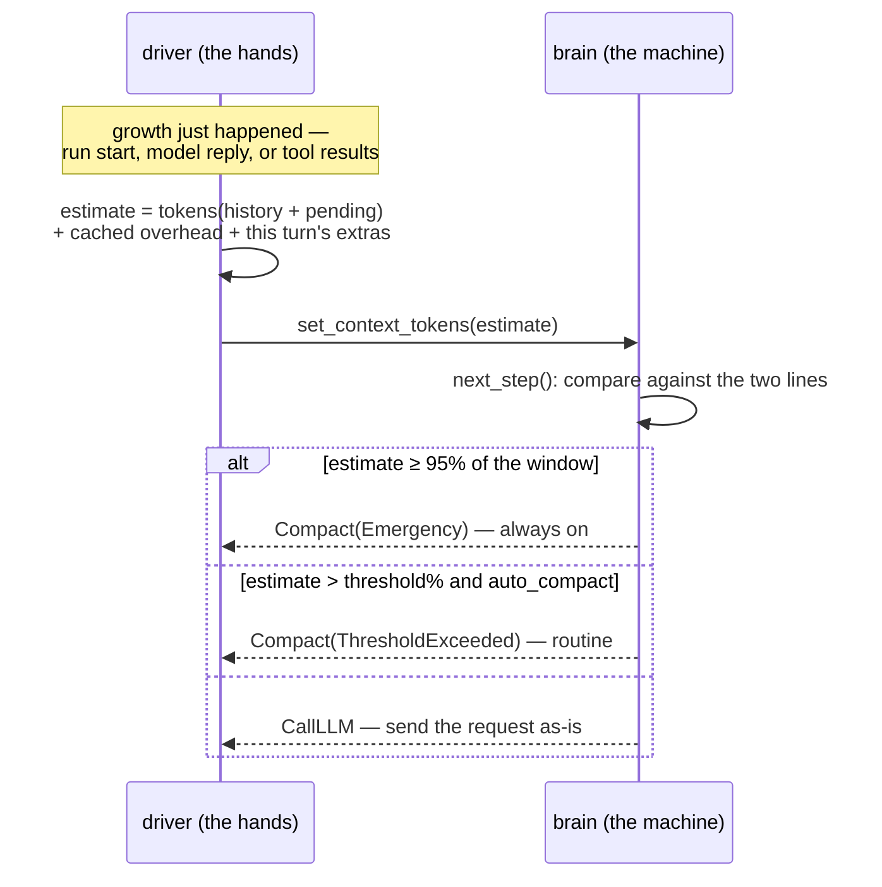

Almost every number in an agent engine — costs, limits, when to shrink the conversation — is measured in **tokens**. This page explains what a token is, why the limits exist, and why loopctl *estimates* them instead of counting them exactly. If you have ever wondered what `context_window = 200_000` actually pays for, start here.

---

## What a token is

A model does not read characters or words. It reads **tokens**: short chunks of text drawn from a fixed vocabulary the model was trained on. Common words are usually one token ("the", "hello"); rarer or longer pieces get split ("tokenization" → "token" + "ization"); numbers and code chop up unpredictably.

Rules of thumb for English text:

- **1 token ≈ 4 characters**, ≈ ¾ of a word.
- 100 tokens ≈ a short paragraph; a big novel is roughly 100k–150k tokens.

Why providers speak in tokens rather than characters: the model's actual reading unit *is* the token. Every character you send is first converted to tokens, and everything downstream — memory use, compute time, price, limits — is counted in that unit.

> **Tokenization** is the name of that text-to-tokens conversion. The exact splits depend on the tokenizer, which depends on the model — the same sentence can tokenize slightly differently for two different models. This detail is the reason exact counting is harder than it sounds (below).

## Why the context window is finite

The **context window** is everything the model can *see* in one request: the whole conversation — system prompt, user messages, tool definitions, every tool result — plus its own reply, all at once, as tokens. Providers cap it (tens of thousands to a few million tokens depending on the model) for two physical reasons:

1. **Memory.** The model's attention mechanism relates every token to every other token. Doubling the context more than doubles the bookkeeping; the window is where the hardware says stop.
2. **Cost.** Providers bill input tokens per request. A conversation that grows by 2,000 tokens per turn is a meter running faster every turn — even before it hits any limit.

For a chat interface, a long conversation is an inconvenience. For an **agent**, it is a structural problem: tool results are big, runs are long, and the conversation *only grows*. Without intervention, every sufficiently long run eventually builds a request the provider will reject. That intervention is [compaction](/engine/compaction/) — and compaction's trigger, budget, and success measure are all token counts.

---

## Why loopctl estimates instead of counting

The honest way to know a conversation's token count is to run the provider's exact tokenizer over it. loopctl deliberately does not, and the reasons are practical:

- The *right* tokenizer varies by model — and changes with model versions.
- Pulling a tokenizer library into an agent framework adds weight and a per-message cost for a number you only need approximately.
- What the engine needs is not the bill, but a **conservative yes/no**: "will the next request fit?"

So the engine measures with a **token counter** trait, and the default is deliberately crude:

```text
HeuristicTokenCounter:
    tokens(message) ≈ (characters + 20) / 4      # +20 covers message framing
    image          = 256 tokens flat             # whatever its pixel size
```

Two properties matter more than its accuracy:

**It errs high.** The estimate over-counts rather than under-counts (images at a flat 256, message framing charged per message, tool-schema overhead reserved even when suppressed). A false "too big" costs one compaction pass. A false "fits" costs a rejected request and a **failed run** — asymmetric harm, so the bias is chosen to match.

**It errs *consistently*.** The same conversation always measures the same number. Consistency matters more than closeness, because — see below — mixing two counters is worse than either.

### Overhead tokens — the invisible baseline

The conversation isn't the only thing riding a request. The **system prompt** and every **tool schema** (the JSON descriptions of your tools) travel along and count against the window, every turn. The driver measures this **overhead** once, caches it, and includes it in every context estimate. An agent with 40 tools registered can carry thousands of overhead tokens before the conversation says a word — which is why the estimate counts them.

---

## Where the estimate is refreshed — every growth point

An estimate is only as good as its recency, so the driver re-measures at *every* moment the next request could grow:

| Moment | What the driver adds to the measurement |
|---|---|
| Run start | committed `history` + the new user input |
| After each model response | the reply just adopted (its text *and* any tool calls) |
| After each tool-result batch | the results — a single huge output is visible **before** the next request goes out |
| Before a model call carrying extras | this turn's contributor + memory messages (the *only* transient inputs that count) |

That last row has a subtlety: extras are gathered, *then* the estimate is refreshed with them included, *then* `next_step` runs — so a turn whose extras would push the payload over a line defers to compaction **before** anything is sent, and the retried turn reserves budget so the extras still fit after shrinking.

## A conversation, measured turn by turn

Window 8,000; threshold 80% (line: 6,400); overhead measured once at 700. Watch the arithmetic work:

| Turn | Event | Measured now | Estimate | % of window | Decision |
|---|---|---|---|---|---|
| — | run starts, history empty | input: 2,100 tokens | 700 + 2,100 = **2,800** | 35% | `CallLLM` |
| 0 | reply (1 tool call, 300 tokens) | — | **3,100** | 39% | `CallTools` |
| 0 | tool result: 1,200 tokens | — | 700 + 2,100 + 300 + 1,200 = **4,300** | 54% | `CallLLM` |
| 1 | reply (2 calls, 400 tokens) | — | **4,700** | 59% | `CallTools` |
| 1 | tool results: 1,900 tokens | — | **6,600** | 82% | past 6,400 → `Compact(ThresholdExceeded)` |
| — | pass shrank to 3,800 total | re-measured by the manager's counter | **3,800** | 48% | `CallLLM` — comfortably under |

Two things this trace shows that prose can't:

- **The trigger sees tool results, not replies.** The jump from 59% to 82% is a *tool output* — the estimate refreshes after the batch, before the next request, so a giant result cannot sneak past the line.
- **After compaction, the estimate is the manager's own re-count**, not the compactor's self-report — the number that decides "when next" is always produced by the same counter that decided "when now". Swap in a different counter at any layer and rows like the last two stop agreeing: compact to 3,800 by one ruler, measure 5,100 by another, compact again — the [flapping](/cookbook/gotchas/) loop that gotcha #6 warns about, visible here as two rows that must share a ruler.

---

## The two lines: threshold and emergency

The engine watches one number — the current estimate — against two lines on the window:

```text
0% ──────────── 80% ──────── 95% ──────── 100%
   normal life     threshold    emergency     provider's
                   (compact     (compact      hard wall
                   now, this    regardless
   is routine)     of settings)
```

- The **threshold** (default 80%) is ordinary planning: "past here, shrink before the next model call." Controlled by `auto_compact`, tunable.
- The **emergency line** (95%) is the safety net: it fires even when compaction is switched off, because the alternative is a request the provider will refuse.

Why two lines? A single line that's safe (95%) leaves you compacting in a panic with little room for the next turn's growth; a single line that's comfortable (80%) would fire constantly if it couldn't be turned off. Two lines give you a routine lane and a last-resort lane — the same shape as a soft budget and a hard cap.

And here is the same decision as an interaction — who measures, who decides, and when:



The brain never measures anything itself — the driver feeds it a number, and the comparison against the lines is the brain's entire job. (That's the [sans-IO](/principles/sans-io/) discipline: the meter lives in the hands, the rule lives in the brain.)

### The one-unit rule

One consistency rule sits above all tuning: **every token decision must be made with the same counter.** The trigger asks "are we past 80%?" and the post-compaction check asks "did we get smaller?" — if those two questions use *different* units (a heuristic here, the provider's billed count there), the system can flap: compact, measure small, grow back, measure big, compact again, forever. Install one counter on the `ContextManager` and the driver reuses it everywhere. (This is [gotcha #6](/cookbook/gotchas/) in the cookbook.)

---

## A worked example

Window 8,000 tokens, threshold 80% (line: 6,400), emergency 95% (line: 7,600). System prompt + tool schemas measured at 700 tokens overhead.

| Conversation | Overhead | Estimate | Decision before next model call |
|---|---|---|---|
| 4,000 tokens | 700 | 4,700 | normal — 59% of window |
| 5,700 | 700 | 6,400 | normal — *at* the line; threshold is strict (`>`), exactly-at serves |
| 5,701 | 700 | 6,401 | `Compact(ThresholdExceeded)` — routine shrink |
| 7,200 | 700 | 7,900 | `Compact(Emergency)` — even with `auto_compact: false` |

And after a compaction pass, the [no-progress guard](/engine/compaction/) compares before/after **with the same counter**: if nothing was shaved, the run ends with `ContextExceeded` rather than looping between "compact" and "call" forever.

---

## Related pages

- [Compaction](/engine/compaction/) — what actually happens when the lines are crossed.
- [Session config](/core-data/session-config/) — where the window and threshold live.
- [Sans-IO](/principles/sans-io/) — why the brain stores a *number someone fed it*, never a measurement it took itself.
