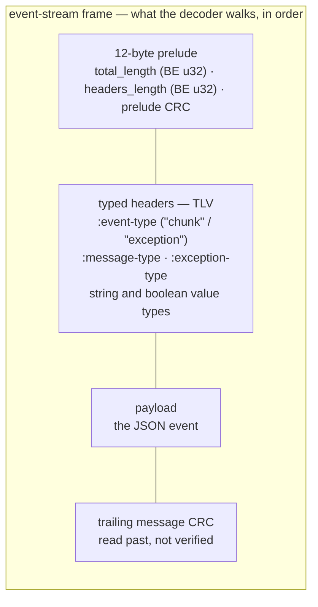

`BedrockClient` speaks AWS Bedrock — which means two things other providers don't need: **signed requests** (SigV4, the AWS authentication scheme) and **binary event-stream framing** for streaming (not SSE). Source: `src/provider/bedrock.rs`. Feature: `bedrock` (pulls in `hmac`/`sha2` for signing).

---

## Construction

```rust
let client = BedrockClient::from_env()?;
// AWS_REGION, AWS_ACCESS_KEY_ID, AWS_SECRET_ACCESS_KEY (required)
// AWS_SESSION_TOKEN (optional), AWS_BEDROCK_MODEL
//   → default "anthropic.claude-sonnet-4-5-20250929-v1:0"

let client = BedrockClient::builder()
    .region("us-east-1")
    .access_key_id(...)
    .secret_access_key(...)
    .session_token(...)                    // optional (STS / role credentials)
    .model("anthropic.claude-sonnet-4-5-20250929-v1:0")
    .max_tokens(8192)                      // default 8192; 0 rejected
    .build()?;
```

Region format is validated (lowercase letters/digits/hyphens — a dotted region would silently redirect the host). Models with their own lower output caps (some Claude 3 tiers: 4096) reject budgets above the cap — set `max_tokens` per client accordingly.

**Credential rotation:** `set_credentials(key, secret, token)` swaps the triple atomically on a live client — for STS/IRSA refresh flows. Every request signs with one consistent snapshot; a torn pair (new key, old secret) can never be sent.

## Two wire paths, picked per model

```text
model id starts with "anthropic."  →  ANTHROPIC path: the native Messages body
                                       (reuses the direct client's builders and emitter)
everything else                    →  CONVERSE path: Bedrock's cross-model API
                                       (its own body shape and stream events)
```

Auto-selected per request (so `set_model` across vendors switches the wire format too), or pinned with `.path(BedrockPath::Anthropic | BedrockPath::Converse)`. ARN-style and inference-profile ids (no `anthropic.` prefix) route to Converse — the only API that serves them.

## SigV4 in one paragraph

Every request is signed: a canonical request (method, URI, headers, hashed payload) is HMAC-chained (`AWS4<secret>` → date → region → `bedrock` → `aws4_request`) into an `Authorization` header, plus `X-Amz-Date` and the payload hash. Model ids are percent-encoded into the URL path, and the exact encoded path is what gets signed — matching the AWS SDKs. The signing implementation is pinned against AWS's own documented test vectors.

## Streaming — binary event-stream, not SSE

Bedrock streams responses as AWS **event-stream frames**: binary headers + payload chunks, not text lines. The client contains a hand-written incremental decoder (frame length, typed headers like `:event-type`, payload, CRCs), robust to partial frames arriving in arbitrary TCP chunk splits:

- **Anthropic path** — each frame's payload is the same JSON event as the direct API; it feeds the shared Anthropic emitter.
- **Converse path** — frames carry `messageStart` / `contentBlockDelta` (text, tool-input, or reasoning lanes) / `messageStop`, plus a final `metadata` frame that carries stop reason and usage together. The terminal pair is emitted exactly once, from `metadata`.
- Exception frames carry their `:exception-type` into the error.
- A stream cut before the terminal frame emits no terminal — truncation, as everywhere else.

The frame format itself, for when you're reading packet captures:



A frame's declared length must land in `16 bytes … 16 MiB`; anything else marks the buffer as unsynchronized and it resets — the decoder never allocates based on a hostile length. Header values that overrun their declared frame are skipped individually, not fatally.

## Converse mapping notes

- Messages use `user`/`assistant` roles only; tool calls are `toolUse` blocks, results are `toolResult` blocks with a `status: "success" | "error"` field — so **`is_error` does travel on this wire**.
- Tools go in `toolConfig.tools[].toolSpec`; system prompt in `system: [{text}]`; output budget in `inferenceConfig.maxTokens`.
- Empty-content messages (which Bedrock rejects) are dropped for you.

## Limits of this client

- **No `RequestOptions` support** — per-request model overrides, response formats, and tool constraints are not implemented on the Bedrock path (the base trait's "reject loudly" defaults apply).
- **HTTP errors are not auto-classified** into rate-limit/auth forms the way the other clients do (they surface as plain `ApiError` with status and body).
- Images are dropped, as with the other shipped converters.

## Related pages

- [Anthropic](/providers/anthropic/) — whose body builders and emitter the Anthropic path shares.
- [Overview](/providers/overview/)
