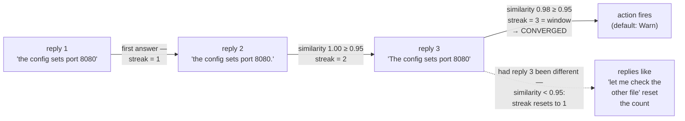

Loop detection (previous page) watches repeated **tool calls**. Convergence detection watches something else: the model's **final answers** becoming near-identical, turn after turn — the agent is "converged" on one response and quietly stuck saying it. Source: `src/detection/convergence.rs`.

---

## How it works — in plain words

1. Only **terminal replies** (no tool calls) are considered. An "acting" turn that says "Let me check..." before running tools is *not* a converged answer — the engine never feeds those to this detector.
2. Each new terminal reply is compared to the **immediately previous** reply with a similarity score: how many words the two texts share (word sets, case-folded, punctuation ignored), 0.0 to 1.0.
3. Similar (≥ threshold, default **0.95**) → the streak grows. Dissimilar → the streak resets to 1.
4. The streak reaching the window size (default **3** consecutive similar answers) means **converged**.

One timeline makes the whole mechanism visible — each reply is compared only to its *predecessor*, and one dissimilar answer resets everything:



Because the streak compares each reply only to its *predecessor*, an A-B-A-B alternation never counts, and one odd answer in the middle resets everything. An empty reply also resets the streak — silence is a break, not a continuation.

> **Honesty about the metric:** word-overlap similarity is simple and cheap, and it shows: a paraphrase with different vocabulary scores low (missed), and boilerplate-heavy replies ("Sure! Here's what I found:") score high even when the content differs. That is exactly why the default action is a **warning**, not a stop.

---

## The actions — what happens on convergence

`ConvergenceConfig::on_converge`, default `Warn`:

| Action | Engine behavior |
|---|---|
| `Warn` **(default)** | run continues; observers get `on_convergence_detected` — you log/alert |
| `Stop` | run ends with `LoopError::LoopDetected` ("convergence detected") — opt-in only |
| `AskUser` | run ends with `LoopError::UserInputRequired` — ask a human, then run again |
| `Compact` | run continues; the *host* is expected to compact — the engine does not |
| `SwitchPhase` | run continues; the host decides what "next phase" means |

The split is deliberate: text similarity is a heuristic, so anything drastic (Stop/AskUser) is strictly opt-in, and the two host-executed actions surface through `ConvergenceStatus::action` for your code to act on.

```rust
let detection = DetectionManager::new_with_config(DetectionConfig {
    convergence_threshold: 0.90,          // default 0.95
    convergence_count: 2,                 // default 3 (window size)
    on_converge: ConvergenceAction::Warn, // default
    ..DetectionConfig::default()
})?;
```

---

## Reading the state

```rust
ConvergenceStatus {
    detected: bool,             // streak >= window
    consecutive_count: usize,   // current streak
    similarity_score: f32,      // peak similarity vs any window member, last add
    similar_responses: Vec<String>, // the streak's members, deduplicated
    action: ConvergenceAction,  // forwarded from config
}
```

Config validation is real: window size < 2 and thresholds outside [0, 1] are rejected with a `ConvergenceConfigError` rather than silently misbehaving.

---

## The two detectors, side by side

| | Loop detection | Convergence detection |
|---|---|---|
| Watches | tool operations (name + param + result hash) | terminal reply texts |
| Metric | exact identity of operations | word-set similarity ≥ threshold |
| Warn at | 3 repetitions (default) | converged streak (3 similar answers) |
| Stop at | 10 repetitions — **default on** | never by default — opt-in |
| False-positive armor | result-hash awareness, recoverable-error clearing, signature normalization | warnings-only default, acting turns excluded, predecessor-only streak |

Both live behind one `DetectionManager` with independent enable flags (`enable_loop_detection`, `enable_convergence_detection`) and one `reset()`. Which fires first? The engine checks loop first — "a tool-calling loop is a stronger signal."

One cross-run subtlety: loop-detection state is cleared between runs appropriately (a never-fired stop must not kill the next run), but **convergence state deliberately persists** — "three consecutive identical final answers across three runs" is a real signal for the opt-in Stop/AskUser actions.

---

## Related pages

- [Windows, averages, and similarity](/principles/measuring-repetition/) — the Jaccard word-set similarity this detector uses, with worked examples.
- [Loop detection](/safety/loop-detection/) — the sibling detector.
- [Termination](/engine/termination/) — where `UserInputRequired` fits.
