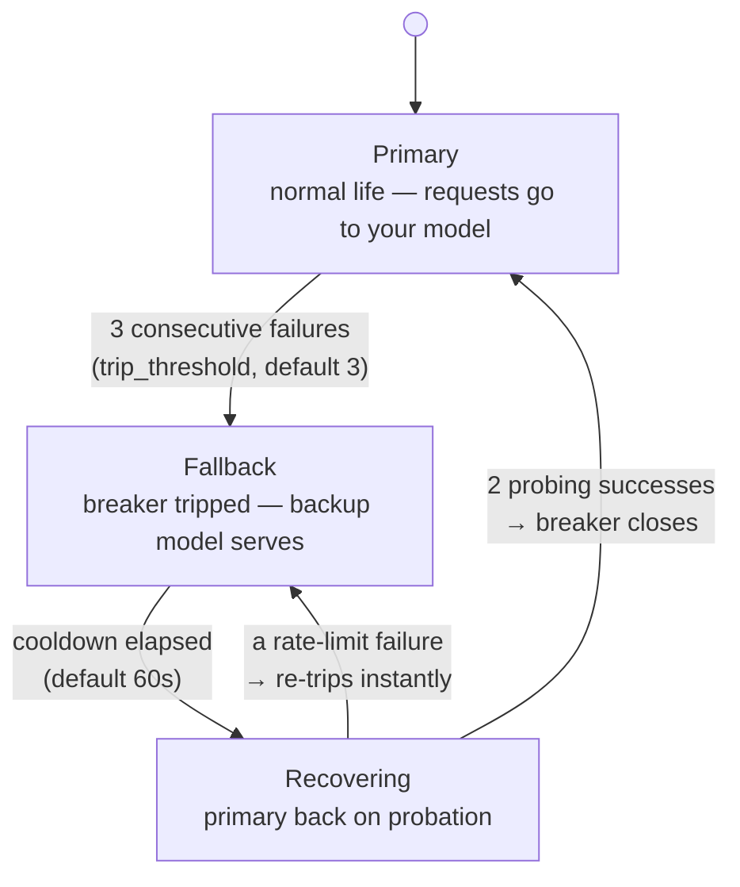
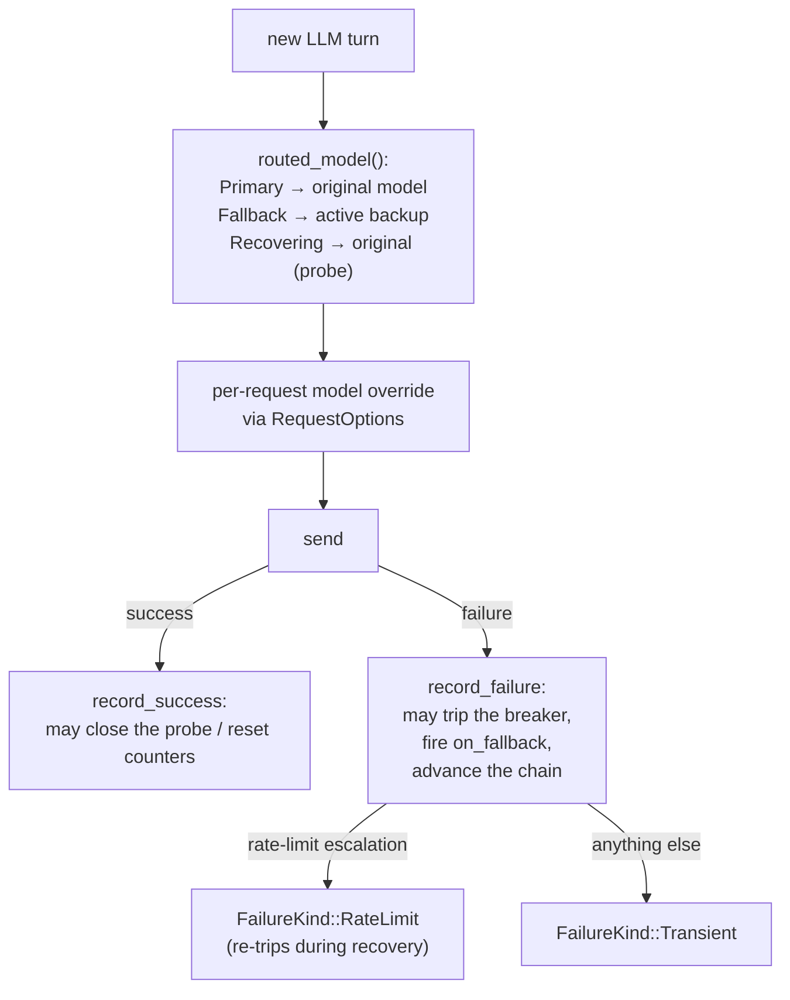

Providers fail: rate limits, outages, timeouts. The **fallback manager** (`src/fallback.rs`) is a circuit breaker over the model — after enough consecutive failures it reroutes requests to a backup model, and carefully probes the primary to decide when to come back.

---

## The three states



- **Primary** — normal life; requests go to your model. Failures stack up (`consecutive_failures`); one success resets the count.
- **Fallback** — the breaker has tripped; requests route to a backup model. Entering this state fires `on_fallback` to observers and resets the failure counter.
- **Recovering** — cooldown has passed; requests go back to the *primary* on probation. Two successes close the breaker; a rate-limit failure re-trips instantly; a transient failure just resets the success streak (probation continues).

> **Threshold nuance:** `trip_threshold = 0` trips on the **first** failure, it does not mean "never trip."

---

## The chain — more than one backup

Backups form an ordered **chain**; the first healthy entry serves:

```rust
let mut managers = LoopManagers::new();
managers.fallback_mut().set_fallback_models(vec![
    "gpt-4o-mini".into(),
    "llama3-local".into(),
]);
```

When the *current* fallback model fails too, the engine marks it failed (`mark_fallback_failed`) and the chain advances to the next entry. An entry recovers when the breaker closes, or you can flip its `available` flag manually (an out-of-band kill switch: `set_fallback_available(name, false)`).

**`FallbackExhausted`** — the honest end: breaker tripped **and** every chain entry failed **and** the cooldown hasn't elapsed. Fail rather than silently retreating to the known-bad primary. Once the cooldown passes, the next turn probes the primary instead of failing again. A manager with *no* chain never produces this error (it trips, but keeps serving the primary).

---

## How the engine uses it



Key mechanics:

- **Routing is per-request.** The engine overrides each request's `model` field — the shared client itself is untouched, so two loops over one client never cross-wire their models. (Corollary gotcha: if you configure the manager's primary to a *different* name than the client's model, every request is silently rerouted — the manager wins.)
- **Every routing change notifies:** `on_model_switched(from → to)` fires on trip, chain advance, and recovery — your observability sees model churn without wiring anything else.
- **Rate-limit escalations are special.** When the [stream handler](/core-data/stream-events/) exhausts its retry budget on 429/503/529, the error arrives as `RateLimitEscalation` and counts as `RateLimit` — during recovery, that re-trips immediately ("the primary is still refusing load").
- **Cancellations don't count.** A cancelled turn touches neither counters nor events.

---

## Configuration quick reference

```rust
FallbackConfig {
    trip_threshold: 3,              // consecutive failures to trip
    recovery_timeout: 60s,          // cooldown before probing
    recovery_successes_needed: 2,   // probe successes to close
    max_fail_count: 2,              // per-backup failures before skipping it
}
```

Reach the manager through the component bundle: `managers.fallback()` (or `Loop::fallback` via the `FallbackCapable` trait). Lock poisoning surfaces as `LoopError::LockPoisoned { what: "fallback" }` — the breaker fails closed rather than guessing with half-updated state.

The **whole-system reset**: `fallback.reset()` (also part of `LoopManagers::reset_all()` and of `RunConfig { reset_managers: true }`) returns to a fresh `Primary` with clean counters — useful after a known outage, or when switching tasks.

## The state, in fields

For reading logs or debugging a stuck breaker, the entire manager is one locked state struct:

| Field | Type | Meaning |
|---|---|---|
| `state` | `FallbackState` | `Primary` / `Fallback` / `Recovering` |
| `consecutive_failures` | counter | resets on trip *and* on any Primary success |
| `primary_success_count` | counter | the recovery probe's streak (needs 2 to close) |
| `fallback_activated` | bool | sticky "has ever tripped" — for telemetry |
| `original_model` | `Option<String>` | the primary; becomes the probe target |
| `fallback_models` | `Vec<FallbackEntry>` | the chain, in order |
| `active_fallback` | `Option<String>` | cached first-non-failed entry — O(1) routing reads |
| `fallback_switched_at` | `Option<Instant>` | when the cooldown clock started |

Each chain entry is `{ name, available, attempt_count, max_fail_count }` with `failed() = !available || attempt_count >= max_fail_count` (default budget 2; values below 1 are clamped up). One lock guards the whole struct — a poisoned lock surfaces as `LoopError::LockPoisoned` and the breaker **fails closed** rather than guessing with half-updated state.

---

## Model switch vs fallback — one table

| | [`switch_model`](/engine/model-switch/) | fallback manager |
|---|---|---|
| Who decides | you, explicitly | the engine, on failures |
| When | between runs | mid-session, per turn |
| Resets breaker? | yes (old-model failures are moot) | it *is* the breaker |
| Fires `on_model_switched` | yes | yes |
| Typical use | "use the cheap model for this phase" | "survive an outage automatically" |

---

## Related pages

- [Circuit breakers](/principles/circuit-breakers/) — the pattern this manager implements, from scratch.
- [Stream handler](/core-data/stream-events/) — the retry ladder that feeds this breaker.
- [Termination](/engine/termination/) — `FallbackExhausted` in context.
