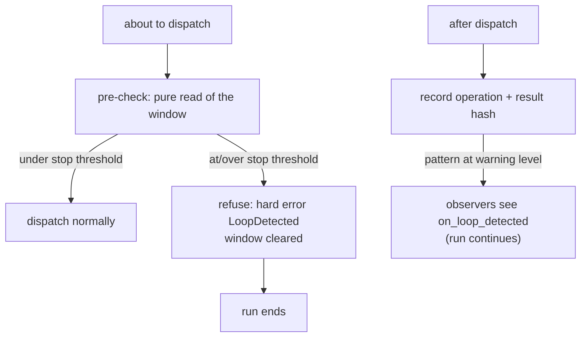

Sometimes a model gets stuck: it calls the same tool with the same arguments, gets the same answer, and does it again — burning tokens forever. The **loop detector** watches for exactly that pattern and stops the run before it wastes your budget. Source: `src/detection/loop_detector.rs`, engine wiring in `src/engine/bare/dispatch.rs`.

---

## What counts as "the same thing"

Every tool dispatch is recorded as one **operation**:

```text
operation = ( tool name,
              primary parameter,        // the "what" — file path, command, query...
              result hash )             // fingerprint of what came back
```

Two operations are identical only when **all three** match. The result hash is the clever part:

- Same call, **different** results → different operations → **that's progress, not a loop.** A search returning changing results never trips the detector.
- Same call, same result, over and over → the repetitions stack up.

Details worth knowing:

- The hash is a fast, non-cryptographic fingerprint — deterministic within a process, **not stable across Rust versions**; never persist it.
- Empty output hashes to "nothing" — silent successes of the same operation count as identical.
- Multipart results are hashed by their rendered text; images are invisible to the detector.
- The **primary parameter** comes from a `ToolSignature` you can supply (see below). If it extracts nothing, the engine falls back to the **whole input JSON** — so only byte-identical inputs repeat-match. That fallback is deliberate: better to under-detect than to flag `Read(a.rs)` and `Read(b.rs)` as "the same".

---

## The thresholds

| Setting | Default | Meaning |
|---|---|---|
| `repetition_threshold` | **3** | at this count, a pattern is flagged: warning fires, run continues |
| `stop_threshold` | **10** | at this count, the next dispatch is **refused** — run ends with `LoopDetected` (`0` disables hard stops) |
| `window_size` / `max_history` | 50 / 100 | how many recent operations are considered; old ones slide out |

The engine checks *before* dispatching (refusing the call that would be repetition #11) and records *after* each call. A stop fires on the dispatch after the threshold is crossed, and consumes the pattern — the next run starts with a clean window (the engine also clears a never-fired stop at every run end, so a run that crossed the line but ended on its own doesn't poison the next one).

Warnings below the stop threshold are one-shot per pattern: once reported, the same pattern won't re-warn on every poll. Make progress (a differing result) and the pattern is forgotten entirely.

---

## Tuning per tool — `ToolSignature`

The detector's accuracy depends on knowing what "the argument that matters" is per tool:

```rust
struct MySignature;
impl ToolSignature for MySignature {
    fn extract_primary_param(&self, tool: &str, input: &Value) -> String {
        match tool {
            "Read" | "Edit" => input["path"].as_str().unwrap_or("").to_string(),
            "Bash" => input["command"].as_str().unwrap_or("").to_string(),
            _ => String::new(),
        }
    }
    fn is_recoverable_error(&self, tool: &str, error: &str) -> bool {
        tool == "Edit" && error.contains("old text not found")
    }
    fn tool_thresholds(&self) -> HashMap<String, usize> {
        [("Edit".to_string(), 2)].into_iter().collect()  // trip faster on Edit
    }
    // also available: get_suggestion, normalize_param_for_comparison,
    // is_file_read_tool / is_file_edit_tool, file_path_for_reset
}
```

The hooks that matter:

- **`extract_primary_param`** — the identity of a call for one tool. Without it everything degrades to whole-input matching (safe but blunt).
- **`is_recoverable_error`** — the false-positive killer. A legitimate workflow (edit fails "old text not found" → re-read the file → retry the edit) *looks* like repetition. Marking the error recoverable makes the detector clear same-file edit warnings when it appears. The docs call overriding this "critical" — most retry storms are recoverable errors.
- **`tool_thresholds`** — per-tool trip lines (e.g. flag `Edit` repetition at 2 instead of 3).
- **`normalize_param_for_comparison`** — make `file.rs#42` and `file.rs#100` match the same file.

Attach it: `DetectionManager::new_with_signature(Arc::new(MySignature))` → `LoopManagers::with_detection(...)` → `new_with_managers`.

---

## What the engine does with a detection



Facts pinned by tests (the false-positive suite):

- **Changing outputs are progress** — never flagged, even at high frequency.
- **Different inputs with identical outputs are different operations** — three files with the same content don't merge into one "repeat."
- **Recovery retries count as attempts** — a flaky tool failing repeatedly *can* trip detection on its own; recoverable-error marking is the fix.
- **Acting-turn preambles never trigger convergence** (see next page) — "Let me check that..." repeated over real tool work is fine.
- **`stop_threshold: 0`** disables hard stops entirely (warnings only).
- A genuinely stuck tool (identical input *and* output, over the line) **does** stop — that's the whole point.

---

## Reading the state

- `LoopStatus { is_looping, repeated_operations, repetition_count, warning, should_stop }` — a full snapshot via `check_loop()`.
- `max_operation_count()` — the live maximum below the threshold too; telemetry can watch a potential loop *build*.
- `DetectionStats { turns_analyzed, loops_detected, convergences_detected, current_streak }` — counters.
- Observer event: `on_loop_detected(pattern: "Read(/etc/hosts)", repetitions)`.

If a warning fires and a human (or your code) has dealt with it, `acknowledge_loop_warning(&ops)` silences that pattern — acknowledging is orthogonal to detection; you can't ack your way out of a stop.

---

## Related pages

- [Windows, averages, and similarity](/principles/measuring-repetition/) — the sliding window and fingerprint hashing this detector is built on.
- [Convergence detection](/safety/convergence/) — the sibling detector for repeated *answers*.
- [Tool dispatch](/engine/tool-dispatch/) — where the checks plug in.
- [File reference: detection](/file-reference/detection/)
