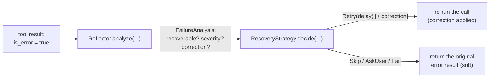

A tool call fails. Now what — retry blindly? Give up? Fix the arguments and try again? loopctl splits that decision into two pluggable pieces: a **reflector** (analyze what went wrong) and a **recovery strategy** (decide what to do about it). Sources: `src/reflection.rs`, `src/reflection/llm.rs`, `src/reflection/backoff.rs`.

---

## The two pieces



### The analysis — `FailureAnalysis`

```rust
FailureAnalysis {
    is_recoverable: bool,          // worth trying again at all?
    root_cause: String,
    severity: FailureSeverity,     // Low < Medium < High < Critical
    correction: Option<Correction>,// how to fix it, if known
    context: String,               // free-form extra info
}
```

**`Correction`** carries a machine-usable fix:

| `correction_type` | Fields that matter | What the engine does on retry |
|---|---|---|
| `InputFix` | `modified_input` (a JSON object) | replaces the call's input |
| `ToolChange` | `alternative_tool` (a registry name) | swaps the tool |
| `PrerequisiteFix` / `ApproachChange` / `Escalate` | `guidance` text | nothing mechanical — the retry runs unchanged, guidance is advisory |

A correction that fails to apply (e.g. `InputFix` without a JSON object) is logged and dropped — the retry still happens, just uncorrected.

### The decision — `RecoveryAction`

- `Retry { delay }` — wait, then re-run (correction applied first). The wait is raced against the cancel signal.
- `Skip(reason)` — give up on this call, return the error result softly, run continues.
- `AskUser(prompt)` — in this driver: returned softly to the model (the run continues); the prompt text tells it a human decision is needed.
- `Fail(reason)` — stop retrying; the error result flows back softly.

Everything except cancel and the hard ceiling stays **soft** — the model sees failures and can change its plan.

### The hard ceiling

`MAX_RECOVERY_ATTEMPTS = 5` overrides any strategy: the 6th total call fails the run with `ToolRecoveryExhausted { tool, attempts }` (`attempts` counts total calls; subtract 1 for retries). One number, enforced both in what the strategy is told (`max_attempts`) and by the driver — a misbehaving custom strategy can't retry forever.

---

## The defaults — and the surprise in them

- Reflector: **`NoopReflector`** — marks everything `is_recoverable: false`, severity `Medium`, no correction.
- Strategy: **`ExponentialBackoffRecovery::new(3)`** — up to 3 retries, delays 100ms → 200ms → 400ms (each doubling, capped at 30s). Its rules: non-recoverable → Fail; out of retries → Fail; **High severity with a correction available → AskUser**; otherwise Retry.

Put together: **stock defaults mean zero retries** — `NoopReflector` says "not recoverable," the strategy fails immediately. Each tool call gets exactly one attempt. Retrying is opt-in; pick your reflector accordingly.

## `LlmReflector` — ask the model to analyze its own failure

The in-tree upgrade: one structured request per failed call, asking the model to produce a `FailureAnalysis` as JSON.

```rust
let reflector = LlmReflector::new(Arc::new(client));       // uses the built-in analyst prompt
// or: .with_system_prompt("You analyze failures for a coding agent...")
agent.set_reflector(Arc::new(reflector));
```

- The default prompt specifies the exact JSON shape and instructs: *only* propose `modified_input` you can conform to the tool's schema; prefer `is_recoverable: false` over inventing a correction.
- With the **`schema_validation`** feature, a proposed `InputFix` is validated against the tool's real schema **before** the retry — a nonsense correction is rejected up front (the reflection errors, the engine maps reflector failure to conservative `Fail`).
- The tool's schema travels in the request when available (`None` for unregistered names — reflectors should skip validation then).
- Cost model: one model round-trip per analyzed failure. That's why it's not the default.

#### The exact wire format

The user message sent to the analyst model is a fixed template — worth knowing when you're debugging why an analysis came back wrong:

```text
Tool: {tool_name}
Input: {tool_input}
Schema: {schema}          ← this line is OMITTED entirely when the tool isn't
                             registered (there is no schema to show)
Error: {error}
Task: {context.task}      ← the engine currently passes an empty task string
Attempt: {attempt + 1} of {max_attempts}
```

Note the `+1`: attempts are 0-indexed in `ReflectionContext` but rendered 1-indexed for the model ("Attempt: 1 of 6" on the original call). The system prompt pins the exact JSON shape (a strict `failure_analysis` schema — every field required, enums for severity and correction type) and ends with the two guardrails that matter most: *only* set `modified_input` when you can conform to the tool's schema, and **prefer `is_recoverable: false` over inventing a correction** — a wrong "fix" costs a retry *and* pollutes the analysis.

Error mapping is total and conservative: an API failure, a schema mismatch, a deserialize error — *every* failure path of the structured request collapses to `ReflectionError::Internal`, and the engine's response to any reflector error is the same: treat the call as unrecoverable and `Fail`. The engine never guesses on top of a broken reflector; a working reflector that says nothing is preferred over a silent fallback to heuristic behavior.

### Writing your own reflector — a rule-based one

```rust
struct SimpleReflector;
impl Reflector for SimpleReflector {
    fn analyze(&self, error: &str, tool: &str, input: &Value,
               _schema: Option<&ToolSchema>, ctx: &ReflectionContext)
        -> Pin<Box<dyn Future<Output = Result<FailureAnalysis, ReflectionError>> + Send + '_>>
    {
        let recoverable = error.contains("timed out") || error.contains("temporarily");
        Box::pin(async move {
            Ok(FailureAnalysis {
                is_recoverable: recoverable,
                root_cause: error.to_string(),
                severity: if recoverable { FailureSeverity::Low }
                          else { FailureSeverity::High },
                correction: None,
                context: format!("attempt {} of {}", ctx.attempt + 1, ctx.max_attempts),
            })
        })
    }
}
```

`ReflectionContext` carries `attempt` (0-indexed — render `+1` for humans) and `max_attempts`. A reflector that itself fails (`ReflectionError::Internal`) maps to a conservative `Fail` — the engine never guesses on top of a broken reflector.

---

## The full loop, end to end

```text
tool call fails (soft error)
  1. reflector.analyze(error, tool, input, schema, {attempt, max})
  2. strategy.decide(analysis, attempt, max)
  3. Retry{delay}?  sleep (cancel-aware) → apply correction → re-run
       — the FULL pipeline re-fires: observers, hooks, detection, health, per attempt
  4. Skip/AskUser/Fail?  original error result returned softly
  5. attempt > 5 at any point?  run ends: ToolRecoveryExhausted
```

Remember the interactions: every retry records into the [loop detector](/safety/loop-detection/) (identical error texts stack up — mark recoverable errors in your `ToolSignature`), and every retry counts toward the tool's [health stats](/safety/tool-health/).

---

## Related pages

- [Tool dispatch](/engine/tool-dispatch/) — where this loop lives.
- [Errors](/core-data/errors/) — `ToolRecoveryExhausted` decoded.
