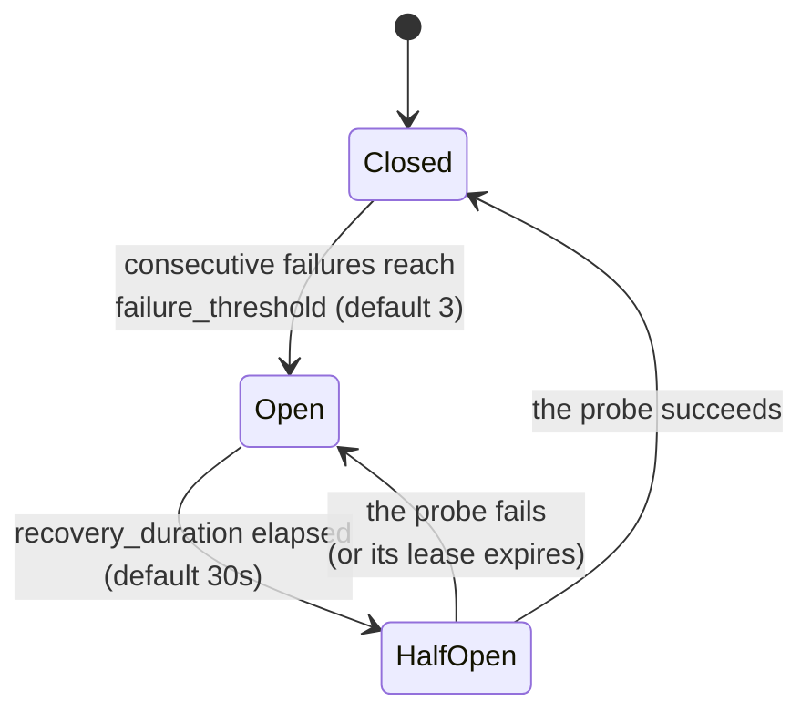

A tool that keeps failing (a dead database behind it, a hanging endpoint) shouldn't get dispatched again and again. The **tool health** subsystem watches success/failure and latency per tool and opens a **circuit breaker** that refuses calls to a sick tool — softly, so the model can adapt. Source: `src/tool/health.rs`.

Enable with `features = ["tool_health"]`, install with `agent.set_health_registry(Arc::new(ToolHealthRegistry::new()))`.

---

## Health stats — what's measured

Per tool, lock-free counters:

- **success rate** — plain success/total.
- **EWMA** (exponentially weighted moving average) of success — recent calls matter more than ancient ones; each new sample is 30% of the score.
- **`health_score` = 0.3 × success_rate + 0.7 × ewma** — recent failures outweigh old successes by design.
- durations: average and max (max includes failed calls — timeouts are tail latency too).

Classification: score ≥ 0.8 → `Healthy`; 0.5–0.8 → `Degraded`; below → `Unhealthy`. But note: **the score never blocks anything by itself — only the breaker does.** A closed breaker dispatches even with a terrible score.

## The stats, in atomics

Per tool, one lock-free struct — every field an `AtomicU64`, so the hot path (record success/failure after each call) never takes a lock:

| Field | What it accumulates |
|---|---|
| `total_calls`, `success_count`, `failure_count` | the all-time ratios |
| `total_duration_ns` | saturating sum → the average duration |
| `max_duration_ns` | high-water mark (failed calls count — a timeout is tail latency too) |
| `ewma_success` | the decaying success score, stored **scaled ×1,000,000** (`0.7` is literally `700_000`) — integer atomics, no floats, no locks |

New tools start at `ewma_success = 1.0` — optimistic, so a tool isn't punished before it has a record. Latency is tracked for dashboards but **never feeds the score**: a slow-but-reliable tool stays healthy; only success/failure moves the number. The registry itself only takes locks on first sight of a tool name (the cold path); everything after that is the atomics above.

## The circuit breaker — three states



- **Closed** — normal; calls allowed; failures counted.
- **Open** — the tool is considered sick; calls are **refused**. After the cooldown, one caller is granted a probe.
- **HalfOpen** — exactly **one** probe call is in flight; concurrent calls are refused (a thundering-herd guard). Probe succeeds → Closed. Probe fails → back to Open with a fresh cooldown.

The **probe lease** (`probe_timeout`, default 30s) prevents the classic wedge: a probe that never returns (cancelled dispatch, dead task) used to strand the breaker in HalfOpen forever. Now an expired lease re-arms the cooldown, availability queries treat it as expired, and a late-arriving result after expiry re-arms instead of closing.

Stale results are handled with the same care: a success arriving while Open is ignored (it describes a pre-trip world); a late success after lease expiry re-arms rather than closing; a failure arriving while Open restarts the cooldown clock ("fresh bad news").

### What a refusal looks like

The engine's gate consults the breaker **before** dispatching. A refusal is a **soft error** — `"tool temporarily unavailable: circuit breaker open"` — zero duration, the model sees it, the run continues. Not an exception, not a crash: the model routes around the sick tool (or waits for recovery).

## Configuration

```rust
ToolHealthRegistry::with_config(CircuitBreakerConfig {
    failure_threshold: 3,          // 0 disables tripping (counting continues)
    recovery_duration: 30s,        // cooldown before probing
    probe_timeout: 30s,            // probe lease; 0 disables the lease
})
```

`with_config` applies to breakers created *after* the call — set it before traffic. Reads for your dashboards: `get_health_status(tool)`, `health_summary()` (every tool: status + score), `is_tool_available(tool)` (a *pure* availability oracle — does not consume the single probe slot, unlike the mutating `allow_request`).

## Health-aware routing

Refusal isn't the only policy. `HealthRouter` routes to a *healthy substitute* instead of refusing:

```rust
let router = HealthRouterBuilder::new()
    .add_fallback("primary_search", vec!["backup_search".into()])
    .build();
// resolve_tool(name, &registry): primary if available, else first healthy fallback
```

Or write it into a middleware that rewrites `tool_name` — but read the gotcha below.

---

## Gotchas

1. **The gate keys on the requested name; recording keys on the resolved name.** A renaming middleware can split those key spaces (no in-tree middleware renames; yours might). Keep them identical or route deliberately.
2. **Everything retry-shaped re-fires per attempt.** A tool failing 3 recovery retries records 3 failures — enough to open its own breaker. That's usually correct (it *is* failing), but it's the interaction to know.
3. **Repeated shield blocks count as failures** toward the breaker ([shield](/safety/tool-shield/)): once open, the engine's gate refuses first, and the model sees "temporarily unavailable" instead of the shield's reason.
4. **Zero-threshold ≠ never-trip.** `failure_threshold: 0` *disables* tripping; the breaker still counts.
5. `is_tool_available` and the mutating gate **agree at every instant** — including expiry-aware HalfOpen states — both pinned by tests. Either is safe to build on.

---

## Related pages

- [Circuit breakers](/principles/circuit-breakers/) — the pattern, from scratch.
- [Windows, averages, and similarity](/principles/measuring-repetition/) — how the EWMA score is computed, with worked numbers.
- [Tool dispatch](/engine/tool-dispatch/) — where the gate sits in the pipeline.
- [The shield](/safety/tool-shield/) — its refusals feed these breakers.
