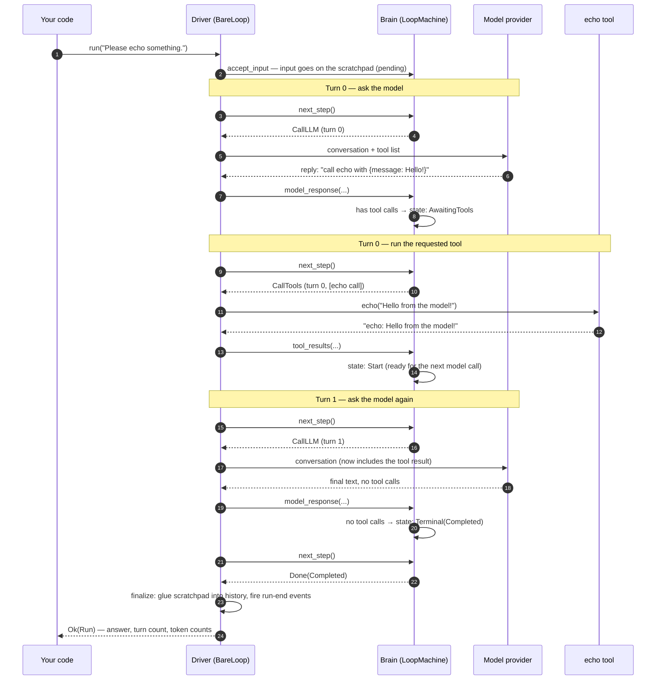

This page walks through **one complete run** of a loopctl agent: the user asks something, the model requests one tool, the tool runs, the model gives the final answer. Every layer, in order, in plain words.

The example matches `examples/echo-tool-cli.rs` from the loopctl repository. The model is a scripted fake (`MockApiClient`), so the behavior is 100% predictable.

---

## The setup

```rust
// A fake model connection with a script of two replies:
//   reply 1: "please call the echo tool with 'Hello from the model!'"
//   reply 2: "I echoed your message. Done!"
let client = MockApiClient::new("echo-model").with_responses(vec![
    MockResponse {
        text: String::new(),
        tool_call: Some(MockToolCall {
            id: "call_1".into(),
            name: "echo".into(),
            input: json!({"message": "Hello from the model!"}),
        }),
        stop_reason: "tool_use".into(),
    },
    MockResponse {
        text: "I echoed your message. Done!".into(),
        tool_call: None,
        stop_reason: "end_turn".into(),
    },
]);

let mut tools = ToolRegistry::new();
tools.register(
    FnTool::new("echo", "Echo a message back", echo_schema, echo_fn).read_only()
);

let mut agent = BareLoop::new(Arc::new(client), tools, SessionConfig::default());

let result = agent.run("Please echo something.", &RunConfig::default()).await?;
// result.turn_count() == 2, result.tool_call_count() == 1
// result.output == "I echoed your message. Done!"
```

---

## The journey, step by step



Now the same walk in words, with the details that matter:

**1. You call `run(input, run_config)`.**
The driver creates a fresh `Run` record (the audit-log entry for this run) and calls `brain.accept_input(input)`. The input becomes a *user message* on the scratchpad (`pending`). The scratchpad is cleared first — a new run starts fresh; only the notebook (`history`) carries over.

**2. The driver asks the brain what to do.**
`brain.next_step(policy)` — with `policy` carrying your limits (max turns, context window). The brain checks, in this order:
- Turn limit reached? → `Done(MaxTurnsExceeded)`.
- Context near the ceiling (95% of the window)? → `Compact(Emergency)`.
- Context past your threshold (default 80%)? → `Compact(ThresholdExceeded)`.
- Otherwise → `CallLLM`.

**3. The driver asks the model.**
It gathers the conversation (`history` + `pending`), your system prompt (if set), and the list of tool schemas. If you configured extra ingredients — memory entries, contributor messages — they are added for **this turn only** and never saved into the conversation. The request goes out through the model client.

**4. The reply comes back.**
The driver folds the reply into the brain with `model_response(...)`. The brain looks at the reply:
- Contains tool calls? → the brain files them and enters `AwaitingTools`.
- Pure text? → the run is done: `Terminal(Completed)` with the text as the final answer.

**5. Tool calls run.**
`next_step` now returns `CallTools`. For each requested call, the driver walks the full safety pipeline: notify observers → ask pre-hooks (if installed) → loop-detection check → health gate (if installed) → **run the tool** (panics are caught and turned into error text) → record the outcome for detection/health/memory. Results — including error text — become tool-result messages fed back with `tool_results(...)`. The brain returns to `Start`.

> **Hint — why errors are fed back instead of crashing the run:** if a tool fails, the model *reading the error* is often the best recovery. It can fix its arguments, pick another tool, or give up gracefully. Only hard problems (cancellation, a detected infinite loop, retries exhausted) end the run.

**6. Repeat until `Done`.**
The loop continues. On turn 1 the model sees the whole conversation so far — including the tool result — and produces the final text. No tool calls → `Terminal(Completed)`.

**7. `finalize()` — the single exit door.**
Every run exit — success, error, max turns, cancellation — passes through the same `finalize()`:
- On success: the scratchpad is glued into the notebook (`commit_pending`), and memory (if installed) is consolidated.
- On failure: the scratchpad is thrown away (`discard_pending`).
- Either way: the run's end time and stop reason are recorded, observers get `on_run_end`, and the cancel signal is re-armed for the next run.

**8. You get a `Run`.**
`Run` carries the answer (`output`), every turn's input/output/tool calls, token counts (`input_tokens`, `output_tokens`), and timing. It lives forever in `agent.session().runs` — the audit trail that compaction never touches.

---

## What the model actually sees, turn by turn

A detail worth internalizing: the model **never** sees your Rust objects. Each request is a plain list of messages. Turn 1's request for our example looks conceptually like this:

```text
[
  { role: "user",      text: "Please echo something." },
  { role: "assistant", tool_call: echo(message="Hello from the model!") },
  { role: "user",      tool_result: "echo: Hello from the model!" }
]
```

The user-role tool result is not a mistake — all major providers expect tool results to come back as user-side messages. loopctl handles this convention for you.

---

## How long can a run get?

Until one of five things ends it:

| Ending | Who decided | Error you see |
|---|---|---|
| Final answer | The model (reply with no tool calls) | none — `Ok(Run)` |
| Turn limit | You (`RunConfig::max_turns`, default 200) | `LoopError::MaxTurnsExceeded` |
| Cancellation | You (cancel signal) | `LoopError::Cancelled` — a clean stop, not a failure |
| Context overflow | The brain (compaction could not shrink enough) | `LoopError::ContextExceeded` |
| Hard failure | The engine (network dead, loop detected, recovery exhausted...) | the matching `LoopError` variant |

See [Termination — every way a run can end](/engine/termination/) for the complete table with code paths.

---

## Where to go next

- [The driver loop](/engine/driver-loop/) — everything steps 3–6 do, in full detail.
- [Tool dispatch](/engine/tool-dispatch/) — the complete safety pipeline around every tool call.
- [Building a tool](/core-data/tools/) — write your own.
