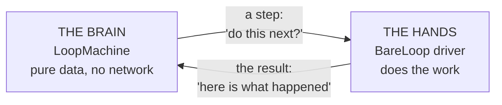
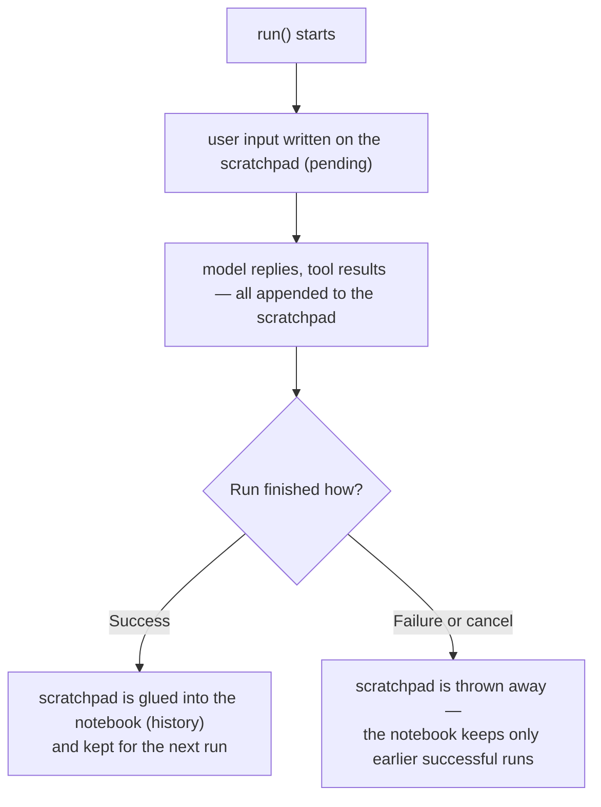

Every agent engine, at heart, answers one question over and over: **"what should happen next?"** loopctl's design splits that into two pieces with a strict border between them:

- **A brain** — the `LoopMachine`. It decides what happens next. It never touches the network, never runs a tool, never reads a clock. It is pure, plain data.
- **A pair of hands** — the `BareLoop` driver. It does whatever the brain asked: calls the model, runs tools, shrinks the conversation. Then it reports the result back to the brain.

This split has a name you may see in the code: **"sans-IO"** — "without input/output." The brain does no input/output at all.



---

## Why split them? Three payoffs

**1. You can test the brain with no mocks.**
The brain is plain data in, plain data out. To test "after 3 identical tool results, does it detect a loop?" you just build a machine, feed it results, and look at what it says. No fake network, no waiting, no flaky tests.

**2. You can save a run mid-flight and continue it elsewhere.**
Because the brain is pure data, it can be serialized (turned into bytes with `serde`, Rust's standard serialization library) and deserialized later. Pause an agent on one machine, resume it on another:

```rust
// Save: the machine is just data — turn it into JSON, store it anywhere.
let machine = agent.into_machine();          // takes the brain out of the agent
let saved = serde_json::to_string(&machine)?; // ...store `saved`...

// Later, elsewhere: put the brain into a fresh body.
let machine: LoopMachine = serde_json::from_str(&saved)?;
let mut agent = BareLoop::from_machine(machine, config, client, tools);
```

**3. The engine works with any model provider.**
The brain does not know or care who the model is. The hands talk to the provider through one small trait (`ApiClient`). Swap OpenAI for a local Ollama model and the brain never notices.

---

## The four steps the brain can ask for

The brain speaks a tiny language — exactly four possible "steps". Each one names a matching "feedback" method the hands use to report back:

| Step (brain says) | Meaning | Hands do | Feedback (hands report back) |
|---|---|---|---|
| `CallLLM { turn }` | "Ask the model now." | Send the conversation to the model | `machine.model_response(...)` |
| `CallTools { turn, calls }` | "Run these tool calls." | Execute each tool | `machine.tool_results(...)` |
| `Compact { reason }` | "Shrink the conversation first." | Rewrite history into something smaller | `machine.compaction_result(...)` or `machine.compaction_noop(...)` |
| `Done(outcome)` | "We're finished." | Wrap up and return | — (nothing; the run is over) |

`LLM` = Large Language Model, the AI model. `Compact` = shrink the conversation (see [Compaction](/engine/compaction/)).

The loop inside the driver is literally this simple:

```rust
loop {
    match machine.next_step(policy) {
        MachineStep::CallLLM { turn } => self.handle_call_llm(turn).await?,   // ask model
        MachineStep::CallTools { turn, calls } => self.handle_call_tools(turn, &calls).await?,
        MachineStep::Compact { reason } => self.handle_compact(reason).await?,
        MachineStep::Done(outcome) => break,                                   // finished
    }
}
```

(Real code shape, slightly simplified. The driver lives in `src/engine/bare.rs`.)

> **Hint — "policy":** the brain never stores settings like "max 200 turns" or "context window is 32,000 tokens". The driver hands it a fresh **`MachinePolicy`** (a small struct of those numbers) on every `next_step` call. That is what keeps the brain pure data that serializes cleanly.

---

## The brain's moods — `MachineState`

At any moment the brain is in exactly one **state**, which tracks what it is waiting for:

```rust
pub enum MachineState {
    Start,                    // ready to ask for the next step
    AwaitingModel { turn },   // asked the driver to call the model; waiting for the reply
    AwaitingTools { turn },   // asked the driver to run tools; waiting for results
    AwaitingCompaction,       // asked the driver to shrink history; waiting
    Terminal(MachineOutcome), // finished — accepts no further input, ever
}
```

Once the machine is `Terminal` it stays terminal forever — a saved-and-restored machine that had finished still knows it finished.

**`MachineOutcome`** — how a run ended — has four variants:

| Outcome | Meaning |
|---|---|
| `Completed { final_text }` | The model gave a final answer with no tool calls. Success. |
| `MaxTurnsExceeded` | Hit the turn limit (`RunConfig::max_turns`, default 200). |
| `Cancelled` | Someone fired the cancel signal. A clean stop, **not** a failure. |
| `Failed { error }` | Something broke (network dead, context overflow, loop detected, ...). |

---

## The two notebooks — `history` and `pending`

The brain holds the conversation in **two** separate lists, and understanding this split explains most of loopctl's behavior:

| List | What lives there | When it changes |
|---|---|---|
| **`history`** (the notebook) | Messages from **previous, successful runs** | Only when a run finishes successfully (its scratchpad pages get glued in), or when compaction rewrites everything |
| **`pending`** (the scratchpad) | The **current run's** messages: the user's input, each model reply, each tool result | Starts empty-ish each run; grows during the run; **thrown away if the run fails** |



**Why this matters to you:** if a run fails halfway (say, the network dies on turn 7), the conversation is **not** poisoned. The next `run()` starts from the last good state. The model never sees a half-finished turn with a missing tool result — providers reject such conversations.

> **Gotcha:** compaction is the one operation that touches both lists at once — it merges `history + pending` into a new, shorter `history` and empties `pending`. See [Compaction](/engine/compaction/) for the full story, including why a run that compacts and *then* fails leaves the compacted history behind (compaction is a commit point).

---

## Who is allowed to decide what

A useful rule to hold onto while reading the rest of this knowledge base:

| Question | Answered by |
|---|---|
| What happens next? (model / tools / shrink / stop) | The brain — `LoopMachine` |
| How exactly to do it? (HTTP, retries, running the tool) | The hands — `BareLoop` |
| When has the context grown too big? | The brain (threshold + emergency line) |
| How to shrink it? | A pluggable `ContextCompactor` (default: cut the middle, keep head and tail) |
| Should this tool call be allowed? | Hooks and middleware, if you install them |
| Is the model stuck in a loop? | The `DetectionManager`, if enabled |

The hands **never** decide turn order, compaction timing, or termination. That single discipline is what makes the whole engine predictable.

---

## Where to go next

- [Anatomy of a run](/start-here/anatomy-of-a-run/) — watch one full run travel through the brain and the hands.
- [The state machine](/engine/state-machine/) — every rule the brain follows, in detail.
- [The driver loop](/engine/driver-loop/) — every job the hands do, in detail.
- [The principles section](/principles/sans-io/) — the ideas on this page ([sans-IO](/principles/sans-io/), [state machines](/principles/state-machines/), and more) explained from scratch.
